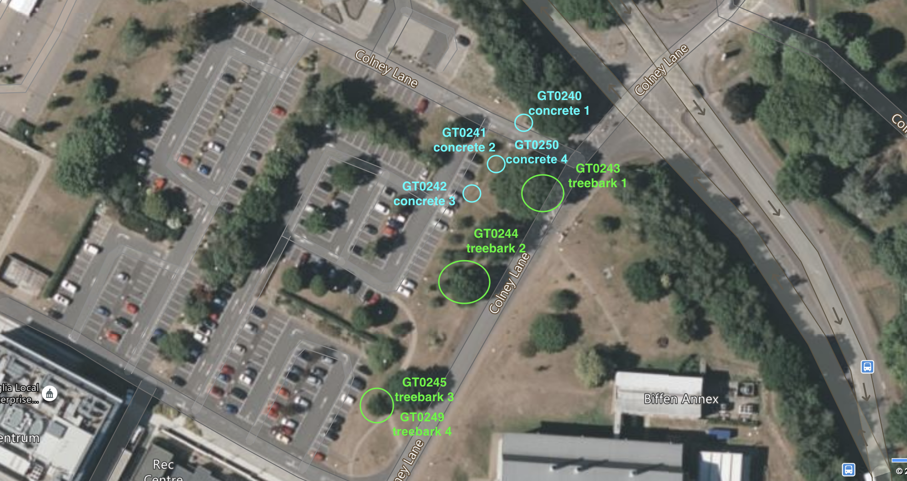

```{r setup, include=FALSE}
knitr::opts_chunk$set(echo = TRUE)
knitr::opts_knit$set(root.dir = "/Users/gol22pin/Documents/Lichen_project_TSL/01_Xanthoria_metagenomics/notebook")

```


# Producing DNA for metagenomic sequencing
The goal is to generate short-read metagenomes from intact thalli. The metagenome-assembled genomes (MAGs) from these can be used to improve the analysis of existing RNA-seq data from lichen thalli. Plan to use 9 thalli in total (6 freshly collected, 3 from the growth chamber)

## Collecting samples
### Fresh samples
#### First batch
* Collected on 4.11.2022 at the TSL campus
* Six samples in total, three from concrete (GT0240-242) & three from tree bark (GT0243-245)


#### Second batch
* Collected on 17.11.2022
* Same location
* Two samples: GT0249 from tree bark (same tree as GT0245), GT0250 from concrete (same fence post as GT0241)




### Samples from growth chambers
* Picked 3 samples from the growth chamber (Ground floor TSL, TSL05)
	* growth chamber 1: from the petri dish labelled "Xp + Tr1". 
  * 
	* growth chamber 2: from L17 branch (the thallus collected from the opposite side of the branch from the label)
	* growth chamber 3: from L22 branch
* All collected by Klara on the TSL campus

### Info on used samples
See `../analysis_and_temp_files/01_DNA_extraction/metagenomes_sample_info.txt` 
```{r echo=F}
x<-read.delim("../analysis_and_temp_files/01_DNA_extraction/metagenomes_specimen_info.txt")
knitr::kable(x)
```

## Extracting DNA
### Lab notes, chronologically organized
#### 08-09.11.2022
* Snapfrozen the samples in liquid nitrogen and pulverised them using Geno/grinder for 1 min on 1,200 rpm
* Used Qiagen DNEasy plant mini kit with extended incubation time (~ 1h)
* QC'd the DNA extractions using Nanodrop and Qubit (see `../analysis_and_temp_files/01_DNA_extraction/nanodrop_qubit_2022.11.08.csv`)

**Conclusion:** DNA is mostly good, but the concentration is below the 10 ng/ul requerement. Will speedvac and qubit again

#### 11.11.2022
* Speedvaced all extractions but 2 (GTX0468 and GTX0470 had >10 ng/ul)
* New Nanodrop and Qubit results (see `../analysis_and_temp_files/01_DNA_extraction/nanodrop_qubit_2022.11.11.csv`)
	* two extractions were still on the lower concentration threshold. three more don't have good purity scores

* Re-prepped extractions that have low concentration and/or bad Nanodrop scores:
	1. concrete2 (GT0241)
	2. growth chamber 1  (different thallus from GTX0471! can't be pooled!)
	3. treebark3 (GT0245)
	4. growth chamber 2  (same thallus from GTX0472)
	5. growth chamber 3  (same thallus from GTX0473)
* Re-extracted using same protocol, except with the addition of RNAse
* All failed (weird curves)

#### 14.11.2022
* Tried diluting the three extractions speedvaced on 11.11 (GTX0467, GTX0472, GTX0473). Goal: normalize the purity scores (which likely worsened due to speedvac)
* QCd them on nanodrop and qubit (see `../analysis_and_temp_files/01_DNA_extraction/nanodrop_qubit_2022.11.14.csv`)
* **Conclusion:** QC scores improved, but concentrations are too low now	
	
* Re-prepped the same 5 extractions:
	1. concrete2 (GT0241)
	2. treebark3 (GT0245)
	3. growth chamber 1  (GT0246; different thallus from GTX0471! can't be pooled!)
	4. growth chamber 2  (GT0247; same thallus from GTX0472)
	5. growth chamber 3  (GT0248; same thallus from GTX0473)
* Extracted them using the same kit, this time with no RNAse. Diluted in 50 uL of TE
* QCd the extractions. Nanodrop and Qubit results (see `../analysis_and_temp_files/01_DNA_extraction/nanodrop_qubit_2022.11.14.csv`)
	* looks good, but concentrations are too low
	
	
#### 15.11.2022
* Speevaced 8 samples:
	* Three from 09.11 (GTX0467, GTX0472, GTX0473). They have been speedvaced and diluted before
	* Five from 14.11 (GTX0479-GTX0483). These are all new extractions produced on that day
* QCd them again. See the results in `../analysis_and_temp_files/01_DNA_extraction/nanodrop_qubit_2022.11.15.csv`

#### 16.11.2022
* Pooled together DNA extractions for:
  * GT0247 (growthchamber 2): GTX0472 and GTX0482
  * GT0248 (growthchamber 3): GTX0473 and GTX0483
* Speedvaced them
* QCd them again. See the results in `../analysis_and_temp_files/01_DNA_extraction/nanodrop_qubit_2022.11.16.csv`

#### 18.11.2022
* Extracted DNA from the second batch samples
  * GT0249 (treebark_4)
    * GTX0484 (eluted DNA in 50 uL of TE buffer)
    * GTX0485 (eluted DNA in 50 uL of nuclease-free water)
  * GT0250 (treebark_4)
    * GTX0486 (eluted DNA in 50 uL of TE buffer)
    * GTX0487 (eluted DNA in 50 uL of nuclease-free water)
* Ran Nanodrop on all 4 extraction. See the results in `../analysis_and_temp_files/01_DNA_extraction/nanodrop_qubit_2022.11.18.csv`
* Pooled GTX0486 and GTX0487 (both from GT250, one was diluted in TE and the other in water) and speedvaced
* QCd the extractions, see in `../analysis_and_temp_files/01_DNA_extraction/nanodrop_qubit_2022.11.18.csv`

#### 17.01.2023
* Replaced GTX0470 (concrete 3) with diluted GTX0491
* GTX0491 was extracted from GT0242 (concrete 3) using Nuclobond HMW kit, for the Nanopore sequencnig
* To be on the safe side, decided to use the same extraction for Illumina sequencing
* Diluted it 3 times (10 uL of extraction + 20 uL of HE buffer), to the final concentration 36 ng/uL

#### QC
* Ran a gel to check DNA quality
* Used two extractions: GTX0466 (fresh Xanthoria thallus) and GTX0472-482 (from growth chamber)
* GTX0466 looks good, single band around 20 Kbp, little smear
* GTX0472-482 looks worse, no visible band
* Will send all anyways, and see what Novogene's QC results will be like

## Round-up of DNA for the metagenomic survey
See `../analysis_and_temp_files/01_DNA_extraction/metagenomic_dna_roundup.csv`
```{r echo=F}
x<-read.delim("../analysis_and_temp_files/01_DNA_extraction/metagenomic_dna_roundup.txt")
knitr::kable(x)
```
**NB!** In addition to these 9 metagenomes, in the same run I sent genomic DNA from Trebouxia pure culture (GTX0488). This extraction had similar concentration to GTX0491 and was treated the same (including the dilution step). See `../../02_long_read_assemblies/analysis_and_temp_files/01_DNA_extraction` for the details

### Replacing bad-quality samples
* 27.01.2023
* After Novogene ran sample QC, they identified 2 samples that didn't pass the check. Both came from the grow-chamber lichen material
  * pooled GTX0472+482
  * pooled GTX0473+483
* Extracted DNA from 2 other lichen thalli from the growth chambers (GT0251-252)
* See `../analysis_and_temp_files/01_DNA_extraction/nanodrop_qubit_2023.01.27.csv` for all DNA extractions info and `analysis_and_temp_files/01_DNA_extraction/SIFTNA*` for the info submitted to Novogene
* Send to Novogene two samples: GTX0493 (extracted from GT0251, speedvaced, new concentration should be about 14 ng/uL) and GTX494 (extracted from GT0252, concentration 20.7 ng/uL)
