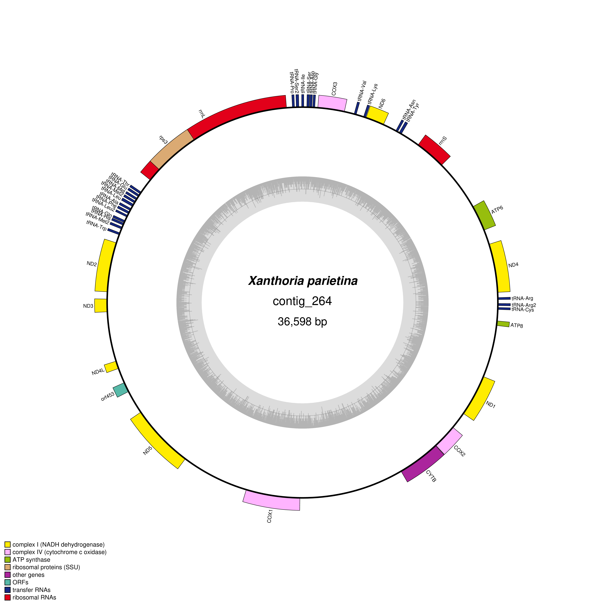

* **Rationale:** Need to annotate the three highly-contiguous genomes of Xanthoria:
1. X. parietina from JGI: Illumina, mostly chromosome-level, from spore cuture (ascospores collected froma single thallus, grown axenically)
2. our X. parietina: Nanopore, more fragmented, from thallus
3. our X. calcicola: Nanopore, mostly chromosome-level, from thallus

## 1. Preparation

### 1.1. Get references for mating loci
* [Scherrer et al. 2005](https://www.sciencedirect.com/science/article/pii/S1087184505001374?casa_token=usjx1V1_XdEAAAAA:PJ2mtsc-ctaVJwEYsTFStfKhAy5WGY3NJKKZQ7PaczKUr_s7rBoVhTk9y7hyK6UYYh_p0tQsjstZ#aep-abstract-id11) shows that different Xanthoria behave differently
  * X. parietina is homothallic, with only MAT1-2-1 (HMG-box protein) in all isolates
  * X. elegans is also homothallic, but has both MAT1-2-1 (HMG-box protein) and MAT1-1-1 (alpha-domain protein)
  * X. polycarpa is heterothallic, with either MAT1-2-1 or MAT1-1-1 
  * In the intro they mention X. calcicola as a likely heterothallic species, based on the frequency of apothecia
* Following [Lore's paper](https://www.frontiersin.org/articles/10.3389/ffunb.2021.656386/full?ref=https://githubhelp.com), I used sequences from X. polycarpa
  * MAT1-1-1 as [AJ884599.1](https://www.ncbi.nlm.nih.gov/nuccore/AJ884599.1/)
  * MAT1-2-1 as [AJ884598.1](https://www.ncbi.nlm.nih.gov/nuccore/AJ884598.1/)
  * Saved all protein fastas associated with this entries as `../analysis_and_temp_files/06_annotate_lecanoro/mat.faa` (this includes flanking genes SLA2 and DNA lyase) and nucleotide fastas as `../analysis_and_temp_files/06_annotate_lecanoro/mat.fna`
* Will give protein fastas to funannotate as evidence

### 1.2. Get RNA-seq data
* For the genome from JGI, I downloaded the transcriptome reads file Xanpa2_ESTs_20140928_est.fasta.gz 

### 1.3. Cleaning and sorting the assemblies
* Ran funannotate clean and sort on all three genomes
```
>singularity run ../singularity/funannotate.sif funannotate clean -i analysis_and_temp_files/02_binning/GTX0501_xanthoria_nuclear_mag.fa -o analysis_and_temp_files/06_annotate_lecanoro/GTX0501_xanthoria_nuclear_mag_clean.fa
>singularity run ../singularity/funannotate.sif funannotate sort -i analysis_and_temp_files/06_annotate_lecanoro/GTX0501_xanthoria_nuclear_mag_clean.fa -o analysis_and_temp_files/06_annotate_lecanoro/GTX0501_xanthoria_nuclear_mag_clean_sort.fa -b Xp_GTX0501
58 input contigs, 58 larger than 500 bp, N50 is 1,589,441 bp
58 input contigs; 58 larger than 500 bp; 0 duplicated; 58 written to file

>singularity run ../singularity/funannotate.sif funannotate clean -i /tsl/data/externalData/ntalbot/lichen_project/external_genomes/xanpa_genome.fasta -o analysis_and_temp_files/06_annotate_lecanoro/Xp_jgi_clean.fa 
>singularity run ../singularity/funannotate.sif funannotate sort -i analysis_and_temp_files/06_annotate_lecanoro/Xp_jgi_clean.fa -o analysis_and_temp_files/06_annotate_lecanoro/Xp_jgi_clean_sort.fa -b Xp_JGI
39 input contigs, 39 larger than 500 bp, N50 is 1,731,186 bp
39 input contigs; 39 larger than 500 bp; 0 duplicated; 39 written to file

>singularity run ../singularity/funannotate.sif funannotate clean -i analysis_and_temp_files/02_binning/GTX0491_xanthoria_nuclear_mag.fa -o analysis_and_temp_files/06_annotate_lecanoro/GTX0491_xanthoria_nuclear_mag_clean.fa
>singularity run ../singularity/funannotate.sif funannotate sort -i analysis_and_temp_files/06_annotate_lecanoro/GTX0491_xanthoria_nuclear_mag_clean.fa -o analysis_and_temp_files/06_annotate_lecanoro/GTX0491_xanthoria_nuclear_mag_clean_sort.fa -b Xc_GTX0491
16 input contigs, 16 larger than 500 bp, N50 is 2,319,243 bp
16 input contigs; 16 larger than 500 bp; 0 duplicated; 16 written to file
```

## 2. Repeat annotation
### Repeat Modeling
* Decided to run RepeatModeler/Masker myself, outside of funannotate
* Followed instructions from [here](https://www.clementgoubert.com/post/a-simple-pipeline-for-te-annotation-in-an-assembled-genome)
* First attempt at repeat modeling:
```{r,eval=F}
source package 85eb6fb0-3eb7-43b2-9659-49e0142481fc
BuildDatabase -name analysis_and_temp_files/06_annotate_lecanoro/Xp_GTX0501 analysis_and_temp_files/06_annotate_lecanoro/GTX0501_xanthoria_nuclear_mag_clean_sort.fa
RepeatModeler -database analysis_and_temp_files/06_annotate_lecanoro/Xp_GTX0501 -pa 20 -LTRStruct >& analysis_and_temp_files/06_annotate_lecanoro/repeatmodeler_GTX0501.out
```
* Software versions: RepeatModeler Version 2.0.3, rmblast 2.11.0+, TRF 4.09, RECON 1.08, RepeatScout 1.0.5, RepeatMasker 4.1.2, LTR Structural Analysis: Enabled (GenomeTools 1.6.0, LTR_Retriever v2.9.0, Ninja 0.97-cluster_only, MAFFT 7.471, CD-HIT 4.8.1)

### RepeatMasker
```{r,eval=F}
source package /tsl/software/testing/bin/repeatmasker-4.0.9 
RepeatMasker -pa 5 -a -s -gff -xsmall -lib analysis_and_temp_files/06_annotate_lecanoro/Xp_GTX0501-families.fa  analysis_and_temp_files/06_annotate_lecanoro/GTX0501_xanthoria_nuclear_mag_clean_sort.fa  &> analysis_and_temp_files/06_annotate_lecanoro/repeatmasker_GTX0501.run.out
```
```
==================================================
file name: GTX0501_xanthoria_nuclear_mag_clean_sort.fa
sequences:            58
total length:   29958160 bp  (29958060 bp excl N/X-runs)
GC level:         50.81 %
bases masked:    3792836 bp ( 12.66 %)
==================================================
               number of      length   percentage
               elements*    occupied  of sequence
--------------------------------------------------
SINEs:                0            0 bp    0.00 %
      ALUs            0            0 bp    0.00 %
      MIRs            0            0 bp    0.00 %

LINEs:              630      1411422 bp    4.71 %
      LINE1           0            0 bp    0.00 %
      LINE2           0            0 bp    0.00 %
      L3/CR1          0            0 bp    0.00 %

LTR elements:      1283      1749134 bp    5.84 %
      ERVL            0            0 bp    0.00 %
      ERVL-MaLRs      0            0 bp    0.00 %
      ERV_classI      0            0 bp    0.00 %
      ERV_classII     0            0 bp    0.00 %

DNA elements:        70        66834 bp    0.22 %
     hAT-Charlie      0            0 bp    0.00 %
     TcMar-Tigger     0            0 bp    0.00 %

Unclassified:      1905       357710 bp    1.19 %

Total interspersed repeats:  3585100 bp   11.97 %


Small RNA:            0            0 bp    0.00 %

Satellites:           0            0 bp    0.00 %
Simple repeats:    4090       173439 bp    0.58 %
Low complexity:     688        36419 bp    0.12 %
==================================================
```

### Visualize % of repeats
```{r}
library(tidyverse)
repeat_df<-data.frame("LINEs"=4.71,"LTR elements"=5.84,"DNA elements"=0.22,"Unclassified"=1.19,"Simple repeats"=0.58,"Low complexity"=0.12,"Small RNA"=0,"Satellites"=0)

repeat_df$genome<-"GTX0501 X. parietina"
repeat_df<-repeat_df %>%  pivot_longer(-genome,names_to = "type",values_to = "percentage")

ggplot(repeat_df,aes(x=genome,y=percentage,fill=type))+geom_bar(position="stack",stat = "identity")
```

### RIP
* Used [RIPper webserver](https://theripper.hawk.rocks/) 
* Results for RIP profiles are in `analysis_and_temp_files/06_annotate_lecanoro/Xanthoria_parietina_GTX0501.scaffolds.fa_profile.csv`

* Saved LRAR (Large RIP Affected Genomic Regions) coordinates as  `analysis_and_temp_files/06_annotate_lecanoro/X*_GTX0*_LRAR.csv`

### Visualize GC%, repeat content, and RIP
* Calculated repeat density with BEDtools
```{r,eval=F}
#first, create bed files with windows of 10,000 bp
sbatch --mem=10G -c 5 --partition=tsl-short --wrap="source package b0ed0698-358b-4c9b-9d21-603ea8d6e478; bedtools makewindows -g  analysis_and_temp_files/06_annotate_lecanoro/GTX0501_xanthoria_nuclear_mag_clean_sort.fa.fai  -w 10000 > analysis_and_temp_files/06_annotate_lecanoro/GTX0501_xanthoria_nuclear_mag_clean_sort.bed"


#overlap them with the repeatmasker gff
sbatch --mem=10G -c 5 --partition=tsl-short --wrap="source package b0ed0698-358b-4c9b-9d21-603ea8d6e478; bedtools coverage -a analysis_and_temp_files/06_annotate_lecanoro/GTX0501_xanthoria_nuclear_mag_clean_sort.bed -b analysis_and_temp_files/06_annotate_lecanoro/GTX0501_xanthoria_nuclear_mag_clean_sort.fa.out.gff > analysis_and_temp_files/06_annotate_lecanoro/GTX0501_xanthoria_nuclear_mag_clean_sort_repeatcov.txt"


```

* Had to re-do GC% analysis to do it on the Funannotate-cleaned assembly (so the names of the contigs are consistent)
  * Used bedtools for consistency
  * Increased the window size to 10,000 bp, to reduce the file size
```{r,eval=F}
sbatch --mem=10G -c 5 --partition=tsl-short --wrap="source package b0ed0698-358b-4c9b-9d21-603ea8d6e478; bedtools nuc -fi analysis_and_temp_files/06_annotate_lecanoro/GTX0501_xanthoria_nuclear_mag_clean_sort.fa -bed analysis_and_temp_files/06_annotate_lecanoro/GTX0501_xanthoria_nuclear_mag_clean_sort.bed > analysis_and_temp_files/06_annotate_lecanoro/GTX0501_xanthoria_nuclear_mag_clean_sort_GC.txt"

```

* Translate LRAR coordinates into bed format, so it is easier to visualize
```{r,eval=F}
#First, save LRAR table in a bed format
lrar_Xp<-read.delim2("../analysis_and_temp_files/06_annotate_lecanoro/Xp_GTX0501_LRAR.csv",sep=",")
write.table(lrar_Xp[,1:3],"../analysis_and_temp_files/06_annotate_lecanoro/Xp_GTX0501_LRAR.bed",col.names = F,row.names = F,quote = F,sep="\t")

#intersec LRAR file with the bed file
sbatch --mem=10G -c 5 --partition=tsl-short --wrap="source package b0ed0698-358b-4c9b-9d21-603ea8d6e478; bedtools coverage -a analysis_and_temp_files/06_annotate_lecanoro/GTX0501_xanthoria_nuclear_mag_clean_sort.bed -b analysis_and_temp_files/06_annotate_lecanoro/Xp_GTX0501_LRAR.bed > analysis_and_temp_files/06_annotate_lecanoro/GTX0501_xanthoria_nuclear_mag_clean_sort_LRAR_bedtools.txt"

```
* Re-run telomer detection on the cleaned and sorted genomes
```{r,eval=F}
sbatch --mem=10G -c 5 --partition=tsl-short --wrap="python code/detect_telomers.py analysis_and_temp_files/06_annotate_lecanoro/GTX0501_xanthoria_nuclear_mag_clean_sort.fa > analysis_and_temp_files/06_annotate_lecanoro/GTX0501_xanthoria_nuclear_mag_clean_sort_telomer.txt"

```


* GTX0501: plot each parameter separately
  * NB: here and below, when plotting GC% for GTX0501, I "squished" the color scale because of one outlier (smallest GC%=0.27, while the next is 0.34), which was messing up the scale
```{r,fig.show="hold"}
library(viridis)
library(scales)
#GC%
gc<-read.delim2("../analysis_and_temp_files/06_annotate_lecanoro/GTX0501_xanthoria_nuclear_mag_clean_sort_GC.txt")[,c(1,2,5)]
colnames(gc)<-c("contig","window_start","gc_content")
gc$gc_content<-gc$gc_content %>% as.numeric()


#Repeats
rep<-read.delim2("../analysis_and_temp_files/06_annotate_lecanoro/GTX0501_xanthoria_nuclear_mag_clean_sort_repeatcov.txt",header=F)[,c(1,2,7)]
colnames(rep)<-c("contig","window_start","repeat_content")
rep$repeat_content<- rep$repeat_content %>% as.numeric()

#RIP
lrar<-read.delim2("../analysis_and_temp_files/06_annotate_lecanoro/GTX0501_xanthoria_nuclear_mag_clean_sort_LRAR_bedtools.txt",header=F)[,c(1,2,7)]
colnames(lrar)<-c("contig","window_start","LRAR")
lrar <- lrar %>% mutate(LRAR_binary = ifelse( as.numeric(LRAR)>0.3,1,0))


#visualize
ggplot(gc)+
  geom_tile(aes(y=fct_reorder(contig,window_start),x=window_start,fill=gc_content))+
 # geom_tile(aes(y=fct_reorder(contig,window_start),x=window_start,alpha=telomere),fill="red")+
  xlab("")+ylab("")+
   #scale_alpha_discrete(range=c(0,1))+
  scale_fill_viridis(begin = 1,end = 0,limits=c(0.33,0.57),oob=squish)+
   scale_x_continuous(breaks = c(0,1000000,2000000,3000000,4000000),
                     labels = c("0","1 Mbp","2 Mbp","3 Mbp","4 Mbp"))+
  theme_minimal()

ggplot(rep)+
  geom_tile(aes(y=fct_reorder(contig,window_start),x=window_start,fill=repeat_content))+
 # geom_tile(aes(y=fct_reorder(contig,window_start),x=window_start,alpha=telomere),fill="red")+
  xlab("")+ylab("")+
   #scale_alpha_discrete(range=c(0,1))+
  scale_fill_viridis(begin = 1,end = 0)+
   scale_x_continuous(breaks = c(0,1000000,2000000,3000000,4000000),
                     labels = c("0","1 Mbp","2 Mbp","3 Mbp","4 Mbp"))+
  theme_minimal()


ggplot(lrar,aes(y=fct_reorder(contig,window_start),x=window_start))+
  geom_tile(aes(fill=LRAR_binary,alpha=LRAR_binary))+
  geom_tile(aes(height=0.1),fill="black")+
  xlab("")+ylab("")+
  scale_alpha_continuous(range=c(0,1))+
  scale_fill_gradient(low="#f0f0f0",high="black")+
   scale_x_continuous(breaks = c(0,1000000,2000000,3000000,4000000),
                     labels = c("0","1 Mbp","2 Mbp","3 Mbp","4 Mbp"))+
  theme_minimal()+
  theme(panel.grid.major = element_blank(), panel.grid.minor = element_blank())

```

* Put them together
```{r,fig.width=8,fig.height=8}
library(ggnewscale)
library(patchwork)

##add telomers
tel<-read.delim2("../analysis_and_temp_files/06_annotate_lecanoro/GTX0501_xanthoria_nuclear_mag_clean_sort_telomer.txt",header=F)[,c(1,2)]
colnames(tel)<-c("contig","position")
tel_start_contig_list<-tel[tel$position=="forward",1] #list all contigs that have telomer at the contig start (corresponds to 'forward')
tel_end_contig_list<-tel[tel$position=="reverse",1] #list all contigs that have telomer at the contig start (corresponds to 'forward')
tel_start<-gc %>% dplyr::select(contig,window_start) %>% mutate(telomere=0) %>% group_by(contig) %>% arrange(window_start) %>% filter(row_number()<3 & contig %in% tel_start_contig_list) %>% mutate(telomere=1) %>% ungroup()
tel_end<-gc %>% dplyr::select(contig,window_start) %>% mutate(telomere=0) %>% group_by(contig) %>% arrange(window_start) %>% 
  dplyr::slice(tail(row_number(), 3)) %>% filter(contig %in% tel_end_contig_list) %>% mutate(telomere=1) %>% ungroup()
gc<-gc %>% left_join(rbind(tel_start,tel_end))
gc$telomere[is.na(gc$telomere)]<-0


df<-rep %>% left_join(gc) %>% left_join(lrar) %>% dplyr::select(-LRAR) %>%
  pivot_longer(-c(contig, window_start,telomere),names_to = "parameter",values_to = "value") 
df$parameter<-plyr::revalue(df$parameter, c("gc_content"="CGC%", "repeat_content"="BRepeate%","LRAR_binary"="ARIP-affected"))
df$contig<-reorder(df$contig,df$contig,FUN=function(x) -length(x))

df<-df %>% mutate(panel=case_when(
  contig %in% c("Xp_GTX0501_1","Xp_GTX0501_2","Xp_GTX0501_3",  "Xp_GTX0501_4", 
"Xp_GTX0501_5",  "Xp_GTX0501_6",  "Xp_GTX0501_7",  "Xp_GTX0501_8", 
"Xp_GTX0501_9",  "Xp_GTX0501_10", "Xp_GTX0501_11", "Xp_GTX0501_12",
"Xp_GTX0501_13", "Xp_GTX0501_14", "Xp_GTX0501_15", "Xp_GTX0501_16",
"Xp_GTX0501_17", "Xp_GTX0501_18", "Xp_GTX0501_19") ~ 1,
contig %in% c("Xp_GTX0501_19", "Xp_GTX0501_20","Xp_GTX0501_21", "Xp_GTX0501_22", "Xp_GTX0501_23", "Xp_GTX0501_24","Xp_GTX0501_25", "Xp_GTX0501_26", "Xp_GTX0501_27", "Xp_GTX0501_28","Xp_GTX0501_29", "Xp_GTX0501_30", "Xp_GTX0501_31", "Xp_GTX0501_32",
"Xp_GTX0501_33", "Xp_GTX0501_34", "Xp_GTX0501_35", "Xp_GTX0501_36", "Xp_GTX0501_37", "Xp_GTX0501_38") ~ 2, T ~3))

gg1<-df %>% filter(panel==1) |> 
  ggplot() +
  # apply the gradient to group 1
  geom_tile(aes(y=parameter,x=window_start,fill=value,height=value*2), 
    filter(df, parameter == "CGC%"&panel==1)) +
  geom_tile(aes(y=parameter,x=window_start,alpha=telomere),fill="red")+
 scale_fill_viridis(begin = 1,end = 0,direction=1,limits=c(0.33,0.57),oob=squish)+
  labs(fill = "GC%") +
  # start a new scale
  new_scale_fill() +
  geom_tile(aes(y=parameter,x=window_start,fill=value), 
    filter(df, parameter == "BRepeate%"&panel==1)) +
 scale_fill_gradientn(colours = c("purple", "orange"))+
  labs(fill = "Repeat%") +
  # start a new scale
  new_scale_fill() +
  geom_tile(aes(y=parameter,x=window_start,fill=value,alpha=value), filter(df, parameter == "ARIP-affected",panel==1))+
  geom_tile(aes(y=parameter,x=window_start,height=0.25),fill="black", filter(df, parameter == "ARIP-affected",panel==1))+
  scale_alpha_continuous(range=c(0,1),guide = 'none')+
  scale_fill_gradientn(colours = c("white","black"),guide = 'none')+
  scale_x_continuous(breaks = c(0,1000000,2000000,3000000,4000000),
                     labels = c("0","1 Mbp","2 Mbp","3 Mbp","4 Mbp"),expand = c(0, 0))+
  labs(fill = "RIP-affected") +  xlab("")+ylab("Contigs")+
  facet_wrap(~contig,ncol=1)+
  theme_classic()+
  theme(panel.grid.major = element_blank(), panel.grid.minor = element_blank(),
        strip.background = element_blank(),strip.text.x = element_blank(),
        axis.text.y = element_blank(),legend.position="bottom",
        axis.line.y = element_blank(),axis.ticks.y = element_blank())

gg2<-df %>% filter(panel==2) |> 
  ggplot() +
  # apply the gradient to group 1
  geom_tile(aes(y=parameter,x=window_start,fill=value,height=value*2), 
    filter(df, parameter == "CGC%",panel==2)) +
  geom_tile(aes(y=parameter,x=window_start,alpha=telomere),fill="red")+
 scale_fill_viridis(begin = 1,end = 0,limits=c(0.33,0.57),oob=squish,direction=1)+
  labs(fill = "GC%") +
  # start a new scale
  new_scale_fill() +
  geom_tile(aes(y=parameter,x=window_start,fill=value), 
    filter(df, parameter == "BRepeate%",panel==2)) +
 scale_fill_gradientn(colours = c("purple", "orange"),guide = 'none')+
  labs(fill = "Repeat%") +
  # start a new scale
  new_scale_fill() +
  geom_tile(aes(y=parameter,x=window_start,fill=value,alpha=value), filter(df, parameter == "ARIP-affected",panel==2))+
  geom_tile(aes(y=parameter,x=window_start,height=0.25),fill="black", filter(df, parameter == "ARIP-affected",panel==2))+
  scale_alpha_continuous(range=c(0,1),guide = 'none')+
  scale_fill_gradientn(colours = c("white","black"),guide = 'none')+
  scale_x_continuous(breaks = c(0,250000),
                     labels = c("0","250 Kbp"),expand = c(0, 0))+
  labs(fill = "RIP-affected") +  xlab("")+ylab("")+
  facet_wrap(~contig,ncol=1)+
  theme_classic()+
  theme(panel.grid.major = element_blank(), panel.grid.minor = element_blank(),
        strip.background = element_blank(),strip.text.x = element_blank(),
        axis.text.y = element_blank(),legend.position="bottom",
        axis.line.y = element_blank(),axis.ticks.y = element_blank())

gg3<-df %>% filter(panel==3) |> 
  ggplot() +
  # apply the gradient to group 1
  geom_tile(aes(y=parameter,x=window_start,fill=value,height=value*2), 
    filter(df, parameter == "CGC%",panel==3)) +
  geom_tile(aes(y=parameter,x=window_start,alpha=telomere),fill="red")+
 scale_fill_viridis(begin = 1,end = 0,limits=c(0.33,0.57),oob=squish,direction=1)+
  labs(fill = "GC%") +
  # start a new scale
  new_scale_fill() +
  geom_tile(aes(y=parameter,x=window_start,fill=value), 
    filter(df, parameter == "BRepeate%",panel==3)) +
 scale_fill_gradientn(colours = c("purple", "orange"),guide = 'none')+
  labs(fill = "Repeat%") +
  # start a new scale
  new_scale_fill() +
  geom_tile(aes(y=parameter,x=window_start,fill=value,alpha=value), filter(df, parameter == "ARIP-affected",panel==3))+
  geom_tile(aes(y=parameter,x=window_start,height=0.25),fill="black", filter(df, parameter == "ARIP-affected",panel==3))+
  scale_alpha_continuous(range=c(0,1),guide = 'none')+
  scale_fill_gradientn(colours = c("white","black"),guide = 'none')+
  scale_x_continuous(breaks = c(50000),
                     labels = c("50 Kbp"),expand = c(0, 0))+
  labs(fill = "RIP-affected") +  xlab("")+ylab("")+
  facet_wrap(~contig,ncol=1)+
  theme_classic()+
  theme(panel.grid.major = element_blank(), panel.grid.minor = element_blank(),
        strip.background = element_blank(),strip.text.x = element_blank(),
        axis.text.y = element_blank(),legend.position="bottom",
        axis.line.y = element_blank(),axis.ticks.y = element_blank())

#scale graph widths
#max(df$window_start[df$panel==1]) / max(df$window_start[df$panel==3]) [1] 29.44444
#max(df$window_start[df$panel==2]) / max(df$window_start[df$panel==3]) [1] 3.666667
gg1+gg2+gg3 + plot_layout(guides = "collect",widths = c(29.4, 3.7, 1)) & theme(legend.position = 'bottom')
```

* Save the figure
```{r}
plot<-gg1+theme(axis.text = element_text(size=6),
          axis.title = element_text(size=7),
          legend.text = element_text(size=7),
          legend.title = element_text(size=8))+
  gg2+theme(axis.text = element_text(size=6),
          axis.title = element_text(size=7),
          legend.text = element_text(size=7),
          legend.title = element_text(size=8))+
  gg3 +theme(axis.text = element_text(size=6),
          axis.title = element_text(size=7),
          legend.text = element_text(size=7),
          legend.title = element_text(size=8))+
  plot_layout(guides = "collect",widths = c(29.4, 3.7, 1)) & theme(legend.position = 'bottom')
ggsave('../results/contigs.pdf',plot, width = 5, height = 5)
```


* Code GC% as height of tiles in addition to the color
```{r,fig.width=8,fig.height=8}
df |> 
  ggplot() +
  # apply the gradient to group 1
  geom_tile(aes(y=parameter,x=window_start,height=value*3,fill=value), 
    filter(df, parameter == "CGC%")) +
  geom_tile(aes(y=parameter,x=window_start,alpha=telomere),fill="red")+
 scale_fill_viridis(begin = 1,end = 0,direction=1)+
  labs(fill = "GC%") +
  # start a new scale
  new_scale_fill() +
  geom_tile(aes(y=parameter,x=window_start,fill=value), 
    filter(df, parameter == "BRepeate%")) +
 scale_fill_gradientn(colours = c("purple", "orange"))+
  labs(fill = "Repeat%") +
  # start a new scale
  new_scale_fill() +
  geom_tile(aes(y=parameter,x=window_start,fill=value,alpha=value), filter(df, parameter == "ARIP-affected"))+
  geom_tile(aes(y=parameter,x=window_start,height=0.1),fill="black", filter(df, parameter == "ARIP-affected"))+
  scale_alpha_continuous(range=c(0,1),guide = 'none')+
  scale_fill_gradientn(colours = c("white","black"),guide = 'none')+
  scale_x_continuous(breaks = c(0,1000000,2000000,3000000,4000000),
                     labels = c("0","1 Mbp","2 Mbp","3 Mbp","4 Mbp"),expand = c(0, 0))+
  labs(fill = "RIP-affected") +  xlab("")+ylab("Contigs")+
  facet_wrap(~contig,ncol=1)+
  theme_classic()+
  theme(panel.grid.major = element_blank(), panel.grid.minor = element_blank(),
        strip.background = element_blank(),strip.text.x = element_blank(),
        axis.text.y = element_blank(),legend.position="bottom",
        axis.line.y = element_blank(),axis.ticks.y = element_blank())

```

* Older version, saved just in case, which separates contigs into two columns
```{r,eval=F}
gg1<-df %>% filter(panel==1) |> 
  ggplot() +
  # apply the gradient to group 1
  geom_tile(aes(y=parameter,x=window_start,fill=value), 
    filter(df, parameter == "CGC%"&panel==1)) +
  geom_tile(aes(y=parameter,x=window_start,alpha=telomere),fill="red")+
 scale_fill_viridis(begin = 1,end = 0,direction=-1)+
  labs(fill = "GC%") +
  # start a new scale
  new_scale_fill() +
  geom_tile(aes(y=parameter,x=window_start,fill=value), 
    filter(df, parameter == "BRepeate%"&panel==1)) +
 scale_fill_gradientn(colours = c("purple", "orange"))+
  labs(fill = "Repeat%") +
  # start a new scale
  new_scale_fill() +
  geom_tile(aes(y=parameter,x=window_start,fill=value,alpha=value), filter(df, parameter == "ARIP-affected",panel==1))+
  geom_tile(aes(y=parameter,x=window_start,height=0.1),fill="black", filter(df, parameter == "ARIP-affected",panel==1))+
  scale_alpha_continuous(range=c(0,1),guide = 'none')+
  scale_fill_gradientn(colours = c("white","black"),guide = 'none')+
  scale_x_continuous(breaks = c(0,1000000,2000000,3000000,4000000),
                     labels = c("0","1 Mbp","2 Mbp","3 Mbp","4 Mbp"),expand = c(0, 0))+
  labs(fill = "RIP-affected") +  xlab("")+ylab("Contigs")+
  facet_wrap(~contig,ncol=1)+
  theme_classic()+
  theme(panel.grid.major = element_blank(), panel.grid.minor = element_blank(),
        strip.background = element_blank(),strip.text.x = element_blank(),
        axis.text.y = element_blank(),legend.position="bottom",
        axis.line.y = element_blank(),axis.ticks.y = element_blank())

gg2<-df %>% filter(panel==2) |> 
  ggplot() +
  # apply the gradient to group 1
  geom_tile(aes(y=parameter,x=window_start,fill=value), 
    filter(df, parameter == "CGC%",panel==2)) +
  geom_tile(aes(y=parameter,x=window_start,alpha=telomere),fill="red")+
 scale_fill_viridis(begin = 1,end = 0,guide = 'none',direction=-1)+
  labs(fill = "GC%") +
  # start a new scale
  new_scale_fill() +
  geom_tile(aes(y=parameter,x=window_start,fill=value), 
    filter(df, parameter == "BRepeate%",panel==2)) +
 scale_fill_gradientn(colours = c("purple", "orange"),guide = 'none')+
  labs(fill = "Repeat%") +
  # start a new scale
  new_scale_fill() +
  geom_tile(aes(y=parameter,x=window_start,fill=value,alpha=value), filter(df, parameter == "ARIP-affected",panel==2))+
  geom_tile(aes(y=parameter,x=window_start,height=0.1),fill="black", filter(df, parameter == "ARIP-affected",panel==2))+
  scale_alpha_continuous(range=c(0,1),guide = 'none')+
  scale_fill_gradientn(colours = c("white","black"),guide = 'none')+
  scale_x_continuous(breaks = c(0,250000),
                     labels = c("0","250 Kbp"),expand = c(0, 0))+
  labs(fill = "RIP-affected") +  xlab("")+ylab("")+
  facet_wrap(~contig,ncol=1)+
  theme_classic()+
  theme(panel.grid.major = element_blank(), panel.grid.minor = element_blank(),
        strip.background = element_blank(),strip.text.x = element_blank(),
        axis.text.y = element_blank(),legend.position="bottom",
        axis.line.y = element_blank(),axis.ticks.y = element_blank())


#scale graph widths
#max(df$window_start[df$panel==1]) / max(df$window_start[df$panel==2]) [1] 2.368687
gg1+gg2+ plot_layout(guides = "collect",widths = c(2.4, 1)) & theme(legend.position = 'bottom')

```

## 3. Gene predictions
### GeneMark ab initio predictions
* Had to run GeneMark outside of funannotate, because of dependencties issues
* Ran as a script
```
#gmes_petap.pl --ES --max_intron 3000 --soft_mask 2000 --cores $thread  --fungus --sequence ../../$filename

code/genemark.sh analysis_and_temp_files/06_annotate_lecanoro/GTX0501_xanthoria_nuclear_mag_clean_sort.fa.masked analysis_and_temp_files/06_annotate_lecanoro/GTX0501_pred 20
```

### Funannotate train+predict
* First, ran on GTX501, using RNA-seq from our cultures
```
#!/bin/bash
#SBATCH --time=3-0:00:00
#SBATCH --cpus-per-task=28
#SBATCH --job-name=funtrain1
#SBATCH --output=tmp.funtrain1.logs.out
#SBATCH --mem=80G

singularity run ../singularity/funannotate.sif funannotate train -i analysis_and_temp_files/06_annotate_lecanoro/GTX0501_xanthoria_nuclear_mag_clean_sort.fa.masked -o analysis_and_temp_files/06_annotate_lecanoro/GTX0501_pred --jaccard_clip --strain GTX0501 \
    --left /tsl/data/reads/ntalbot/lichen_coculture_i_21_days/21x_bmm1_ks/s_21xb1/raw/S_21XB1_1.fq.gz /tsl/data/reads/ntalbot/lichen_coculture_i_21_days/21x_bmm2_ks/ks21xb1/raw/KS21XB1_1.fq.gz /tsl/data/reads/ntalbot/lichen_coculture_i_21_days/21x_bmm3_ks/s_21xb3/raw/S_21XB3_1.fq.gz /tsl/data/reads/ntalbot/lichen_coculture_i_42_days/42x_bmm1_ks/s_42xb1/raw/S_42XB1_1.fq.gz /tsl/data/reads/ntalbot/lichen_coculture_i_42_days/42x_bmm2_ks/s_42xb2/raw/S_42XB2_1.fq.gz /tsl/data/reads/ntalbot/lichen_coculture_i_42_days/42x_bmm3_ks/s_42xb3/raw/S_42XB3_1.fq.gz /tsl/data/reads/ntalbot/lichen_coculture_i_2_days/48x_bmm1_ks/ks48xb1/raw/KS48XB1_1.fq.gz /tsl/data/reads/ntalbot/lichen_coculture_i_2_days/48x_bmm2_ks/ks48xb2/raw/KS48XB2_1.fq.gz /tsl/data/reads/ntalbot/lichen_coculture_i_2_days/48x_bmm3_ks/ks48xb3/raw/KS48XB3_1.fq.gz /tsl/data/reads/ntalbot/lichen_coculture_i_9_days/9x_bmm1_ks/ks9xb1/raw/KS9XB1_1.fq.gz /tsl/data/reads/ntalbot/lichen_coculture_i_9_days/9x_bmm2_ks/ks9xb2/raw/KS9XB2_1.fq.gz /tsl/data/reads/ntalbot/lichen_coculture_i_9_days/9x_bmm3_ks/ks9xb3/raw/KS9XB3_1.fq.gz \
    --right  /tsl/data/reads/ntalbot/lichen_coculture_i_21_days/21x_bmm1_ks/s_21xb1/raw/S_21XB1_2.fq.gz /tsl/data/reads/ntalbot/lichen_coculture_i_21_days/21x_bmm2_ks/ks21xb1/raw/KS21XB1_2.fq.gz /tsl/data/reads/ntalbot/lichen_coculture_i_21_days/21x_bmm3_ks/s_21xb3/raw/S_21XB3_2.fq.gz /tsl/data/reads/ntalbot/lichen_coculture_i_42_days/42x_bmm1_ks/s_42xb1/raw/S_42XB1_2.fq.gz /tsl/data/reads/ntalbot/lichen_coculture_i_42_days/42x_bmm2_ks/s_42xb2/raw/S_42XB2_2.fq.gz /tsl/data/reads/ntalbot/lichen_coculture_i_42_days/42x_bmm3_ks/s_42xb3/raw/S_42XB3_2.fq.gz /tsl/data/reads/ntalbot/lichen_coculture_i_2_days/48x_bmm1_ks/ks48xb1/raw/KS48XB1_2.fq.gz /tsl/data/reads/ntalbot/lichen_coculture_i_2_days/48x_bmm2_ks/ks48xb2/raw/KS48XB2_2.fq.gz /tsl/data/reads/ntalbot/lichen_coculture_i_2_days/48x_bmm3_ks/ks48xb3/raw/KS48XB3_2.fq.gz /tsl/data/reads/ntalbot/lichen_coculture_i_9_days/9x_bmm1_ks/ks9xb1/raw/KS9XB1_2.fq.gz /tsl/data/reads/ntalbot/lichen_coculture_i_9_days/9x_bmm2_ks/ks9xb2/raw/KS9XB2_2.fq.gz /tsl/data/reads/ntalbot/lichen_coculture_i_9_days/9x_bmm3_ks/ks9xb3/raw/KS9XB3_2.fq.gz \
    --species "Xanthoria parietina" \
    --cpus 28 --memory 80G
```

### Gene prediction
* GTX0501
```
#!/bin/bash
#SBATCH --time=3-0:00:00
#SBATCH --cpus-per-task=28
#SBATCH --job-name=funpred
#SBATCH --output=analysis_and_temp_files/06_annotate_lecanoro/funannotate-predict_GTX0501.log
#SBATCH --mem=80G

singularity run ../singularity/funannotate.sif funannotate predict -i analysis_and_temp_files/06_annotate_lecanoro/GTX0501_xanthoria_nuclear_mag_clean_sort.fa.masked -o analysis_and_temp_files/06_annotate_lecanoro/GTX0501_pred --species "Xanthoria parietina" \
    --cpus 28 --strain GTX0501 --optimize_augustus --genemark_gtf analysis_and_temp_files/06_annotate_lecanoro/GTX0501_pred/genemark/genemark.gtf --protein_evidence ../singularity/funannotate2/opt/databases/uniprot_sprot.fasta  analysis_and_temp_files/06_annotate_lecanoro/mat.faa
    
singularity run ../singularity/funannotate.sif funannotate update -i analysis_and_temp_files/06_annotate_lecanoro/GTX0501_pred --cpus 28
```

### Fixing error
* After trying to run files on antiSMASH, I discovered a bug: gff files had CDS duplicates: one gene had two CDS that differed only in UTR elements
* Manually changed gff, gbk, protein, and tbl files to remove duplicates
* Put those into the `update_results` folder. kept the original files in `update_notfixed`
* In GTX0491, removed FUN_003486-T2. In GTX0501, removed FUN_000850-T2, FUN_001971-T2, FUN_001974-T2, FUN_001975-T2, FUN_006242-T2, FUN_006694-T2, FUN_007685-T2
* In Xp_jgi duplicates: FUN_000084-T2, FUN_001527-T2, FUN_001785-T2, FUN_002323-T2, FUN_002448-T3, FUN_002962-T2, FUN_003840-T2, FUN_004229-T2, FUN_006332-T2, FUN_006039-T2, FUN_006356-T2, FUN_007026-T2, FUN_007398-T2, FUN_007866-T2, FUN_007970-T2, FUN_007976-T2, FUN_008529-T2, FUN_009309-T2, FUN_009679-T2, FUN_010812-T2. Here, edited only the tbl file, and then I re-run `funannotate fix`

## 4. Functional annotation, external tools
### For eggnog-mapper, used the webserver http://eggnog-mapper.embl.de/
  * on 12.09.2023
  * database v5.0
  * emapper v2.1.12
```
emapper.py --cpu 20 --mp_start_method forkserver --data_dir /dev/shm/ -o out --output_dir /emapper_web_jobs/emapper_jobs/user_data/MM_ysq45n67 --temp_dir /emapper_web_jobs/emapper_jobs/user_data/MM_ysq45n67 --override -m diamond --dmnd_ignore_warnings -i /emapper_web_jobs/emapper_jobs/user_data/MM_ysq45n67/queries.fasta --evalue 0.001 --score 60 --pident 40 --query_cover 20 --subject_cover 20 --itype proteins --tax_scope auto --target_orthologs all --go_evidence non-electronic --pfam_realign none --report_orthologs --decorate_gff yes --excel > /emapper_web_jobs/emapper_jobs/user_data/MM_ysq45n67/emapper.out 2> /emapper_web_jobs/emapper_jobs/user_data/MM_ysq45n67/emapper.err
```
### For InterPro, ran it outside of funannotate, locally
```
#!/bin/bash
#SBATCH --time=3-0:00:00
#SBATCH --cpus-per-task=20
#SBATCH --job-name=funpred2
#SBATCH --output=analysis_and_temp_files/06_annotate_lecanoro/GTX0501_pred/logfiles/interproscan.log
#SBATCH --mem=80G

source package 0dd71e29-8eb1-4512-b37c-42f7158718f4
source package /tsl/software/testing/bin/gcc-5.2.0 
source package 999eb878-6c39-444e-a291-e2e0a86660e6
source package /tsl/software/testing/bin/java-11.0.7  
source package 0f2514dd-8288-47ed-96cd-80905f9b0644
source package /tsl/software/production/bin/perl-5.16.2 

mkdir -p analysis_and_temp_files/06_annotate_lecanoro/GTX0501_pred/interpro
rm -rf temp
/tsl/data/interproscan/5.42/interproscan.sh -i analysis_and_temp_files/06_annotate_lecanoro/GTX0501_pred/update_results/Xanthoria_parietina_GTX0501.proteins.fa -d analysis_and_temp_files/06_annotate_lecanoro/GTX0501_pred/interpro -dp -f XML -goterms -dra -cpu 20
```

### For antiSMASH, used the webserver
* On 2023.09.12
* Fungal version
* Default search, with all extra features

## 5. Funannotate annotate
```
#!/bin/bash
#SBATCH --time=7-0:00:00
#SBATCH --cpus-per-task=20
#SBATCH --job-name=annot
#SBATCH --output=analysis_and_temp_files/06_annotate_lecanoro/GTX0501_pred/logfiles/annotate.log
#SBATCH --mem=80G

singularity run ../singularity/funannotate.sif funannotate annotate -i analysis_and_temp_files/06_annotate_lecanoro/GTX0501_pred --iprscan analysis_and_temp_files/06_annotate_lecanoro/GTX0501_pred/interpro/Xanthoria_parietina_GTX0501.proteins.fa.xml --eggnog analysis_and_temp_files/06_annotate_lecanoro/GTX0501_pred/emapper/out.emapper.annotations --antismash analysis_and_temp_files/06_annotate_lecanoro/GTX0501_pred/antismash/Xanthoria_parietina_GTX0501.gbk --signalp  analysis_and_temp_files/06_annotate_lecanoro/GTX0501_pred/Xanthoria_parietina_GTX0501.proteins_summary.signalp5 --cpus 20  --sbt analysis_and_temp_files/06_annotate_lecanoro/template.sbt  --isolate GTX0501
```

## 6. Improving annotations via Orthogroups + adding KEGG
* Used predicted proteome form our annotation of X. parietina and Aspergillus niger form JGI

#### Parse the Orthogroups file (output from Orthofinder)
```{r }
og<-read_tsv("../analysis_and_temp_files/06_annotate_lecanoro/Orthogroups.txt",show_col_types = F) #added colnames and replaced ": " by "\t" beforehand
og1<-separate_rows(og, ProtID, sep = " ")
og1<-og1[grepl("FUN_",og1$ProtID),] #take only Xanthoria genes
og1$ProtID<-str_replace_all(og1$ProtID,"FUN","XANPAGTX0501")
og_counts<-data.frame(table(og1$OG_ID)) #number of Xanthoria genes in each orthogroup
colnames(og_counts)<-c("OG_ID","Total")
head(og_counts)  
```

#### Read the Funannotate annotation for Xanthoria
```{r }
anot<-read_tsv("../analysis_and_temp_files/06_annotate_lecanoro/GTX0501_pred/annotate_results/Xanthoria_parietina_GTX0501.annotations.txt",show_col_types = F)

anot$ProtID<-paste0(anot$TranscriptID,"_",anot$GeneID)
anot$ProtID<-gsub("-","_",anot$ProtID)
anot_main<-left_join(anot,og1,by="ProtID") #assign OG_IDs to the genes
head(anot_main)
```

#### Check the current status of anonated and unannoated genes
```{r fig.align='center'}
library(reshape2)
anot1<-unique(anot[c(28,13:18,20,21)])
anot1_1<-melt(anot1,id=c("ProtID"))
anot1_1$plot<-ifelse(is.na(anot1_1$value),"no_anot","Anot")
orig<-ggplot(anot1_1, aes(x = variable, fill = plot))+
  geom_bar(position = "dodge")+
  labs(title = "Annotated genes and genes with no functional annotation for each Database", 
       x = "Types of Databases", 
       y = "Annotations in 11185 genes")+
  geom_text(stat = "count", 
            aes(label = after_stat(count)),
            position = position_dodge(width = 0.9),
            vjust = -0.5) +
  scale_fill_manual(values = c("blue", "grey"))+
  theme_bw()
orig
```

#### Create new annotations using Orthogroups
```{r }
anot2<-na.omit(anot1_1)
anot2<-anot2 %>%
  mutate(anot = str_split(value, ";")) %>%
  unnest(cols = anot)
anot2$merge<-paste0(anot2$variable,"_",anot2$anot)
anot2<-unique(anot2[c(1,6)])
anot3<-left_join(anot2,og1,by="ProtID")
anot_counts<-data.frame(table(anot3$OG_ID,anot2$merge))
anot_counts1<-anot_counts[which(anot_counts$Freq!=0),]
colnames(anot_counts1)<-c("OG_ID","anot","anot_counts") #list of genes with annotations based on Orthogropus
head(anot_counts1)
```

#### Select orthogroups which have ATLEAST 40% of genes annotated
```{r }
anot_perc<-unique(left_join(anot_counts1,og_counts,by="OG_ID"))
anot_perc$anot_perc<-(anot_perc$anot_counts/anot_perc$Total)*100
anot_perc1<-unique(anot_perc[which(anot_perc$anot_perc>=40),])
head(anot_perc)
```

#### Assign new annotations to the original funannotate file
```{r }
anot_fin<-left_join(anot_main[c(1,2,29)],anot_perc,by="OG_ID",relationship = "many-to-many")
head(anot_fin)
anot_fin[c("anot","anot_desc")]<-str_split_fixed(anot_fin$anot,"_",2)
head(anot_fin)
anot_fin1<-unique(na.omit(anot_fin[c(1,2,4,8)]))
head(anot_fin1)
anot_fin1$anot<-paste0(anot_fin1$anot,"_new")
anot_fin2<-aggregate(anot_desc~.,anot_fin1,toString)
head(anot_fin2)

anot_fin3<-pivot_wider(anot_fin2,values_from=anot_desc,names_from = anot)
head(anot_fin3)
colnames(anot_fin3)
length(unique(anot_fin3$GeneID))
length(anot_fin3$GeneID)
length(unique(anot_fin3$TranscriptID))
length(anot_fin3$TranscriptID)
fin<-left_join(anot,anot_fin3,by="TranscriptID")
colnames(fin)[1]<-"GeneID"
fin <- fin %>% select(-GeneID.y)

```

#### Plot the previous and new annotations
```{r fig.align='center',fig.width=10, fig.height=15}
colnames(fin)
fin1<-unique(fin[c(28,21,13:17,20,29:35)])
head(fin1)
fin1_1<-melt(fin1,id=c("ProtID"))
head(fin1_1)
fin1_1$plot<-ifelse(is.na(fin1_1$value),"no_anot","Anot")
fin1_1$new<-ifelse(grepl("_new",fin1_1$variable),"New_anot","Old_anot")
fin1_1$variable<-gsub("_new","",fin1_1$variable)
new<-ggplot(fin1_1, aes(x = variable, fill = plot))+
  geom_bar(position = "dodge")+
  labs(title = "Annotated genes and genes with no functional annotation for each Database", 
       x = "Types of Databases", 
       y = "Annotations in 11185 genes")+
  geom_text(stat = "count", 
            aes(label = after_stat(count)),
            position = position_dodge(width = 0.9),
            vjust = -0.5) +
  scale_fill_manual(values = c("blue", "grey"))+
  theme_bw()+
  facet_wrap(~new,nrow=2,scales="free")
new
```

### Adding KEGG annotations
* Run annotations on the KAAS server on 20.11.2023
* Combined with the other annotations and saved as `06_annotate_lecanoro/Annotation_with_OG.txt`
```{r}
kegg<-read.delim2("../analysis_and_temp_files/06_annotate_lecanoro/kaas_GTX0501.txt",header=F,sep="\t")
colnames(kegg)<-c("TranscriptID","KO")

fin<-fin %>% left_join(kegg)
write.table(fin,"../analysis_and_temp_files/06_annotate_lecanoro/Annotation_with_OG.txt",quote=F,sep="\t",row.names = F)
```


## 9. Mitochondrial genome
* Used a new tool, MitoFinder
* As a reference used Peltigera malacea mitochondrion from Xavier et al. 2012. I picked this annotation, becuase it seems to be most carefully curated, with the use of RNA data to verify annotations. 
* Following Xavier et al., I used alternative genetic code #4 (The Mold, Protozoan, and Coelenterate Mitochondrial Code and the Mycoplasma/Spiroplasma Code). This code is known from mitochondria of several model ascomycetes, including Neurospora and Aspergillus
* Ran the program on the entire assembly, not just the contig I identified as the mitogenome. This is to rule out that there are other contigs that somehow didn't assemble together. The contig I identified as the mito genome (contig_264) in only 36.6 Kbp, which is on the lower side for lecanoromycete mitochnidrial genomes, according to the sample in NCBI (although still within limits)
* Had to use --new-genes flag, as recommended for fungi by the authors 
```
#!/bin/bash
#SBATCH --time=12:00:00
#SBATCH --cpus-per-task=20
#SBATCH --job-name=annot
#SBATCH --output=analysis_and_temp_files/06_annotate_lecanoro/GTX0501_mitofinder.log
#SBATCH --mem=20G

source package 6ee2e05d-af0a-43ea-9094-26dcb93ccbbd
mitofinder -a analysis_and_temp_files/02_binning/GTX0501.fasta -o 4 -r analysis_and_temp_files/06_annotate_lecanoro/Peltigera_mito_reference.gb -p 2 -j GTX0501mito --new-genes  --max-contig-size 5000000
```
* Identified 4 contigs with hits to the reference mitogenme:
  * contig_264: my candidate
  * contig_269: the other contig that is likely a fungal mitogenome. This one didn't blast as a Lecanoromycete (but as Dothideo) and had very low coverage with the Illumina reads. Most likely this is a non-mycobiont fragment
  * contig_237: mitogenome of Trebouxia
  * contig_50: a non-circular contig of 850 Kbp. Identified as a part of nuclear genome (assigned to bin.8). This is likely a NUMT
* Final annotation of contig_264 was missing rrnL, even though it had matches identified by blast. Maybe the problem is with introns?
* Re-ran the script with the --allow-intron flag, this time only on the contig identified as Xanthoria mito genome
* Still, no rrnL annotation
```
#!/bin/bash
#SBATCH --time=12:00:00
#SBATCH --cpus-per-task=20
#SBATCH --job-name=annot
#SBATCH --output=analysis_and_temp_files/06_annotate_lecanoro/GTX0501_mitofinder.log
#SBATCH --mem=20G

source package 6ee2e05d-af0a-43ea-9094-26dcb93ccbbd
mitofinder -a analysis_and_temp_files/02_binning/GTX0501_xanthoria_mitogenome.fa --allow-intron -o 4 -r analysis_and_temp_files/06_annotate_lecanoro/Peltigera_mito_reference.gb -p 2 -j GTX0501mito --new-genes --max-contig-size 5000000

```
* In the end, added rrnL manually using blast hits and copying the structure form the reference files. It seems, that rps3 might have messed the annotation up, since it's locted in the rrnL intron
```
source package 37f0ffda-9f66-4391-87e2-38ccd398861d
blastn -query GTX0501mito/GTX0501mito_tmp/ref_rrnL_database.fasta -subject analysis_and_temp_files/02_binning/GTX0501_xanthoria_mitogenome.fa -evalue 0.00001 -outfmt 6
```
* Corrected gbk file is in `analysis_and_temp_files/06_annotate_lecanoro/GTX0501mito/GTX0501mito_MitoFinder_mitfi_Final_Results/GTX0501mito_mtDNA_renamed.gb`
* Fasta file with predicted transcripts is in `analysis_and_temp_files/06_annotate_lecanoro/GTX0501mito/GTX0501mito_MitoFinder_mitfi_Final_Results/GTX0501mito_final_genes_NT_renamed.fasta`
  * Renamed fasta sequences so they are in the format "GTX0501mito_$name". This is necessary if I want to use these genes in the transcriptomic analysis
* Visualized using OGDraw. Saved the figures as `results/GTX0501_mito_annotation`



## 10. RIP-associated genes
* Searched for two genes from Neurospora that are associated with RIP (following [Van Wyk et al. 2021](https://www.frontiersin.org/journals/microbiology/articles/10.3389/fmicb.2020.622368/full))
  * RID (AAM27409.1)
  * DIM2 (AAK49954.1)
* Saved the queries as `analysis_and_temp_files/06_annotate_lecanoro/RIP_genbank.fa`
```{r,eval=F}
sbatch --mem=10G -c 5 --partition=tsl-short --wrap="source package d6092385-3a81-49d9-b044-8ffb85d0c446; blastp -query analysis_and_temp_files/06_annotate_lecanoro/RIP_genbank.fa -subject analysis_and_temp_files/06_annotate_lecanoro/GTX0501_pred/annotate_results/Xanthoria_parietina_GTX0501.proteins.fa -outfmt 6 -out analysis_and_temp_files/06_annotate_lecanoro/GTX0501_RIP_blast.txt -evalue 1e-10"
>AAM27409.1      XANPAGTX0501_000874-T1  39.863  291     161     5       301     584     2       285     1.01e-51        181
AAM27409.1      XANPAGTX0501_003681-T1  32.487  394     243     9       66      452     11      388     2.54e-50        181
AAM27409.1      XANPAGTX0501_006923-T1  33.846  195     117     3       278     460     9       203     5.86e-28        111
AAM27409.1      XANPAGTX0501_000875-T1  29.327  208     118     7       63      247     164     365     2.60e-17        84.0
AAM27409.1      XANPAGTX0501_003551-T1  23.678  397     190     17      279     562     688     1084    2.57e-11        66.2
AAM27409.1      XANPAGTX0501_003551-T2  23.678  397     190     17      279     562     412     808     3.83e-11        65.5
AAK49954.1      XANPAGTX0501_003551-T2  40.393  713     382     19      539     1238    136     818     6.83e-155       491
AAK49954.1      XANPAGTX0501_003551-T1  40.393  713     382     19      539     1238    412     1094    2.40e-152       492
AAK49954.1      XANPAGTX0501_003551-T1  29.167  288     168     9       164     430     116     388     7.40e-29        124

sbatch --mem=10G -c 5 --partition=tsl-short --wrap="source package d6092385-3a81-49d9-b044-8ffb85d0c446; blastp -query analysis_and_temp_files/06_annotate_lecanoro/RIP_genbank.fa -subject analysis_and_temp_files/06_annotate_lecanoro/GTX0491_pred/annotate_results/Xanthoria_calcicola_GTX0491.proteins.fa -outfmt 6 -out analysis_and_temp_files/06_annotate_lecanoro/GTX0491_RIP_blast.txt -evalue 1e-10"

>AAM27409.1      XANCAGTX0491_002545-T1  40.717  307     168     5       285     584     442     741     3.77e-56        205
AAM27409.1      XANCAGTX0491_002545-T1  28.365  208     120     6       63      247     111     312     9.07e-17        83.6
AAM27409.1      XANCAGTX0491_006300-T1  32.581  399     236     9       66      452     11      388     3.84e-50        182
AAK49954.1      XANCAGTX0491_006425-T1  39.419  723     395     19      529     1238    404     1096    2.13e-148       481
AAK49954.1      XANCAGTX0491_006425-T1  29.861  288     166     9       164     430     118     390     1.45e-29        126
```
* Both genomes have matched to RID (evalue ~ 1e-50) and DIM-2 (evalue ~ 1e-150). Both matches ~ 40% identical. This is similar to the values Van Wyk et al. give for the two Lecanoromycete genomes they examined
* In X.p. the top match to RID (XANPAGTX0501_000874-T1) is upregulated in lichen (bvalue = -1.16). The match to DIM2 (XANPAGTX0501_003551) isn't DGE


## 11. N50
* Calculate N50 stats for the Xanthoria MAGs
```
sbatch --mem=10G -c 5 --partition=tsl-short --wrap="source package /tsl/software/testing/bin/bbmap-37.90; stats.sh in=analysis_and_temp_files/06_annotate_lecanoro/GTX0501_xanthoria_nuclear_mag_clean_sort.fa > analysis_and_temp_files/06_annotate_lecanoro/GTX0501_stats.txt"
```