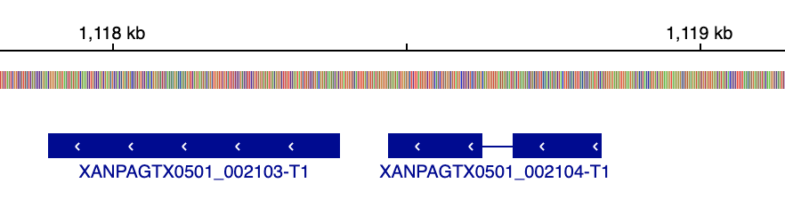
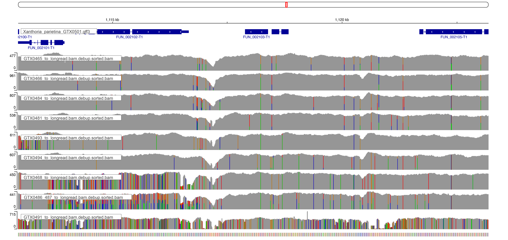
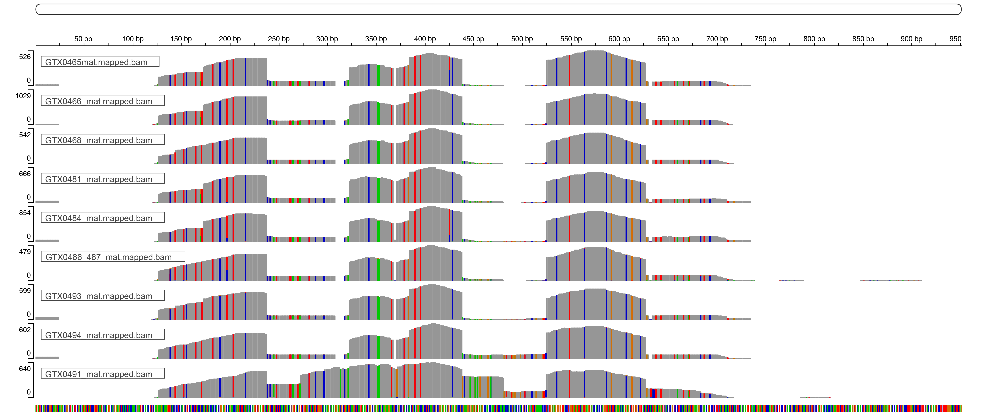
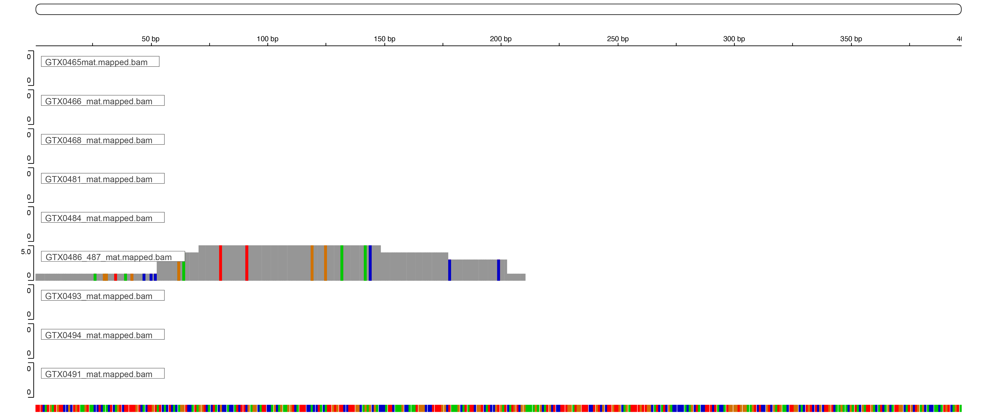
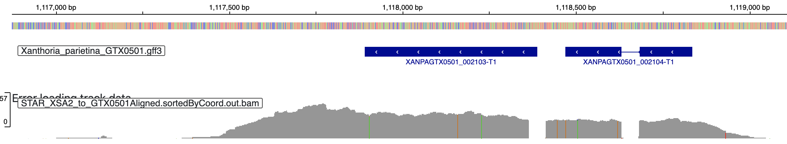
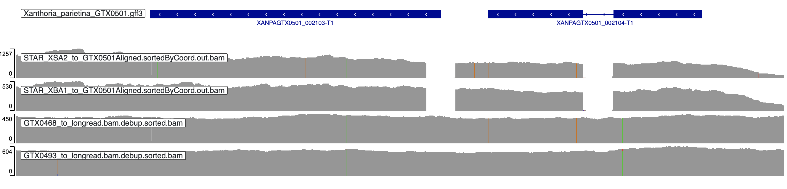
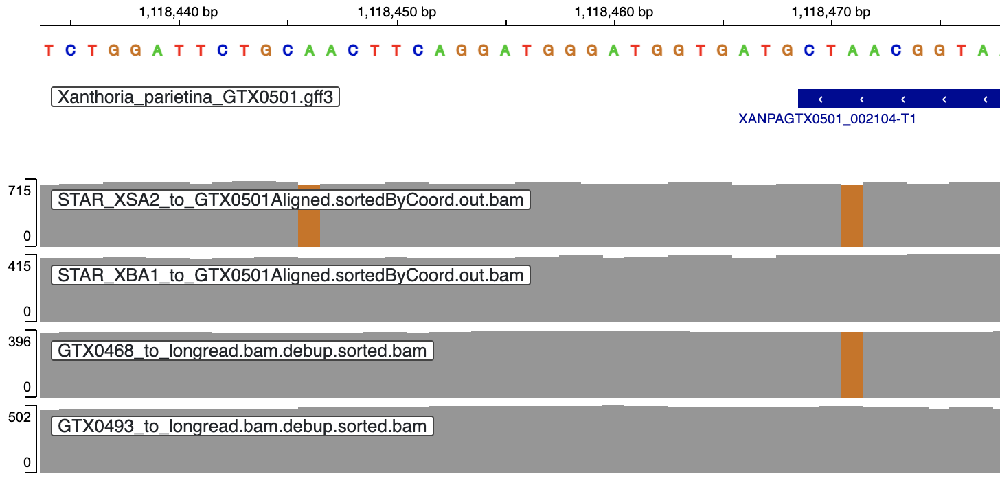

```{r setup, include=FALSE}
knitr::opts_chunk$set(echo = TRUE)
knitr::opts_knit$set(root.dir = "/Users/gol22pin/Documents/Lichen_project_TSL/02_long_read_assemblies/notebook")

```

## Identify MAT locus in the reference
* Searched for the MAT loci and flanking regions in the reference assembly
```
source package d6092385-3a81-49d9-b044-8ffb85d0c446
blastp -query analysis_and_temp_files/06_annotate_lecanoro/mat.faa -subject analysis_and_temp_files/06_annotate_lecanoro/GTX0501_pred/annotate_results/Xanthoria_parietina_GTX0501.proteins.fa -outfmt 6 -out analysis_and_temp_files/08_mat/blastp_mat.txt -evalue 1e-20

>CAI59770.1      XANPAGTX0501_002105-T1  98.684  152     2       0       1       152     898     1049    6.70e-99        305
CAI59772.1      XANPAGTX0501_002102-T1  92.754  69      5       0       1       69      587     655     8.47e-43        145
CAI59769.1      XANPAGTX0501_002102-T1  94.203  69      4       0       2       70      587     655     1.67e-43        147
CAI59767.1      XANPAGTX0501_002105-T1  98.026  152     3       0       1       152     898     1049    4.29e-98        302
CAI59768.2      XANPAGTX0501_002103-T1  60.366  164     62      1       123     286     3       163     1.41e-69        213
CAI59768.2      XANPAGTX0501_002104-T1  55.046  109     44      1       1       109     1       104     3.97e-32        115
```

#### Results:
* XANPAGTX0501_002105-T1 is SLA2
* XANPAGTX0501_002103-T1 and XANPAGTX0501_002104-T1 blast to MAT1-2-1 
* XANPAGTX0501_002102-T1 is DNA lyase

#### XANPAGTX0501_002103-T1 and XANPAGTX0501_002104-T1 are fragments of MAT-1-2-1
* took XANPAGTX0501_002103-T1 and XANPAGTX0501_002104-T1, and CAI59768.2. Aligned them with MAFFT webserver
```{r,message=F,warning=F,fig.width=8,fig.height=8}
library(ggplot2)
library(ggmsa)
library(Biostrings)
library(patchwork)
protein_sequences<-readAAMultipleAlignment("../analysis_and_temp_files/08_mat/GTX0501_mat_align.fa")
rownames(protein_sequences)<-c("Reference MAT-1-2-1 X. polycarpa","XANPAGTX0501_002103","XANPAGTX0501_002104")
al1<-ggmsa(protein_sequences, start=1, end=50,char_width = 0.5,seq_name = T)
al2<-ggmsa(protein_sequences, start=51, end=100,char_width = 0.5, seq_name = T)
al3<-ggmsa(protein_sequences, start=101, end=150,char_width = 0.5, seq_name = T)
al4<-ggmsa(protein_sequences, start=151, end=200,char_width = 0.5, seq_name = T)
al5<-ggmsa(protein_sequences, start=201, end=250,char_width = 0.5, seq_name = T)
al6<-ggmsa(protein_sequences, start=251, end=300,char_width = 0.5, seq_name = T)
al7<-ggmsa(protein_sequences, start=301, end=353,char_width = 0.5, seq_name = T)

al1/al2/al3/al4/al5/al6/al7
ggsave("../analysis_and_temp_files/08_mat/mat_alignment.pdf",device="pdf")
```

* It seems that the reason that funannotate predicted two gene models is the stop codon at the end of XANPAGTX0501_002104. However, it could also be another intron? XANPAGTX0501_002104 already contains one intron



* The presence of stopcodon is confiremid by [an old paper form Honegger](https://www.sciencedirect.com/science/article/pii/S1087184505001374?casa_token=dIpRbpv6-CoAAAAA:2qrij9g_SWvAN55Pvmxgwi9nnkgKKwWvzkXMg6lekBovQZoE-gSYvVU8bFV21E5gS10Axa_f0UW3). They suggest that the stop codon makes MAT-1-2-1 non-functional
* **However, since both these proteins seem to be expressed, the MAT system is probably functional. However, how exactly the protein model should be is unclear. For now, I kept it as funannotate suggested**

## Looking at BAM files' MAT region
### SNPs
* GTX0465 has a few SNPs close to 50/50
* GTX0468 is completely homozygous (corresponds to its MAF plot, which was 100% haploid-looking)
* GTX0493 has a few SNPs with 92/8 (corresponds to its MAF plot, which had a peak at around 0.08)

### Coverage depth
* Coverage of the XANPAGTX0501_002103-T1 and XANPAGTX0501_002104-T1 is the same as in flanking regions in all samples (including X. calcicola GTX0491)
* See `../analysis_and_temp_files/08_mat/mat_bam_all.*`



* Saved screenshots of the individual bam files in the MAT region as `../analysis_and_temp_files/08_mat/GTX0*_mat_bam.png`

## MAT locus in X. calcicola
```
blastp -query analysis_and_temp_files/06_annotate_lecanoro/mat.faa -subject analysis_and_temp_files/06_annotate_lecanoro/GTX0491_pred/annotate_results/Xanthoria_calcicola_GTX0491.proteins.fa -outfmt 6 -out analysis_and_temp_files/08_mat/blastp_mat_GTX0491.txt -evalue 1e-20

>CAI59770.1      XANCAGTX0491_003727-T1  98.684  152     2       0       1       152     851     1002    2.65e-99        305
CAI59772.1      XANCAGTX0491_003730-T1  92.754  69      5       0       1       69      587     655     5.23e-43        145
CAI59769.1      XANCAGTX0491_003730-T1  94.203  69      4       0       2       70      587     655     1.39e-43        147
CAI59767.1      XANCAGTX0491_003727-T1  98.026  152     3       0       1       152     851     1002    1.24e-98        303
CAI59768.2      XANCAGTX0491_003729-T1  56.522  345     144     2       1       344     1       340     6.83e-137       392

```
#### Results:
* XANCAGTX0491_003727-T1: SLA2
* XANCAGTX0491_003729-T1: MAT1-2-1 (maps to the entirety of the reference MAT-1-2-1)
* XANCAGTX0491_003730-T1: DNA lyase
* XANCAGTX0491_003728-T1: not mapping to any of the reference genes
  * according to InterPro, it's a IPR009057 Homeobox-like domain superfamily, suggesting it could be MAT-1-1-1
  * meanwhile XANCAGTX0491_003729-T1, identified as MAT-1-2-1, is a IPR009071 High mobility group box domain. XANPAGTX0501_002103-T1, identified as MAT-1-2-1 in X. parietina, is also IPR009071
  * Lore says this might be a fragment of MAT-1-1-1, which is normal. Her annotation of Letharia MAT region also contained an ORF in the middle
* By contrast with X. parietina, MAT-1-2-1 isn't split between two genes, but it also contains introns. Here, it also has UTR elements


## MAT in metagenomic assemblies
* Searched manually
```
tblastn -query analysis_and_temp_files/06_annotate_lecanoro/mat.faa -subject ../01_Xanthoria_metagenomics/analysis_and_temp_files/03_assembly/GTX0465_megahit/final.contigs.fa -outfmt 6 -out analysis_and_temp_files/08_mat/tblastn_mat_GTX0465.txt -evalue 1e-20

tblastn -query analysis_and_temp_files/06_annotate_lecanoro/mat.faa -subject ../01_Xanthoria_metagenomics/analysis_and_temp_files/03_assembly/GTX0466_megahit/final.contigs.fa -outfmt 6 -out analysis_and_temp_files/08_mat/tblastn_mat_GTX0466.txt -evalue 1e-20

tblastn -query analysis_and_temp_files/06_annotate_lecanoro/mat.faa -subject ../01_Xanthoria_metagenomics/analysis_and_temp_files/03_assembly/GTX0468_megahit/final.contigs.fa -outfmt 6 -out analysis_and_temp_files/08_mat/tblastn_mat_GTX0468.txt -evalue 1e-20

tblastn -query analysis_and_temp_files/06_annotate_lecanoro/mat.faa -subject ../01_Xanthoria_metagenomics/analysis_and_temp_files/03_assembly/GTX0481_megahit/final.contigs.fa -outfmt 6 -out analysis_and_temp_files/08_mat/tblastn_mat_GTX0481.txt -evalue 1e-20

tblastn -query analysis_and_temp_files/06_annotate_lecanoro/mat.faa -subject ../01_Xanthoria_metagenomics/analysis_and_temp_files/03_assembly/GTX0484_megahit/final.contigs.fa -outfmt 6 -out analysis_and_temp_files/08_mat/tblastn_mat_GTX0484.txt -evalue 1e-20

tblastn -query analysis_and_temp_files/06_annotate_lecanoro/mat.faa -subject ../01_Xanthoria_metagenomics/analysis_and_temp_files/03_assembly/GTX0486_487_megahit/final.contigs.fa -outfmt 6 -out analysis_and_temp_files/08_mat/tblastn_mat_GTX0486_487.txt -evalue 1e-20

tblastn -query analysis_and_temp_files/06_annotate_lecanoro/mat.faa -subject ../01_Xanthoria_metagenomics/analysis_and_temp_files/03_assembly/GTX0493_megahit/final.contigs.fa -outfmt 6 -out analysis_and_temp_files/08_mat/tblastn_mat_GTX0493.txt -evalue 1e-20

tblastn -query analysis_and_temp_files/06_annotate_lecanoro/mat.faa -subject ../01_Xanthoria_metagenomics/analysis_and_temp_files/03_assembly/GTX0494_megahit/final.contigs.fa -outfmt 6 -out analysis_and_temp_files/08_mat/tblastn_mat_GTX0494.txt -evalue 1e-20

tblastn -query analysis_and_temp_files/06_annotate_lecanoro/mat.faa -subject ../01_Xanthoria_metagenomics/analysis_and_temp_files/03_assembly/GTX0491_megahit/final.contigs.fa -outfmt 6 -out analysis_and_temp_files/08_mat/tblastn_mat_GTX0491.txt -evalue 1e-20
```
#### several assemblies have hits to MAT-1-1-1 (CAI59771.1), but they are probably from other fungi
* In GTX0484, it's on an unbinned contig with 5X coverage (compared to ~465X of the mycobiont MAG). It's also only 41% identical to X. polycarpa MAT-1-1-1 (compared to 98% identical MAT-1-2-1)
```
CAI59771.1      k141_374508     40.909  132     76      1       81      210     2230    1835    7.30e-22        100
```
* In GTX0486_487, it's on an contig with 15X coverage (compared to ~750X of the mycobiont MAG). The contig is assigned to bin.100, which is an additional fungal MAG sister to Candelaria. It's only 41% identical to X. polycarpa MAT-1-1-1 (compared to 98% identical MAT-1-2-1)
```
CAI59771.1      k141_1127905    41.250  160     89      2       44      200     68164   67691   2.08e-34        138
```

## MAT in reads
* Got nucleotide fasta for MAT-1-1-1 and MAT-1-2-1 (only itself, without flanking regions!) from X. elegans, saved it as `analysis_and_temp_files/08_mat/mat_genbank_no_flanking.fna`
```{r,eval=F}
sbatch --mem=10G -c 1 --wrap="code/index_bwa.sh analysis_and_temp_files/08_mat/mat_genbank_no_flanking.fna"

sbatch --mem=10G -c 1 --wrap="source package 638df626-d658-40aa-80e5-14a275b7464b; samtools faidx analysis_and_temp_files/08_mat/mat_genbank_no_flanking.fna"

sbatch --mem=20G -c 20 --wrap='source package fa33234e-dceb-4a58-9a78-7bcf9809edd7; source package 638df626-d658-40aa-80e5-14a275b7464b; for sample in GTX0465 GTX0466 GTX0468 GTX0481 GTX0484 GTX0486_487 GTX0491 GTX0493 GTX0494; do bwa mem analysis_and_temp_files/08_mat/mat_genbank_no_flanking.fna ../01_Xanthoria_metagenomics/data/fastq/"$sample"_trimmed.1.fq.gz ../01_Xanthoria_metagenomics/data/fastq/"$sample"_trimmed.2.fq.gz -t 20 -M | samtools view -Su - | samtools sort -l 5 -O bam -T "$sample"_mat -@ 20 > analysis_and_temp_files/08_mat/"$sample"_mat.bam; samtools view -b -F 4 analysis_and_temp_files/08_mat/"$sample"_mat.bam > analysis_and_temp_files/08_mat/"$sample"_mat.mapped.bam; samtools index analysis_and_temp_files/08_mat/"$sample"_mat.mapped.bam; rm analysis_and_temp_files/08_mat/"$sample"_mat.bam; done'
```
* MAT-1-2-1 had read aligned (although only some portion of the gene, maybe introns were too different between X. parietina and X. elegans?)




#### No reads mapped to MAT-1-1-1, except for one sample



* from GTX0486_487, 5 reads mapped to MAT-1-1-1 (in contrast, for MAT-1-2-1, the coverage was 479x). 
* The reads cover 222 bp, and have no contradiction in sequences, so I assembled them manually to a consensus sequence
* It's the same sample that had a 15x coverage contig with a match to MAT-1-1-1. However, the reads do not match this contig! 
* Instead, they are very similar to the X. elegans MAT-1-1-1 locus (90% identical over the 222bp fragment)
* When blasted against NCBI, the only hit was to the original X. elegans MAT-1-1-1
  * For comparison, when I blasted one of the reads mapped to MAT-1-2-1, I only got hit to the X. elegans MAT-1-1-1, with 99% identical 

#### Conclusion: 8/9 have no trace of MAT-1-1-1. I will need to check with Hanna's lab to interpret the few reads mapped to MAT-1-1-1 in GTX0486_487

## Is MAT one genes or two?
* Will check whether the two models withing MAT1-2-1 are actually one, but with an in-line intron
* To check for it, will map a library from apothecia (XSA2), and align it to the genome with STAR v2.7.10a
```
mkdir analysis_and_temp_files/06_annotate_lecanoro/GTX0501_xanthoria_nuclear_mag_STAR_index

sbatch --mem=15G -c 10 --partition=tsl-short --wrap="source package 266730e5-6b24-4438-aecb-ab95f1940339; STAR --runThreadN 10 \
--runMode genomeGenerate \
--genomeDir analysis_and_temp_files/06_annotate_lecanoro/GTX0501_xanthoria_nuclear_mag_STAR_index \
--genomeFastaFiles  analysis_and_temp_files/06_annotate_lecanoro/GTX0501_xanthoria_nuclear_mag_clean_sort.fa"

sbatch --mem=15G -c 10 --partition=tsl-short --wrap="source package 266730e5-6b24-4438-aecb-ab95f1940339; STAR --genomeDir analysis_and_temp_files/06_annotate_lecanoro/GTX0501_xanthoria_nuclear_mag_STAR_index \
--runThreadN 10 \
--readFilesIn ../03_transcriptomic_analysis/analysis_and_temp_files/03_qc/trimmed_reads/XSA2_trimmed.bbmapmerged.non_rRNA.1.fq.gz  ../03_transcriptomic_analysis/analysis_and_temp_files/03_qc/trimmed_reads/XSA2_trimmed.bbmapmerged.non_rRNA.2.fq.gz \
--readFilesCommand zcat \
--outFileNamePrefix analysis_and_temp_files/08_mat/STAR_XSA2_to_GTX0501 \
--outSAMtype BAM SortedByCoordinate \
--outSAMunmapped Within \
--outSAMattributes Standard "
    
sbatch --mem=15G -c 10 --partition=tsl-short --wrap="source package c92263ec-95e5-43eb-a527-8f1496d56f1a; samtools index analysis_and_temp_files/08_mat/STAR_XSA2_to_GTX0501Aligned.sortedByCoord.out.bam"
```
* Results: in the cDNA sequences, there is no stop codon there! Instead of TGA, it's GGA! * Based on this mapping, the intron of XANPAGTX0501_002104-T1 is correctly identified by funannotate
* But the 'ending' of XANPAGTX0501_002104-T1 due to the stop codon isn't right, the mapping continues beyond it (but there is still a gap between it and XANPAGTX0501_002103-T1, probably an intron)

```{r}
library(kableExtra)

```

* If I manually extend translation to cover this 'extended' portion of XANPAGTX0501_002104-T1, it will add to the end of it sequence 'QHHHPILKLQNPDLHNNQI', which is an almost perfect match to the 'missing' portion of the X. polycarpa MAT
  * the 'Q' in the beginning replaces the stop codon!

* Get the same info from all lichen metatranscriptomes
```
sbatch --mem=15G -c 10 --partition=tsl-medium --wrap='source package 266730e5-6b24-4438-aecb-ab95f1940339; for sample in XBA1 XBA2 XBC1 XBC2 XBE1 XBE2 XMC2 XSA1 XSA2_2 XSC1 XSC2 XSE2 XTA1 XTA2 XTC2 XTE2; do STAR --genomeDir analysis_and_temp_files/06_annotate_lecanoro/GTX0501_xanthoria_nuclear_mag_STAR_index \
--runThreadN 10 \
--readFilesIn ../03_transcriptomic_analysis/analysis_and_temp_files/03_qc/trimmed_reads/"$sample"_trimmed.bbmapmerged.non_rRNA.1.fq.gz  ../03_transcriptomic_analysis/analysis_and_temp_files/03_qc/trimmed_reads/"$sample"_trimmed.bbmapmerged.non_rRNA.2.fq.gz \
--readFilesCommand zcat \
--outFileNamePrefix analysis_and_temp_files/08_mat/STAR_"$sample"_to_GTX0501 \
--outSAMtype BAM SortedByCoordinate \
--outSAMunmapped Within \
--outSAMattributes Standard; done'

sbatch --mem=15G -c 10 --partition=tsl-short --wrap='source package c92263ec-95e5-43eb-a527-8f1496d56f1a; for sample in XBA1 XBA2 XBC1 XBC2 XBE1 XBE2 XMC2 XSA1 XSA2_2 XSC1 XSC2 XSE2 XTA1 XTA2 XTC2 XTE2; do samtools index analysis_and_temp_files/08_mat/STAR_"$sample"_to_GTX0501Aligned.sortedByCoord.out.bam; done'

sbatch --mem=15G -c 10 --partition=tsl-short --wrap='source package c92263ec-95e5-43eb-a527-8f1496d56f1a; for sample in XBA1 XBA2 XBC1 XBC2 XBE1 XBE2 XMC2 XSA1 XSA2 XSA2_2 XSC1 XSC2 XSE2 XTA1 XTA2 XTC2 XTE2; do bcftools mpileup --annotate FORMAT/AD -r Xp_GTX0501_3:1118471-1118471 --fasta-ref analysis_and_temp_files/06_annotate_lecanoro/GTX0501_xanthoria_nuclear_mag_clean_sort.fa  analysis_and_temp_files/08_mat/STAR_"$sample"_to_GTX0501Aligned.sortedByCoord.out.bam | bcftools view  --no-header > analysis_and_temp_files/08_mat/"$sample"_stopcodon.mplieup; done'

cat analysis_and_temp_files/08_mat/X*_stopcodon.mplieup

XBA1       A       <*>     PL:AD   0,255,237:143,0
XBA2       A       T,<*>   PL:AD   0,236,208,255,214,211:89,2,0
XBC1       A       T,<*>   PL:AD   0,133,204,148,207,204:49,1,0
XBC2       A       <*>     PL:AD   0,181,188:60,0
XBE1       A       <*>     PL:AD   0,105,202:35,0
XBE2       A       T,<*>   PL:AD   0,32,158,42,161,160:14,1,0
XMC2       A       G,<*>   PL:AD   191,66,0,191,66,191:0,22,0
XSA1       A       G,<*>   PL:AD   219,255,0,222,255,221:1,99,0
XSA2_2     A       G,<*>   PL:AD   230,255,0,230,255,230:0,118,0
XSA2       A       G,<*>   PL:AD   225,255,0,225,255,225:0,111,0
XSC1       A       G,T,<*> PL:AD   210,223,0,213,207,210,210,223,213,210:0,74,1,0
XSC2       A       G,<*>   PL:AD   211,255,0,211,255,211:0,92,0
XSE2       A       G,<*>   PL:AD   208,154,0,208,154,208:0,51,0
XTA1       A       G,<*>   PL:AD    0,255,208,255,214,213:107,2,0
XTA2       A       G,T,<*> PL:AD   117,0,143,255,236,255,255,248,255,255:53,35,1,0
XTC2       A       G,<*>   PL:AD   149,0,106,245,255,255:32,54,0
XTE2       A       G,<*>   PL:AD   140,0,134,254,255,255:38,45,0
```
* Results:
  * 7 samples with A (from XB1, XB2, XT1)
  * 7 samples with G (from XM2, XS1, XS2)
  * 3 sample with A and G mixed (from XT2)
* Looking at the bam file of XBA1 (has A). The mapping of RNA data looks the same, despite the stop codon!


### How does it look in the metagenomic data?
```
source package c92263ec-95e5-43eb-a527-8f1496d56f1a
for sample in GTX0465 GTX0466 GTX0468 GTX0481 GTX0484 GTX0486_487 GTX0491 GTX0493 GTX0494; do bcftools mpileup --annotate FORMAT/AD -r Xp_GTX0501_3:1118471-1118471 --fasta-ref analysis_and_temp_files/06_annotate_lecanoro/GTX0501_xanthoria_nuclear_mag_clean_sort.fa analysis_and_temp_files/07_snp/"$sample"_to_longread.bam.debup.sorted | bcftools view  --no-header -o analysis_and_temp_files/08_mat/"$sample"_stopcodon.mplieup; done

cat analysis_and_temp_files/08_mat/G*_stopcodon.mplieup

>modified output
GTX0465       A       C,<*>   PL:AD   0,255,255,255,255,255:285,2,0
GTX0466       A       <*>   PL:AD   0,255,255:350,0
GTX0468       A       G,<*>   PL:AD    255,255,0,255,255,255:0,289,0
GTX0481       A       G,T,<*>   PL:AD   0,255,255,255,255,255,255,255,255,255:303,4,1,0
GTX0484       A       C,<*>   PL:AD   0,255,255,255,255,255:344,1,0
GTX0486_487       A       G,T,<*>    PL:AD   255,255,0,255,255,255,255,255,255,255:0,287,1,0
GTX0493       A       C,<*>   PL:AD   0,255,255,255,255,255:314,1,0
GTX0494       A       G,<*>   PL:AD   255,36,0,255,255,255:47,253,0

```
* Results: in 5 samples the base is A
  * in 2 samples (GTX0468,GTX0486_487), it's G, same as in XSA2! These are the two concrete samples
  * in 1 sample (GTX0494), it's G:A with 5.4:1 ratio. 
* This is consistent with the metatranscriptomic data. All concrete samples have G, most of bark samples have A


* Visualized 4 samples: 2 metagenomic and 2 metatranscriptomic; 2 from bark and 2 from stone
```{r}

```

* Zoom in
```{r}

```

## Can we trust the annotatiations of Xanthoria MAT from Scherrer et al.?
* Could it be that there is a frame shift in MAT (due to an intron), and that's why I see a stop codon there
* Initially I thought it being unlikely because both XANPAGTX0501_002103-T1 and XANPAGTX0501_002104-T1 are very similar to different parts of MAT from X. polycarpa. But what if the X. polycarpa protein sequence isn't accurate? 
* To make sure, I aligned my MAT sequences with:
  * MAT from Letharia (QEL51133.1) from Veera's paper, which was vetted using RNA data
  * MAT from Fusarium (AMP43946.1)
  * MAT from Aureobasidium (QBQ58040.3)
* For all, there is clear similarity to XANPAGTX0501_002103-T1 and XANPAGTX0501_002104-T1
* Moreover, the last aa of XANPAGTX0501_002104-T1 (just before the supposed stop codon) are coming from a conserved part (sequence: NAFILYR)
* **Conclusion:** all evidence is that there is no frame shift in our annotations


## Potential mRNA-editing
* In [Bian et al.](https://www.pnas.org/doi/10.1073/pnas.2319235121) they report mRNA editing in fungi mediated by tRNA-editing enzymes
* As a result, A is processed as G. In our case, that would mean UAG -> UGG (Trp=W). W is quite different from Q (which is CAG, what we have in the bark samples and in X.polycarpa)
* Bian et al. identified two proteins, TAD2 and TAD3. TAD2 homolog is XANPAGTX0501_007133-T1, didn't find TAD3 
* TAD2 is constituitively expressed, both in our data and in Bian et al.
* Bian et al. report different variants of TAD2 between hyphae and perythecea
* I compared bams between one culture sample, and 4 lichen samples (2 from apothecia and 2 from edge; 2 from bark and 2 from stone)
* All look more or less the same
```{r}
library(kableExtra)
knitr::include_graphics("../analysis_and_temp_files/08_mat/TAD2.png")
```

* Could still be it?

* Get bams from the transcriptomes from culture
```
sbatch --mem=15G -c 10 --partition=tsl-medium --wrap='source package 266730e5-6b24-4438-aecb-ab95f1940339; for sample in KS48XB1 KS48XB2 KS48XB3 KS9XB1 KS9XB2 KS9XB3 S_21XB1 S_21XB3 KS21XB1 S_42XB1 S_42XB2 S_42XB3; do STAR --genomeDir analysis_and_temp_files/06_annotate_lecanoro/GTX0501_xanthoria_nuclear_mag_STAR_index \
--runThreadN 10 \
--readFilesIn ../03_transcriptomic_analysis/analysis_and_temp_files/03_qc/trimmed_reads/"$sample"_trimmed.bbmapmerged.non_rRNA.1.fq.gz  ../03_transcriptomic_analysis/analysis_and_temp_files/03_qc/trimmed_reads/"$sample"_trimmed.bbmapmerged.non_rRNA.2.fq.gz \
--readFilesCommand zcat \
--outFileNamePrefix analysis_and_temp_files/08_mat/STAR_"$sample"_to_GTX0501 \
--outSAMtype BAM SortedByCoordinate \
--outSAMunmapped Within \
--outSAMattributes Standard; done'

sbatch --mem=15G -c 10 --partition=tsl-short --wrap='source package c92263ec-95e5-43eb-a527-8f1496d56f1a; for sample in KS48XB1 KS48XB2 KS48XB3 KS9XB1 KS9XB2 KS9XB3 S_21XB1 S_21XB3 KS21XB1 S_42XB1 S_42XB2 S_42XB3; do samtools index analysis_and_temp_files/08_mat/STAR_"$sample"_to_GTX0501Aligned.sortedByCoord.out.bam; done'

sbatch --mem=15G -c 10 --partition=tsl-short --wrap='source package c92263ec-95e5-43eb-a527-8f1496d56f1a; for sample in KS48XB1 KS48XB2 KS48XB3 KS9XB1 KS9XB2 KS9XB3 S_21XB1 S_21XB3 KS21XB1 S_42XB1 S_42XB2 S_42XB3; do bcftools mpileup --annotate FORMAT/AD -r Xp_GTX0501_3:1118471-1118471 --fasta-ref analysis_and_temp_files/06_annotate_lecanoro/GTX0501_xanthoria_nuclear_mag_clean_sort.fa  analysis_and_temp_files/08_mat/STAR_"$sample"_to_GTX0501Aligned.sortedByCoord.out.bam | bcftools view  --no-header > analysis_and_temp_files/08_mat/"$sample"_stopcodon.mplieup; done'

cat analysis_and_temp_files/08_mat/*S*XB*_stopcodon.mplieup
```
* Looking for TAD3
```
sbatch --mem=15G -c 10 --partition=tsl-short --wrap='source package d6092385-3a81-49d9-b044-8ffb85d0c446; blastp -query analysis_and_temp_files/08_mat/tad3.fa -subject analysis_and_temp_files/06_annotate_lecanoro/GTX0501_pred/annotate_results/Xanthoria_parietina_GTX0501.proteins.fa -evalue 1e-10 -outfmt 6 -out analysis_and_temp_files/08_mat/blastp_tad3.txt'

>sp|Q9URQ3|TAD3_YEAST    XANPAGTX0501_010356-T1  50.000  50      25      0       237     286     110     159     9.87e-12        62.4
```
* XANPAGTX0501_010356 is a 'hypothetical protein', InterPro annotations are consistent with it being TAD3
* TAD3 has different isomorphs, based on the substrate
```{r}
library(kableExtra)
knitr::include_graphics("../analysis_and_temp_files/08_mat/TAD3.png")
```

* After some thinking, I realized that mRNA editing would result in mRNA being different from the genome. But this is not our case!

### Other explanations
* (Fang et al. 2002)[https://www.sciencedirect.com/science/article/pii/S1087184502000142#BIB9] show mutants of Neurospora that can suppress UAG codon specifically. This fits, but I can't find any recent confirmation of this??

