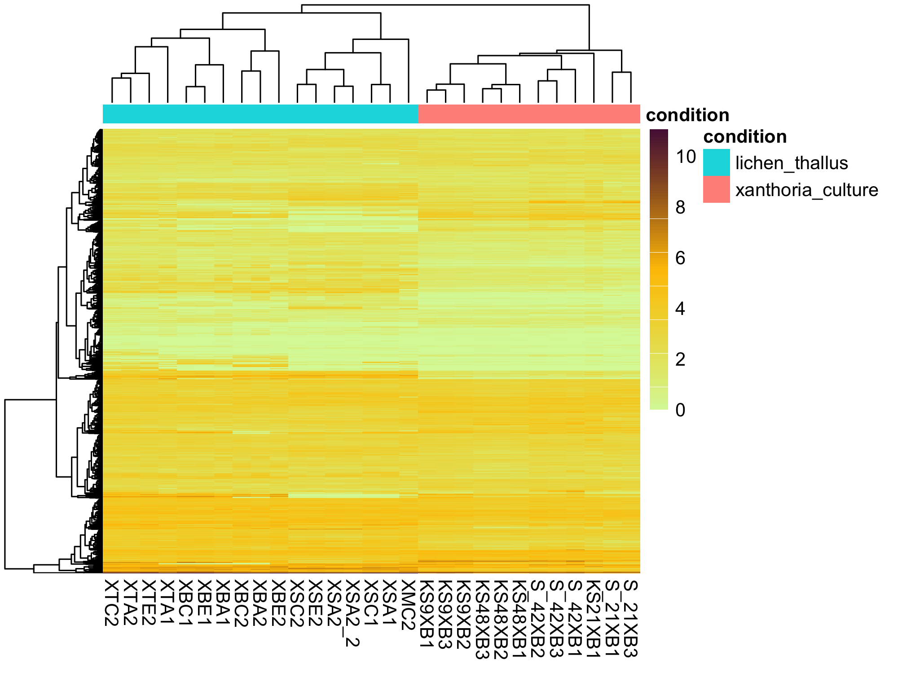

```{r setup, include=FALSE}
library(kableExtra)
knitr::opts_chunk$set(echo = TRUE)
knitr::opts_knit$set(root.dir = "/Users/gol22pin/Documents/Lichen_project_TSL/11_omics_manuscript/repo_public/2024-Multipartite-complexity-omics-Xanthoria/03_transcriptomic_analysis/notebook")
```
**Rationale:** This script performs differential gene expression (dge) and calculates the upregulated and downregulated genes in lichen samples versus Xanthoria culture samples using edgeR and Sleuth

## 1. Prepare

#### Load the libraries


```{r, include=FALSE}
library(here)
lapply(c("tidyverse","stringr","dplyr","limma","edgeR","gplots"), library, character.only = T)
```


#### Create counts table from kallisto output which will be used for further dge analysis 

 
```{r }
counts<-read.delim2("../analysis_and_temp_files/06_meta_mapping/kallisto_mycobiont_only.txt",sep=" ")
metadata<-read.csv2("../analysis_and_temp_files/06_meta_mapping/metadata_shared_with_neha.csv",sep=",")

# Extract locus_tag from target_id (XANPAGTX0501 for nuclear genome and GTX0501mito for mito genome) - OPTIONAL
counts[c("locus_tag","rest")]<-str_split_fixed(counts$target_id,'_',n=2)

# Tabulate the counts
counts_tab<-pivot_wider(counts[c(1,4,6)],names_from=sample,values_from = est_counts)
head(counts_tab)

write.table(counts_tab,"../analysis_and_temp_files/08_dge_culture_lichen/counts_table.tsv",quote=F,sep="\t",row.names = F) # Final table that will be used for dge calculation
```


#### Read the counts table (or Start running the script from this step)


```{r }
full<-read.delim("../analysis_and_temp_files/08_dge_culture_lichen/counts_table.tsv",row.names=1)
d<-full %>% select(-MP_I,-MP_II) #remove MP_I and MP_II samples (based on previous correlation heatmaps)
colnames(d)
head(d,5:5)

```


#### Remove lowly expressed genes


```{r }
# create new column, "max" for the max read count in each row
d$max<-apply(d,1,max)
min(d$max)
d1<-d[which(d$max>=5),] #to remove lowly expressed genes, keep rows in which max read count across whole panel is atleast 5

# drop the max column, as its not needed anymore
raw_counts<-d1 %>% select(-max)
length(rownames(d1)) # total number of genes
length(rownames(raw_counts)) # number after removal of lowly expressed genes
```

## 2. Generate DGE list with Sleuth
* followed tutorial [here](https://pachterlab.github.io/sleuth_walkthroughs/trapnell/analysis.html). Used the log2 transformation function following Dan's analysis and Xia's paper. Used following cutoffs:
  * qva<= 0.05 (standard)
  * In place of logFC cutoff, used the cutoff of abs(b)>1, following Xia's paper
```{r}
library(sleuth)
kal_dirs <- data.frame("sample"=metadata$run_id, "condition"=metadata$sample_type,
                       "path"=paste0("../analysis_and_temp_files/06_meta_mapping/kallisto_meta_mapping/",metadata$run_id,"_kallisto")) %>% filter(sample!="MP_II" & sample!="MP_I")

#define list of genes to be included: only mycobiont and only those that have  read count across whole panel of >=5
target_id<-rownames(d1)
so <- sleuth_prep(kal_dirs, extra_bootstrap_summary = TRUE,filter_target_id = target_id,transformation_function = function(x) log2(x + 0.1))

so <- sleuth_fit(so, ~condition, 'full')
so <- sleuth_fit(so, ~1, 'reduced')
so <- sleuth_lrt(so, 'reduced', 'full')
so <- sleuth_wt(so, 'conditionxanthoria_culture')
plot_pca(so, color_by = 'condition', text_labels = TRUE,use_filtered=T,units="tpm")

sleuth_table <- sleuth_results(so, 'conditionxanthoria_culture')
sig <- sleuth_table %>% tibble::as_tibble() %>% 
  filter( qval <= 0.05, grepl("GTX0501",target_id) ) %>% 
  arrange(desc(b)) %>% mutate(change = if_else(b > 1, "culture", ifelse(b< -1, "lichen", "low_logFC")))

table(sig$change)
```

* Save image
```{r}
pca<-plot_pca(so, color_by = 'condition', text_labels = F,use_filtered=T,units="tpm")
pca+theme_bw()+theme(text=element_text(size=7))
ggsave('../results/lichen_culture_pca.pdf',width = 4.5, height = 3)

```

* PCA: exploring the variation explained by the different PCs
```{r}
plot_pc_variance(so,use_filtered=T,units="tpm")
```

* Get numeric values
```{r}
ppv <- plot_pc_variance(so,use_filtered=T,units="tpm")
PCpc <- ppv$data$var
names(PCpc) <- paste0("PC", seq(1:length(PCpc)))
PCpc
```


### 2.3. Save gene lists
```{r}
funannot<-read.delim2("../../02_mycobiont_genome/analysis_and_temp_files/06_annotate_lecanoro/Annotation_with_OG.txt",sep="\t")


sig2<-sig %>% left_join(funannot, by=c("target_id"="TranscriptID"))

upreg_sl=sig2 %>% filter(change=="lichen") %>% select(-c(CDS.transcript,Translation,gDNA,mRNA))
downreg_sl=sig2 %>% filter(change=="culture")%>% select(-c(CDS.transcript,Translation,gDNA,mRNA))

write.table(upreg_sl, "../analysis_and_temp_files/08_dge_culture_lichen/upreg_in_lichen_sleuth.txt", append="false", sep = "\t", quote=F, row.names = F)
write.table(downreg_sl, "../analysis_and_temp_files/08_dge_culture_lichen/upreg_in_culture_sleuth.txt", append="false", sep = "\t", quote=F, row.names = F)

tabd_df <- so$obs_norm[so$obs_norm$target_id %in% target_id,]
tabd_df <- dplyr::select(tabd_df, target_id, sample, 
            tpm)
tabd_df <- reshape2::dcast(tabd_df, target_id ~ sample, 
            value.var = "tpm") 
write.table(tabd_df, "../analysis_and_temp_files/08_dge_culture_lichen/norm_counts_sleuth.txt", append="false", sep = "\t", quote=F, row.names = F)

```


### 2.4. bootstrap of several genes
* Picked the gene with maximal b-value (log2 fold changes between conditions). Here, b-value > 0 means overrexpression in culture
```{r}
plot_bootstrap(so, 
               target_id = sig$target_id[which.max(sig$b)], 
               units = "est_counts", 
               color_by = "condition")
```

* Picked the gene with minimal b-value, i.e. most strongly overrexpressed in lichen
```{r}
plot_bootstrap(so, 
               target_id = sig$target_id[which.min(sig$b)], 
               units = "est_counts", 
               color_by = "condition")
```


* Picked the gene with minimal absolute b-value, i.e. with the lowest fold change difference. The b for it is `sig$b[which.min(abs(sig$b))]` and the q-value (p-value adjusted for multiple test correction) is `sig$qval[which.min(abs(sig$b))]`, but you can see the difference between sample types somewhat
```{r}
plot_bootstrap(so, 
               target_id = sig$target_id[which.min(abs(sig$b))], 
               units = "est_counts", 
               color_by = "condition")
```

## 2.5. GO enrichment analysis on sleuth
* Upregulated in lichen: largely consistent wiht the edgeR results
```{r,fig.width=12,fig.height=14 }
###make table with GO annotations
go_df <-funannot %>% select(TranscriptID,GO.Terms_new) %>% 
  mutate(GO.Terms_new = strsplit(GO.Terms_new, ",")) %>%
        unnest(GO.Terms_new) %>%
  mutate(GO.Terms=sub(".*? ", "", GO.Terms_new),
         short_term = substr(GO.Terms, 1,40))

go_data <- list(
    term2protein = data.frame(
                        term = go_df$GO.Terms_new,
                        gene = go_df$TranscriptID
                        ),
    term2name = data.frame(
                        term = go_df$GO.Terms_new,
                        name = go_df$short_term
                        ),
    
    universe = unique(as.character(go_df$TranscriptID))
)


### select genes upregulated in lichens and order them by fold change
geneList5 = sig$b[sig$change=="lichen"]
names(geneList5) = sig$target_id[sig$change=="lichen"]
geneList5 = sort(geneList5, decreasing = F)
geneList5 <- names(geneList5)

###enrichment analysis
enrich5<-clusterProfiler::enricher(geneList5,
    pAdjustMethod = "none",
    minGSSize = 1,
    maxGSSize = 2000,
    qvalueCutoff = 1,
    universe=go_data$universe,
    TERM2GENE=go_data$term2protein,
    TERM2NAME=go_data$term2name)

enrichplot::dotplot(enrich5,showCategory=40,label_format=40)
```

* As a graph:
```{r, message = FALSE,fig.width=12,fig.height=12 }
enrich5_pairwise<-enrichplot::pairwise_termsim(enrich5)
enrichplot::emapplot(enrich5_pairwise)
```

* Upregulated in culture
```{r,fig.width=12,fig.height=14 }

### select genes upregulated in lichens and order them by fold change
geneList6 = sig$b[sig$change=="culture"]
names(geneList6) = sig$target_id[sig$change=="culture"]
geneList6 = sort(geneList6, decreasing = T)
geneList6 <- names(geneList6)

###enrichment analysis
enrich6<-clusterProfiler::enricher(geneList6,
    pAdjustMethod = "none",
    minGSSize = 1,
    maxGSSize = 2000,
    qvalueCutoff = 1,
    universe=go_data$universe,
    TERM2GENE=go_data$term2protein,
    TERM2NAME=go_data$term2name)

enrichplot::dotplot(enrich6,showCategory=40,label_format=40)
```

* As a graph
```{r, message = FALSE,fig.width=12,fig.height=12 }
enrich6_pairwise<-enrichplot::pairwise_termsim(enrich6)
enrichplot::emapplot(enrich6_pairwise)
```


## 2.6. InterPro enrichment analysis on sleuth
* Upregulated in lichen
```{r,fig.width=12,fig.height=14 }
###make table with IPS annotations
ips_df <-funannot %>% select(TranscriptID,InterPro_new) %>% 
  mutate(InterPro_new = strsplit(InterPro_new, ", I")) %>%
        unnest(InterPro_new) %>% mutate(InterPro_new=str_replace(InterPro_new,"^PR","IPR")) %>%
  mutate(short_term = substr(InterPro_new, 1,40))


ips_data <- list(
    term2protein = data.frame(
                        term = ips_df$InterPro_new,
                        gene = ips_df$TranscriptID
                        ),
    term2name = data.frame(
                        term = ips_df$InterPro_new,
                        name = ips_df$short_term
                        ),
    
    universe = unique(as.character(ips_df$TranscriptID))
)

enrich7<-clusterProfiler::enricher(geneList5,
    pAdjustMethod = "none",
    minGSSize = 1,
    maxGSSize = 2000,
    qvalueCutoff = 1,
    universe=ips_data$universe,
    TERM2GENE=ips_data$term2protein,
    TERM2NAME=ips_data$term2name)

enrichplot::dotplot(enrich7,showCategory=40,label_format=40)
```
* Upregulated in lichen as a graph
```{r, message = FALSE,fig.width=12,fig.height=12 }
enrich7_pairwise<-enrichplot::pairwise_termsim(enrich7)
enrichplot::emapplot(enrich7_pairwise)
```

* Save the image
```{r}
pdf(file="../results/lichen_upr.pdf",width=5,height=4)
enrichplot::emapplot(enrich7_pairwise,cex_label_category=0.4,cex_line=0.25,
                     shadowtext=F,cex_pie2axis=0.1,repel=T)
dev.off()

```

* Upregulated in culture
```{r, message = FALSE,fig.width=10,fig.height=10 }
enrich8<-clusterProfiler::enricher(geneList6,
    pAdjustMethod = "none",
    minGSSize = 1,
    maxGSSize = 2000,
    qvalueCutoff = 1,
    universe=ips_data$universe,
    TERM2GENE=ips_data$term2protein,
    TERM2NAME=ips_data$term2name)

enrichplot::dotplot(enrich8,showCategory=40,label_format=40)
```
* Upregulated in culture as a graph
```{r, message = FALSE,fig.width=12,fig.height=12 }
enrich8_pairwise<-enrichplot::pairwise_termsim(enrich8)
enrichplot::emapplot(enrich8_pairwise)
```

* Save the image
```{r}
pdf(file="../results/culture_upr.pdf",width=5,height=4)
enrichplot::emapplot(enrich8_pairwise,cex_label_category=0.4,cex_line=0.25,
                     shadowtext=F,cex_pie2axis=0.1,repel=T)
dev.off()

```

## 2.7. These enrichment plots need to be taken with a grain of salt
* Among the upregulated in lichens genes only `r ((upreg_sl %>% filter(GO.Terms_new!="") %>% nrow()) *100)/ (upreg_sl %>% nrow())` % have GO annotations and `r ((upreg_sl %>% filter(InterPro_new!="") %>% nrow()) *100)/ (upreg_sl %>% nrow())` % have InterPro annotations
* Among the upregulated in culture genes only `r ((downreg_sl %>% filter(GO.Terms_new!="") %>% nrow()) *100)/ (downreg_sl %>% nrow())` % have GO annotations and `r ((downreg_sl %>% filter(InterPro_new!="") %>% nrow()) *100)/ (downreg_sl %>% nrow())` % have InterPro annotations
* These numbers **are lower** than general stats for the genome:
  * `r ((funannot %>% filter(GO.Terms_new!="") %>% nrow()) *100)/ (funannot %>% nrow())` % have GO annotations
  * `r ((funannot %>% filter(InterPro_new!="") %>% nrow()) *100)/ (funannot %>% nrow())` % have InterPro annotations
* Visualize these proportions
```{r, fig.show="hold"}
perc<-funannot %>% mutate(go_annotated=ifelse(!(is.na(GO.Terms_new)),"Annotated","Non-annotated"),
         ipr_annotated=ifelse(!(is.na(InterPro_new)),"Annotated","Non-annotated"),
         gene_set=case_when(
           TranscriptID %in% sig$target_id[sig$change=="culture"] ~ "Upregulated in culture",
          TranscriptID %in% sig$target_id[sig$change=="lichen"] ~ "Upregulated in lichen",
          T ~ "non-DGE"))

ipr_perc_dge<- perc %>% group_by(gene_set,ipr_annotated) %>% summarize(n=n()) %>% mutate(database="InterPro",annotated=ipr_annotated) %>% select(-ipr_annotated)
go_perc_dge <- perc %>% group_by(gene_set,go_annotated) %>% summarize(n=n()) %>% mutate(database="GO",annotated=go_annotated) %>% select(-go_annotated)
ipr_perc_all<- perc %>% group_by(ipr_annotated) %>% summarize(n=n()) %>% mutate(database="InterPro",gene_set="Whole transcriptome",annotated=ipr_annotated) %>% select(-ipr_annotated)
go_perc_all <- perc %>% group_by(go_annotated) %>% summarize(n=n()) %>% mutate(database="GO",gene_set="Whole transcriptome",annotated=go_annotated) %>% select(-go_annotated)
perc2<-rbind(ipr_perc_dge,go_perc_dge,ipr_perc_all,go_perc_all)
perc2$annotated<-factor(perc2$annotated,levels=c("Non-annotated","Annotated"))

ggplot(perc2 %>% filter(gene_set %in% c("Upregulated in culture","Upregulated in lichen")),
       aes(x=database,y=n,fill=annotated))+geom_bar(position="stack",stat="identity")+
  facet_wrap(~gene_set)
```
* Instead of two datatbases, visualize the number of proteins with any kind of functional annotation
  * **NB:** counted tRNA as being annotated
```{r, fig.show="hold"}
#make bar graph for DGE
perc<-funannot %>% mutate(annotated=ifelse(!(is.na(GO.Terms_new))|                                       !(is.na(CAZyme_new))| !(is.na(PFAM_new))|
                !(is.na(Protease_new))|!(is.na(InterPro_new))| KO!=""|Feature=="tRNA",
                "Annotated","Non-annotated"),
         gene_set=case_when(
           TranscriptID %in% sig$target_id[sig$change=="culture"] ~ "Upregulated in culture",
          TranscriptID %in% sig$target_id[sig$change=="lichen"] ~ "Upregulated in lichen",
          T ~ "non-DGE"))

perc_dge<- perc %>% group_by(gene_set,annotated) %>% summarize(n=n()) %>%
  group_by(gene_set) %>% mutate(perc=(100*n)/sum(n))

dge_plot<-ggplot(perc_dge %>% filter(gene_set %in% c("Upregulated in culture","Upregulated in lichen")),
       aes(x=gene_set,y=n,fill=annotated))+geom_bar(position="stack",stat="identity")+
  geom_text(aes(label = paste0(round(perc,0),"%"),color=annotated), position=position_stack(vjust = 0.5),size=7)+
  xlab("")+ylab("# of transcripts")+ggtitle("Differentially expressed")+
  scale_fill_manual(values = c("Non-annotated"="#ffda73","Annotated"="#156902"))+
  scale_color_manual(values = c("Non-annotated"="#156902","Annotated"="#ffda73"))+ theme_minimal()+
  theme(legend.title=element_blank(),legend.position = c(0.2, 0.8),
  legend.background = element_rect(fill="white",
                                 linewidth=0.5, linetype="solid", 
                                  colour ="grey"),
  panel.grid.major.x = element_blank(),
  text = element_text(size=12),
  axis.text=element_text(size=8))

#donut plot for the whole genome
perc_all <- perc %>% group_by(annotated) %>% summarize(n=n()) %>% mutate(perc=(100*n)/sum(n))
perc_all$ymax <- cumsum(perc_all$perc)
# Compute the bottom of each rectangle
perc_all$ymin <- c(0, head(perc_all$ymax, n=-1))
# Compute label position
perc_all$labelPosition <- (perc_all$ymax + perc_all$ymin) / 2
# Compute a good label
perc_all$label <- paste0(round(perc_all$perc,0), "%")
# Make the plot
all_plot<-ggplot(perc_all, aes(ymax=ymax, ymin=ymin, xmax=4, xmin=3, fill=annotated)) +
  geom_rect() +
  geom_text( x=3.5, aes(y=labelPosition, label=label,color=annotated), size=8) +
  scale_fill_manual(values = c("Non-annotated"="#ffda73","Annotated"="#156902"))+
  scale_color_manual(values = c("Non-annotated"="#156902","Annotated"="#ffda73"))+
  coord_polar(theta="y") + ggtitle("Whole transcriptome (n = 11,185)")+
  xlim(c(2, 4)) +
  theme_void() +
  theme(legend.position = "none",text = element_text(size=12))

library(patchwork)
dge_plot+all_plot


```

* Save image
```{r}
all_plot<-ggplot(perc_all, aes(ymax=ymax, ymin=ymin, xmax=4, xmin=3, fill=annotated)) +
  geom_rect() +
  geom_text( x=3.5, aes(y=labelPosition, label=label,color=annotated), size=2.75) +
  scale_fill_manual(values = c("Non-annotated"="#ffda73","Annotated"="#156902"))+
  scale_color_manual(values = c("Non-annotated"="#156902","Annotated"="#ffda73"))+
  coord_polar(theta="y") + ggtitle("Whole transcriptome (n = 11,185)")+
  xlim(c(2, 4)) +
  theme_void() +
  theme(legend.position = "none",text = element_text(size=8),plot.title = element_text(size=8))
dge_plot<-ggplot(perc_dge %>% filter(gene_set %in% c("Upregulated in culture","Upregulated in lichen")),
       aes(x=gene_set,y=n,fill=annotated))+geom_bar(position="stack",stat="identity")+
  geom_text(aes(label = paste0(round(perc,0),"%"),color=annotated), position=position_stack(vjust = 0.5),size=2.75)+
  xlab("")+ylab("# of transcripts")+ggtitle("Differentially expressed")+
  scale_fill_manual(values = c("Non-annotated"="#ffda73","Annotated"="#156902"))+
  scale_color_manual(values = c("Non-annotated"="#156902","Annotated"="#ffda73"))+ theme_minimal()+
  theme(legend.title=element_blank(),legend.position = c(0.2, 0.8),
  legend.background = element_rect(fill="white",
                                 linewidth=0.5, linetype="solid", 
                                  colour ="grey"),
  panel.grid.major.x = element_blank(),
  text = element_text(size=8),
  axis.text=element_text(size=6),plot.title = element_text(size=8))

pdf(file="../results/annotated_percent.pdf",width=4.5,height=3.5)
dge_plot+all_plot
dev.off()
```


### 3. Create lists for unique genes
#### Identified 13 genes expressed in all lichen samples and none of the culture samples. 
* This list doesn't include any potential effectors
```{r}
lichen_unique<-counts_tab %>% filter(XBC2>0,XBA1>0,XSA2_2>0,XSC1>0,XSE2>0,XBE1>0,XTA2>0,XSC2>0,
  XSA2>0,XBA2>0,XBC1>0,XTA1>0,XSA1>0,XTC2>0,XTE2>0,XBE2>0,XMC2>0,
  S_21XB1==0,KS21XB1==0,S_21XB3==0,S_42XB1==0,S_42XB2==0,S_42XB3==0,
  KS48XB1==0,KS48XB2==0,KS48XB3==0,KS9XB1==0,KS9XB2==0,KS9XB3==0) %>%
  pivot_longer(-target_id,names_to="sample",values_to="counts") %>%
  filter(counts>0, sample !="MP_I",sample !="MP_II") %>% group_by(target_id) %>% summarise(avg_counts_lichen=mean(as.numeric(counts))) %>%  
  left_join(funannot, by=c("target_id"="TranscriptID")) %>%
  select(-c(CDS.transcript,Translation,gDNA,mRNA))
  
lichen_unique %>%
  kable(format = "html", col.names = colnames(lichen_unique)) %>%
  kable_styling() %>%
  kableExtra::scroll_box(width = "100%", height = "600px")

```

* Most of these genes lack any annotation. There are three exceptions
* Two are unclear:
  * A protein assigned to IPR039559 Altered inheritance of mitochondria protein 6, PI-PLC-like catalytic domain. Function is unclear
  * A protein assigned to IPR001128 Cytochrome P450
* XANPAGTX0501_008856-T1 is interesting
  * Has a F-box domain and a LRR (leucine-rich repeat) domain
  * [This review](https://journals.asm.org/doi/full/10.1128/ec.00386-08) of fungal F-box proteins says that such proteins 
  
>act as scavengers in the cell, collecting “junk” proteins to deliver to a “waste processor,” called the SCF complex, to which they dock through their F-box domain. In the SCF complex, the junk proteins are marked with ubiquitin for “incineration” in the proteasome. F-box proteins do not act indiscriminately but recruit specific, often modified proteins to the SCF complex and in this way regulate the level of certain proteins in a cell. F-box proteins are found in all eukaryotes and display a large variety of functions. In fungi they are, for example, involved in control of the cell division cycle, glucose sensing, mitochondrial connectivity, and control of the circadian clock

  * XANPAGTX0501_008856-T1 is from a lichen-enriched orthogroup
  * Expression profile
```{r, message = FALSE,fig.show="hold"}
plot_bootstrap(so, 
               target_id = "XANPAGTX0501_008856-T1", 
               units = "est_counts", 
               color_by = "condition")
```


#### Identified 1 gene that was highly expressed in all culture samples but not at all in the lichens
```{r}
culture_unique<-counts_tab %>% filter(XBC2==0,XBA1==0,XSA2_2==0,XSC1==0,XSE2==0,XBE1==0,XTA2==0,XSC2==0,
  XSA2==0,XBA2==0,XBC1==0,XTA1==0,XSA1==0,XTC2==0,XTE2==0,XBE2==0,XMC2==0,
  S_21XB1>0,KS21XB1>0,S_21XB3>0,S_42XB1>0,S_42XB2>0,S_42XB3>0,
  KS48XB1>0,KS48XB2>0,KS48XB3>0,KS9XB1>0,KS9XB2>0,KS9XB3>0) %>% pivot_longer(-target_id,names_to="sample",values_to="counts") %>%
  filter(counts>0, sample !="MP_I",sample !="MP_II") %>% group_by(target_id) %>% summarise(avg_counts_culture=mean(as.numeric(counts))) %>%  
  left_join(funannot, by=c("target_id"="TranscriptID")) %>%
  select(-c(CDS.transcript,Translation,gDNA,mRNA))

culture_unique %>%
  kable(format = "html", col.names = colnames(culture_unique)) %>%
  kable_styling() %>%
  kableExtra::scroll_box(width = "100%", height = "600px")
```

* According to InterPro, this protein is linked to protein repair
 
## 4. Investigate selected genes
### 4.1. Both gene models from the MAT-1-2-1 are upregulated in lichens
```{r, message = FALSE,fig.show="hold"}
plot_bootstrap(so, 
               target_id = "XANPAGTX0501_002103-T1", 
               units = "est_counts", 
               color_by = "condition")
plot_bootstrap(so, 
               target_id = "XANPAGTX0501_002104-T1", 
               units = "est_counts", 
               color_by = "condition")

```

### 4.2. G-alpha proteins
* Of six proteins identified as G-alpha, none are in the DGE list. 4 have qval <0.05, but their b values are all between 0 and 1
```{r}
galpha<-funannot %>% filter(grepl("IPR001019",InterPro_new))

sig %>% filter(target_id %in% galpha$TranscriptID)

```

### 4.3. Multicellularity-related genes
* Use a review by [Nagy et al.](https://www.biorxiv.org/content/10.1101/2021.12.09.471732v2.full.pdf) to compile a list of gene families/functions potentially involved in fungal multicellularity
  * Lists IDs in three databases: InterPRo, CAZy, and KEGG
  * Includes cell wall remodeling/biosynthesis, transcription factors, lipid metabolism genes, signalling pathways, etc
  * The whole table is in `analysis_and_temp_files/08_dge_culture_lichen/multicellularity.txt`
* Among the Xanpa annotation, 1552 genes belong to potentially multicellularity-involved families   
```{r, message = FALSE,fig.show="hold"}
mult_list<-read.delim2("../analysis_and_temp_files/08_dge_culture_lichen/multicellularity.txt")
#select genes that come from one of the categories of interest

ips_selected<-ips_df %>% mutate(ID=gsub( " .*$", "", InterPro_new)) %>% inner_join(mult_list,relationship = "many-to-many") %>% select(-c(InterPro_new,short_term))
ko_cazy_selected<-funannot %>% select(TranscriptID,KO,CAZyme_new) %>% 
  pivot_longer(-TranscriptID,names_to = "Annotation",values_to = "ID") %>% inner_join(mult_list,relationship = "many-to-many") %>% select(-Annotation)
mult_gene_table<-rbind(ips_selected,ko_cazy_selected)  
mult_gene_list<-unique(mult_gene_table$TranscriptID)

```  
  
* Of them, 176 are deferentially expressed
```{r, message = FALSE,fig.show="hold"}
mult_sig<-sig %>% filter(target_id %in% mult_gene_list)
mult_sig %>% group_by(change) %>% summarise(n=n())
```

* In lichen-upregulated genes, only `r ((mult_sig %>% filter(change=="lichen") %>% nrow())*100)/(sig %>% filter(change=="lichen") %>% nrow())`% come from potentially multicellularity-related
```{r, message = FALSE,fig.show="hold"}
mult_gene_table_lichen<-mult_gene_table %>% left_join(sig, by = c("TranscriptID"="target_id")) %>% 
  filter(change=="lichen") %>% arrange(Function) %>% arrange(Function_type) %>% left_join(funannot %>% select(TranscriptID,Product,CAZyme_new,COG_new,EggNog_new,GO.Terms_new,InterPro_new,PFAM_new,Protease_new,Secreted_new,KO))
mult_gene_table_lichen %>%
  kable(format = "html", col.names = colnames(mult_gene_table_lichen)) %>%
  kable_styling() %>%
  kableExtra::scroll_box(width = "100%", height = "600px")

```
* In the culture-upregulated genes, the percentage is even higher: `r ((mult_sig %>% filter(change=="culture") %>% nrow())*100)/(sig %>% filter(change=="culture") %>% nrow())`% 
```{r, message = FALSE,fig.show="hold"}
mult_gene_table_culture<-mult_gene_table %>% left_join(sig, by = c("TranscriptID"="target_id")) %>%
  filter(change=="culture") %>% arrange(Function) %>% arrange(Function_type) %>% left_join(funannot %>% select(TranscriptID,Product,CAZyme_new,COG_new,EggNog_new,GO.Terms_new,InterPro_new,PFAM_new,Protease_new,Secreted_new,KO))
mult_gene_table_culture %>% 
  kable(format = "html", col.names = colnames(mult_gene_table_culture)) %>%
  kable_styling() %>%
  kableExtra::scroll_box(width = "100%", height = "600px")

```

* In lichens, among the upregulated are transporters, TFs, protein ubiquitination, and cell division

```{r, message = FALSE,fig.show="hold"}
mult_gene_table_lichen %>% group_by(Function) %>% summarise(n=n()) %>% arrange(desc(n))
```
* In culture, transporters and TFs are also on the top of the list. 
```{r, message = FALSE,fig.show="hold"}
mult_gene_table_culture %>% group_by(Function) %>% summarise(n=n()) %>% arrange(desc(n))
```
* Notable differences:
  * Cell division, proliferation and growth are on the 4th place in the lichen list, but are absent from the culture list
  * Cell wall-related proteins upregulated in lichens and almost not in cultures
  * Both genes potentially linked to oxylipin biosynthesis are upregulated in lichens
  * 2 out of 5 genes with the Velvet domain are upregulated in lichens. None are in cultures
  * Both lists contain mycotoxin biosynthesis proteins, but different ones
* Weirdly, almost no 'traditional' signalling pathway genes are upregulated. In each list, we have one MAPK-pathway gene upregulated
  * In lichen, it's tyrosine-protein phosphatase 2/3 (K19806), which according to KEGG annotations acts on MAPK
  * In culture, it's BNI1, a cytokinesis protein (K11238)

* Heatmap showing expression of all multicellularity-related proteins
```{r, message = FALSE,fig.width=10,fig.height=15 }
png("../analysis_and_temp_files/08_dge_culture_lichen/heatmap_multi_all.png",res=300,width=2000,height=1500)
plot_transcript_heatmap(so, transcripts=mult_gene_list,cluster_transcripts=T,show_rownames
=F)
dev.off()
knitr::include_graphics("../analysis_and_temp_files/08_dge_culture_lichen/heatmap_multi_all.png")
```

* Heatmap showing expression of DGE multicellularity-related proteins
  * Added an annotation track showing functions. **NB:** some genes had more than one relevant annotation! In cases where one gene had >1 function, I picked one function to show here. Selection was either based on which function had more annotations. If there were multiple functions with the same number of annotations, picked one randomly
  * Saved the annotation file as `analysis_and_temp_files/08_dge_culture_lichen/multicell_to_genes.txt`
* Here, highlighting Cell division proteins
```{r, message = FALSE,fig.width=10,fig.height=10 }
library(RColorBrewer)
#define annotation for gene functions
annotation<-mult_gene_table %>% group_by(TranscriptID,Function)%>% summarize(n=n()) %>%
  group_by(Function,TranscriptID) %>% dplyr::slice(which.max(n)) %>% 
  group_by(TranscriptID) %>% sample_n(1) %>% select(-n) %>%
  data.frame() %>% left_join(mult_sig,by=c("TranscriptID"="target_id"))
write.table(annotation,"../analysis_and_temp_files/08_dge_culture_lichen/multicell_to_genes.txt", sep = "\t", quote=F, row.names = F)
annotation<-annotation %>% filter(TranscriptID %in% mult_sig$target_id[mult_sig$change!="low_logFC"])
rownames(annotation)<-annotation$TranscriptID
annotation$Function<-as.factor(annotation$Function)
annotation_vector<-annotation %>% select(Function)
#pick colors
ann_colors = list(
    condition = c("lichen_thallus"="#F8766D","xanthoria_culture"="#619CFF"),
    Function = c("Transcription factors"="grey",
                 "Transporters"="grey",
                 "Protein ubiquitination"="grey",
                 "Cell division, proliferation and growth"=brewer.pal(n = 8, name = "Dark2")[4],
                 "Acetyl-CoA production and metabolism"="grey",
                 "Cell surface and cell wall proteins"="grey",
                 "Cell wall remodeling"="grey",
                 "Velvet"="grey","Stress response genes"="grey","RNA interference"="grey",
                 "RNA binding proteins"="grey","Ribosomal genes"="grey","Oxylipins"="grey",
                 "MAPK signaling pathway"="grey","Lipid metabolism"="grey","G-proteins and GPCR"="grey","Defense"="grey","Cytoskeleton"="grey","Cell wall misc"="grey",
                 "Carbohydrate storage"="grey","Cell wall biosynthesis "="grey")
)
#function to reorder clusters
callback = function(hc, mat){
    sv = svd(t(mat))$v[,1]
    dend = reorder(as.dendrogram(hc), wts = sv)
    as.hclust(dend)
}

png("../analysis_and_temp_files/08_dge_culture_lichen/heatmap_multi_dge_division.png",res=300,width=2000,height=1000)
plot_transcript_heatmap(so, transcripts=mult_sig$target_id[mult_sig$change!="low_logFC"],
                        cluster_transcripts=T,show_rownames=F,
                        annotation_row=annotation_vector,clustering_callback = callback,
                        annotation_colors = ann_colors,fontsize=7)
dev.off()
 
```
* Look at boxplots for Cell division
```{r, message = FALSE,fig.show="hold"}
cell_division_list<-annotation %>% filter(Function=="Cell division, proliferation and growth") %>% row.names()
cell_division_table<-mult_sig %>% filter(target_id %in% cell_division_list) %>% arrange(b)

plot_bootstrap(so, 
               target_id = cell_division_table$target_id[1], 
               units = "est_counts", 
               color_by = "condition")
plot_bootstrap(so, 
               target_id = cell_division_table$target_id[2], 
               units = "est_counts", 
               color_by = "condition")
plot_bootstrap(so, 
               target_id = cell_division_table$target_id[3], 
               units = "est_counts", 
               color_by = "condition")

```

* Highlighting TFs
  * In total, in the genome we have `r funannot %>% filter(grepl(paste(mult_list$ID[mult_list$Function=="Transcription factors"],collapse="|"),InterPro_new)) %>% nrow()` putative TFs
  * Of them, `r read.delim2("../../02_mycobiont_genome/analysis_and_temp_files/09_ortho/lichen_enriched_ortho_in_xanpa.tsv",sep="\t") %>% filter(grepl(paste(mult_list$ID[mult_list$Function=="Transcription factors"],collapse="|"),InterPro_new),lichen_ortho==T) %>% nrow()` are from lichen-enriched orthoproups
```{r, message = FALSE,fig.width=10,fig.height=10 }

ann_colors = list(
    condition = c("lichen_thallus"="#F8766D","xanthoria_culture"="#619CFF"),
    Function = c("Transcription factors"=brewer.pal(n = 8, name = "Dark2")[1],
                 "Transporters"="grey",
                 "Protein ubiquitination"="grey",
                 "Cell division, proliferation and growth"="grey",
                 "Acetyl-CoA production and metabolism"="grey",
                 "Cell surface and cell wall proteins"="grey",
                 "Cell wall remodeling"="grey",
                 "Velvet"="grey","Stress response genes"="grey","RNA interference"="grey",
                 "RNA binding proteins"="grey","Ribosomal genes"="grey","Oxylipins"="grey",
                 "MAPK signaling pathway"="grey","Lipid metabolism"="grey","G-proteins and GPCR"="grey","Defense"="grey","Cytoskeleton"="grey","Cell wall misc"="grey",
                 "Carbohydrate storage"="grey","Cell wall biosynthesis "="grey")
)

png("../analysis_and_temp_files/08_dge_culture_lichen/heatmap_multi_dge_TFs.png",res=300,width=2000,height=1000)
plot_transcript_heatmap(so, transcripts=mult_sig$target_id[mult_sig$change!="low_logFC"],
                        cluster_transcripts=T,show_rownames=F,
                        annotation_row=annotation_vector,clustering_callback = callback,
                        annotation_colors = ann_colors,fontsize=7)
dev.off()
 
```

* Highlighting transporters
  * In total, in the genome we have `r funannot %>% filter(grepl(paste(mult_list$ID[mult_list$Function=="Transporters"],collapse="|"),InterPro_new)) %>% nrow()` putative transporters
  * Of them, `r read.delim2("../../02_mycobiont_genome/analysis_and_temp_files/09_ortho/lichen_enriched_ortho_in_xanpa.tsv",sep="\t") %>% filter(grepl(paste(mult_list$ID[mult_list$Function=="Transporters"],collapse="|"),InterPro_new),lichen_ortho==T) %>% nrow()` are from lichen-enriched orthoproups
```{r}
ann_colors = list(
    condition = c("lichen_thallus"="#F8766D","xanthoria_culture"="#619CFF"),
    Function = c("Transcription factors"="grey",
                 "Transporters"=brewer.pal(n = 8, name = "Dark2")[2],
                 "Protein ubiquitination"="grey",
                 "Cell division, proliferation and growth"="grey",
                 "Acetyl-CoA production and metabolism"="grey",
                 "Cell surface and cell wall proteins"="grey",
                 "Cell wall remodeling"="grey",
                 "Velvet"="grey","Stress response genes"="grey","RNA interference"="grey",
                 "RNA binding proteins"="grey","Ribosomal genes"="grey","Oxylipins"="grey",
                 "MAPK signaling pathway"="grey","Lipid metabolism"="grey","G-proteins and GPCR"="grey","Defense"="grey","Cytoskeleton"="grey","Cell wall misc"="grey",
                 "Carbohydrate storage"="grey","Cell wall biosynthesis "="grey")
)
#function to reorder clusters
callback = function(hc, mat){
    sv = svd(t(mat))$v[,1]
    dend = reorder(as.dendrogram(hc), wts = sv)
    as.hclust(dend)
}
png("../analysis_and_temp_files/08_dge_culture_lichen/heatmap_multi_dge_transporters.png",res=300,width=2000,height=1000)
plot_transcript_heatmap(so, transcripts=mult_sig$target_id[mult_sig$change!="low_logFC"],
                        cluster_transcripts=T,show_rownames=F,
                        annotation_row=annotation_vector,clustering_callback = callback,
                        annotation_colors = ann_colors,fontsize=7)
dev.off()
 
```


* Highlighting cell wall proteins
```{r, message = FALSE,fig.width=10,fig.height=10 }
ann_colors = list(
    condition = c("lichen_thallus"="#F8766D","xanthoria_culture"="#619CFF"),
    Function = c("Transcription factors"="grey",
                 "Transporters"="grey",
                 "Cell surface and cell wall proteins"=brewer.pal(n = 8, name = "Dark2")[3],
                 "Cell wall remodeling"=brewer.pal(n = 8, name = "Dark2")[5],
                 "Cell wall misc"=brewer.pal(n = 8, name = "Dark2")[6],
                 "Cell wall biosynthesis "=brewer.pal(n = 8, name = "Dark2")[7],
                 "Protein ubiquitination"="grey",
                 "Cell division, proliferation and growth"="grey",
                 "Acetyl-CoA production and metabolism"="grey",
                 "Velvet"="grey","Stress response genes"="grey","RNA interference"="grey",
                 "RNA binding proteins"="grey","Ribosomal genes"="grey","Oxylipins"="grey",
                 "MAPK signaling pathway"="grey","Lipid metabolism"="grey","G-proteins and GPCR"="grey","Defense"="grey","Cytoskeleton"="grey",
                 "Carbohydrate storage"="grey")
)

png("../analysis_and_temp_files/08_dge_culture_lichen/heatmap_multi_dge_cell_wass.png",res=300,width=2000,height=1000)
plot_transcript_heatmap(so, transcripts=mult_sig$target_id[mult_sig$change!="low_logFC"],
                        cluster_transcripts=T,show_rownames=F,
                        annotation_row=annotation_vector,clustering_callback = callback,
                        annotation_colors = ann_colors,fontsize=7)
dev.off()
 
```

* Redraw the heatmap manually (since `plot_transcript_heatmpap()` is not very flexible)
  * For this, I tool the source code from sleuth and modified it
  * Used log transformation and offset = 1, following the default parameters in `plot_transcript_heatmpap()`
```{r, message = FALSE,fig.width=10,fig.height=10 }
library(ComplexHeatmap)
library(viridis)
#make a matrix
tabd_df <- so$obs_norm[so$obs_norm$target_id %in% target_id,]
tabd_df <- dplyr::select(tabd_df, target_id, sample, 
            tpm)
tabd_df <- reshape2::dcast(tabd_df, target_id ~ sample, 
            value.var = "tpm") 
rownames(tabd_df) <- tabd_df$target_id
tabd_df$target_id <- NULL
trans_mat <- as.matrix(log(tabd_df + 1))

#filter to include only DGE and multicellularity-related
include_list<-mult_sig$target_id[mult_sig$change %in% c("lichen","culture")]
filt_mat<-subset(trans_mat, rownames(trans_mat) %in% include_list)

#define column annotations
s2c <- so$sample_to_covariates
s2c<-data.frame("sample"=colnames(filt_mat)) %>% left_join(s2c)
rownames(s2c)<-s2c$sample
s2c<-s2c %>% select(condition)
s2c$condition[s2c$condition=="xanthoria_culture"]<-"Main Fungus culture"
s2c$condition[s2c$condition=="lichen_thallus"]<-"Lichen Thallus"
ta_colors = c("Main Fungus culture" = "#619CFF", "Lichen Thallus" = "#F8766D")
ta = HeatmapAnnotation(df=s2c,col = list(condition = ta_colors))

#define row annotation
g2r<-data.frame("TranscriptID"=rownames(filt_mat)) %>% left_join(annotation) %>%
  select(Function)
la = rowAnnotation(df = g2r)

#plot
HM = Heatmap(filt_mat, show_row_names = F, show_column_names = T, name = " ",
            top_annotation = ta, 
            left_annotation = la,
            col=viridis(100) )
HM

```


### 4.4. Genes from lichen-enriched orthogroups
* The list of lichen-enriched orthogroups, see `../02_mycobiont_genome/notebook/09_lichen_specific_genes.html`
* Heatmap showing all 1226 lichen-specific genes, regardles of DGE status
```{r, message = FALSE,fig.width=10,fig.height=15 }
funannot2<-read.delim2("../../02_mycobiont_genome/analysis_and_temp_files/09_ortho/lichen_enriched_ortho_in_xanpa.tsv",sep="\t")
png("../analysis_and_temp_files/08_dge_culture_lichen/heatmap_lichen_enriched_all.png",res=300,width=2000,height=1500)
plot_transcript_heatmap(so, transcripts=funannot2$TranscriptID[funannot2$lichen_ortho==T],
                        cluster_transcripts=T,show_rownames=F,
                        clustering_callback = callback)
dev.off()
 
```

* Of them, 361 are differentially expressed. This is 29.5% (compared to `r ((sig %>% filter(change!="low_logFC") %>% nrow())*100)/ (funannot2 %>% nrow())`% across the genome)
```{r}
og_sig<-sig %>% filter(target_id %in% funannot2$TranscriptID[funannot2$lichen_ortho==T])
og_sig %>% group_by(change) %>% summarise(n=n())
```
* Heatmap with only DGE genes. Lichen samples are split based on substrates
```{r, message = FALSE,out.width = "100%"}
png("../analysis_and_temp_files/08_dge_culture_lichen/heatmap_lichen_enriched_dge.png",res=300,width=2000,height=1000)
plot_transcript_heatmap(so, transcripts=og_sig$target_id[og_sig$change!="low_logFC"],
                        cluster_transcripts=T,show_rownames=F,
                        clustering_callback = callback)
dev.off()
 
```


* Of 361 DGE lichen-specific genes, `r funannot2  %>% filter(TranscriptID %in% og_sig$target_id[og_sig$change!="low_logFC"],is.na(CAZyme_new), is.na(GO.Terms_new), is.na(InterPro_new),is.na(PFAM_new),is.na(Protease_new),KO=="") %>% nrow()` have no functional annotation. This is 47%, compared to `r (funannot2  %>% filter(is.na(CAZyme_new), is.na(GO.Terms_new), is.na(InterPro_new),is.na(PFAM_new),is.na(Protease_new),KO=="") %>% nrow()) / (funannot2 %>% nrow())`) across the whole genome


### 4.5. Secondary metabolism clusters
* How many genes are in the genome in total that are annotated as part of a SM gene cluster? 1239 in 59 clusters
  * **NB:** this is according to funannotate indexing. The number of regions displayed in the antiSMASH output is 49, since funannotate have split some of the 'mixed' clusters in to several)
  * Funannotate indexing here is misleading, because it didn't handle correctly cases in which one gene is assigned to different clusters. I manually compiled a table instead
```{r}
funannot2 %>% group_by(antiSMASH,Contig) %>% summarize(n=n()) %>% filter(!is.na(antiSMASH))
```
* Save SM-related genes as a list
```{r}
sm_genes<-funannot2 %>% filter(!is.na(antiSMASH)) %>% mutate(cluster = paste0(Contig,"_",antiSMASH)) %>% select(-c(gDNA,mRNA,CDS.transcript,Translation,CAZyme,COG,EggNog,GO.Terms,InterPro,PFAM,Protease,Secreted))
```

* 318 of them are differentially expressed. Weirdly enough, 30% of thouse are upregulated in culture!
```{r}
sm_sig<-sig %>% filter(target_id %in% sm_genes$TranscriptID)
sm_sig %>% group_by(change) %>% summarise(n=n())
```
* Heatmap of those
```{r, message = FALSE,out.width = "100%"}
png("../analysis_and_temp_files/08_dge_culture_lichen/heatmap_SM_dge.png",res=300,width=2000,height=1000)
plot_transcript_heatmap(so, transcripts=sm_sig$target_id[sm_sig$change!="low_logFC"],
                        cluster_transcripts=T,show_rownames=F,
                        clustering_callback = callback)
dev.off()
 
```

* Break down by cluster

```{r}
library(splitstackshape)
antismash<-read.delim2("../../02_mycobiont_genome/analysis_and_temp_files/06_annotate_lecanoro/GTX0501_pred/antismash/antismash_summary.txt")

#get a list of all genes in each cluster
antismash_gene_all<-antismash %>% mutate(start_num=as.numeric(gsub("^.*?_","",Start)),
                                         end_num=as.numeric(gsub("^.*?_","",End))) %>%
  mutate(gene_number=end_num-start_num+1) %>%
  expandRows("gene_number", drop = FALSE) %>%
  group_by(start_num,end_num) %>%
  mutate(gene_num = seq(start_num[1],end_num[1],by = 1)) %>%
  mutate(GeneID=ifelse(gene_num<1000,paste0("XANPAGTX0501_000",gene_num),
                                            ifelse(gene_num<10000,paste0("XANPAGTX0501_00",gene_num),
                                            paste0("XANPAGTX0501_0",gene_num)))) %>%
  mutate(Core_gene = ifelse(GeneID==Core_gene1|GeneID==Core_gene2,T,F)) %>% ungroup %>%
  select(GeneID,Cluster,Description,Core_gene)

#add transcriptomic results
summary_antismash_all<-antismash_gene_all %>% left_join(funannot2,relationship = "many-to-many") %>% 
  left_join(sig, by = c("TranscriptID"="target_id")) %>%
  group_by(Cluster,change) %>% summarize(n=n()) %>% 
  pivot_wider(names_from=change,values_from=n,values_fill=0) %>%
  left_join(antismash)
```
* Looking at just core biosynthetic genes, weirdly some of them are upregulated in culture
```{r}
summary_antismash_core<-antismash_gene_all %>% filter(Core_gene==T) %>%
  left_join(funannot2,relationship = "many-to-many") %>% 
  left_join(sig, by = c("TranscriptID"="target_id")) %>%
  mutate(change=ifelse(change %in% c("lichen","culture"),change,"Non-DGE")) %>%
  group_by(Cluster) %>% mutate(Core_gene_status=paste(change,collapse=",")) %>%
  select(Cluster,Core_gene_status) %>% distinct()


summary_antismash_core %>% group_by(Core_gene_status) %>%summarize(n=n())
```

* In most clusters, the mojority is non DGE, as expected. Otherwise, the results are unexpectedly mixed.
  * 6 clusters are definitiely upregulated in lichen (core gene is upregulated in lichen, and no genes are upregulated in culture)
  * One is clearly upregulated in culture! Xp_GTX0501_8_Cluster_1 (unknown NRPS)
  * The rest is mixed
```{r}
summary_antismash_all<-summary_antismash_all %>% left_join(summary_antismash_core)
summary_antismash_all %>%
  kable(format = "html", col.names = colnames(summary_antismash_all)) %>%
  kable_styling() %>%
  kableExtra::scroll_box(width = "100%", height = "600px")
```

* The list of definitiely upregulated in lichen
  * 2 of them have mathces to known clusters **and are discussed below**
```{r}
summary_antismash_all %>% filter(culture==0,lichen>0,grepl("lichen",Core_gene_status))  %>% 
  kable(format = "html", col.names = colnames(summary_antismash_all)) %>%
  kable_styling() %>%
  kableExtra::scroll_box(width = "100%", height = "600px")
```


#### Parietin cluster
* Cross-referencing with [Theo Llewellyn's paper](https://academic.oup.com/gbe/article/15/2/evad002/6986375). In his analysis of many lecanoromycete genomes, he identified putative anthraquinone BGC as those similar to 4 MIBiG clusters: 
  * the anthraquinones emodin in Escovopsis weberi
  * asperthecin in Aspergillus nidulans FGSC A4
  * endocrocin/clavorubin in Claviceps purpurea
  * the structurally related alternariol in Aspergillus nidulans FGSC A4 and TAN-1612 Aspergillus niger
* Our genome has one such cluster: Xp_GTX0501_17_Cluster_1 is a TPK1S cluster similar to TAN-1612
* This cluster is one of the 6 definitely upregulated in lichen
* This matches Theo's results, since he also shown one such cluster in the X. parietina from JGI
* Also the structure of the gene cluster matches what Theo describes as a conserved 4-gene structure unique to Teloschistales:
  * FUN_008850: a transporter with an ABC-casset (IPR003439 ABC transporter-like, ATP-binding domain); - strand
  * FUN_008851: metallo-beta-lactamase-type thioesterase (IPR001279 Metallo-beta-lactamase)
  * FUN_008852: PKS-synthase with SAT-KS-AT-PT-ACP domains (starter unit acyltransferase domain - ketoacyl synthase - acyltransferase - product template - acyl carrier protein)
  * FUN_008853: a dehydratase with a single EthylD domain (IPR009799 EthD domain)
* None of other PKS clusters had this structure
* All four of the genes are upregulated in lichen
```{r}
sig %>% filter(target_id %in% c("XANPAGTX0501_008850-T1","XANPAGTX0501_008851-T1","XANPAGTX0501_008852-T1","XANPAGTX0501_008853-T1")) %>% select(target_id,qval,b,change)
```

* Boxplots show clearly that it is upregulated in lichen
```{r, message = FALSE,fig.show="hold",fig.width=10,fig.height=5}
plot_bootstrap(so, 
               target_id = "XANPAGTX0501_008850-T1", 
               units = "est_counts", 
               color_by = "condition")
plot_bootstrap(so, 
               target_id = "XANPAGTX0501_008851-T1", 
               units = "est_counts", 
               color_by = "condition")
plot_bootstrap(so, 
               target_id = "XANPAGTX0501_008852-T1", 
               units = "est_counts", 
               color_by = "condition")
plot_bootstrap(so, 
               target_id = "XANPAGTX0501_008853-T1", 
               units = "est_counts", 
               color_by = "condition")
```

#### 	Peramine-like cluster
* Main biosynthetic gene from Xp_GTX0501_4_Cluster_4 (XANPAGTX0501_002535) is 65% identical to peramine synthase (evalue=0.0). However, it's much shorter than the reference (1425 aa vs 2773 aa in the reference)
* This gene is from a lichen-enriched orthogroup
* Peramine is an anti-insect alcaloid from Epichloe, which is a mutualistic endophyte. [Thought to be](https://pubmed.ncbi.nlm.nih.gov/16091042/) offer the host plant protection from herbivory
* Some lichen compaunds are apparently alkaloids, including [rhizocarpic acid](https://pubs.acs.org/doi/pdf/10.1021/acs.jnatprod.2c01013), but none of these are known from Xanthoria. There is one [report](https://link.springer.com/content/pdf/10.1134/S1062359015060023.pdf) showing trace amounts of alkaloids in Xanthoria
* [This paper](https://ami-journals.onlinelibrary.wiley.com/doi/10.1111/1462-2920.14483) describes similar cluster from Cladonia grayi
* **They also report similar cluster from Xanthoria parietina, but deem it non-functional or producing something other than peramine.** The reason for that is two missing domains: A1 (first of the adenylylation domains; peramine synthase from Cladonia has two of them, while Xanthoria only one) and R (reductase domain). In total, their annotation has 3 domains: 
  * C (condensation domain)
  * A (adenylylation domain)
  * M (methylation domain)
* According to antiSMASH, our putative peramine synthase has four domains. First three are the same as in the paper, but the last (CP or PCP) is an addition
  * C (condensation domain)
  * A (adenylylation domain)
  * nMT (nitrogen methyltransferase)
  * CP (peptidyl-carrier protein domain)
* I ran antiSMASH on Cladonia grayi to compare. There, putative peramine synthase has 6 domains: A, CP, C, nMT, CP, NAD. The length of the Cladonia protein is close to that of the reference
* **Conclusion:** this cluster is likely functional, but producing something other than peramine


### 4.6. Protein Kinases
* In total, the genome has 144 proteins with a protein kinase domain. Of them, 24 are from lichen-enriched orthogroups
```{r}
funannot2 %>% filter(grepl("IPR000719",InterPro)) %>% group_by(lichen_ortho) %>% summarize(n=n())
```
* Lichen and culture have similar number of kinases upregulated
```{r}
funannot2 %>% left_join(sig,by=c("TranscriptID"="target_id")) %>%
  filter(grepl("IPR000719",InterPro)) %>% group_by(change) %>% summarize(n=n())
```

* How many of them are serine/threonine kinases? In culture 9 (out of 11) upregulated kinases are serine/threonine kinases, in lichens it's only 4
```{r}
funannot2 %>% left_join(sig,by=c("TranscriptID"="target_id")) %>%
  filter(grepl("IPR008271",InterPro)) %>% group_by(change) %>% summarize(n=n())
```
* List them. The list includes one lichen-upregulated "MAP kinase-activated protein kinase"
```{r}
funannot2 %>% left_join(sig,by=c("TranscriptID"="target_id")) %>%
  filter(grepl("IPR008271",InterPro),change %in% c("culture","lichen")) %>%
  select(TranscriptID,b,change,Product,InterPro) %>%
  kable(format = "html", col.names = c("TranscriptID","b","change","Product","InterPro")) %>%
  kable_styling() %>%
  kableExtra::scroll_box(width = "100%", height = "600px")
```

* All other MAPKs that were found in the genome aren't DGE
```{r}
funannot2 %>% left_join(sig,by=c("TranscriptID"="target_id")) %>% 
  filter(grepl("IPR017240",InterPro)|grepl("IPR003527",InterPro) | 
          grepl( "IPR008352",InterPro) | grepl( "IPR038783",InterPro)) %>%
  select(TranscriptID,b,change,Product,InterPro) %>%
kable(format = "html", col.names = c("TranscriptID","b","change","product","InterPro")) %>%
  kable_styling() %>%
  kableExtra::scroll_box(width = "100%", height = "600px")
```

* The remaining kinases in culture are both undefined any further
```{r}
funannot2 %>% left_join(sig,by=c("TranscriptID"="target_id")) %>% 
  filter(grepl("IPR000719",InterPro),change =="culture") %>%
  filter(!grepl("IPR008271",InterPro)) %>% 
  select(TranscriptID,b,change,Product,InterPro) %>%
kable(format = "html", col.names = c("TranscriptID","b","change","product","InterPro")) %>%
  kable_styling() %>%
  kableExtra::scroll_box(width = "100%", height = "600px")
```

* In lichens, those are:
  * two of them are not defined further
  * one AGC-kinase, one Tyr kinase
  * one with HeLo domain, one with Ankyrin and TPR repeats, one with von Willebrand factor A-like domain (from blood proteins)
```{r}
funannot2 %>% left_join(sig,by=c("TranscriptID"="target_id")) %>% 
  filter(grepl("IPR000719",InterPro),change =="lichen") %>%
  filter(!grepl("IPR008271",InterPro)) %>% 
  select(TranscriptID,b,change,Product,InterPro) %>%
kable(format = "html", col.names = c("TranscriptID","b","change","product","InterPro")) %>%
  kable_styling() %>%
  kableExtra::scroll_box(width = "100%", height = "600px")
```

### 4.7. Transporters
#### Sugar and polyol transporters
* In total, the genome has 38 proteins from the Major facilitator, sugar transporter-like family. This is in line with what Philipp identified in other lecanoromycetes. Of them, 5 are from lichen-enriched orthogroups
```{r}
funannot2 %>% filter(grepl("IPR005828",InterPro_new)) %>% group_by(lichen_ortho) %>% summarize(n=n())
```
* List all lichen-specific
```{r}
funannot2 %>% filter(grepl("IPR005828",InterPro_new),lichen_ortho==T) %>% select(TranscriptID,InterPro_new)
```
* Six of them upregulated in lichen, 2 in culture
```{r}
funannot2 %>% left_join(sig,by=c("TranscriptID"="target_id")) %>%
  filter(grepl("IPR005828",InterPro_new)) %>% group_by(change) %>% summarize(n=n())
```
* Of the 5 lichen-enriched, 3 were upregulated in lichens
```{r}
funannot2 %>% left_join(sig,by=c("TranscriptID"="target_id")) %>%
  filter(grepl("IPR005828",InterPro_new),lichen_ortho==T) %>% group_by(change) %>% summarize(n=n())
```
* Remaining 2 were more present in lichen, but had b-valie between -1 and 0
```{r}
funannot2 %>% left_join(sig,by=c("TranscriptID"="target_id")) %>%
  filter(grepl("IPR005828",InterPro_new),lichen_ortho==T) %>% select(TranscriptID,change,b,qval)
```

* Identitified putative polyol transporter with blast.
  * Used 4 proteins as queries, following Philipp: "AAX98668.1; from Ambrosiozyma monospora, CAR65543.1, CAG86001.1; from Debaryomyces hansenii, NP_010036.1; from Saccharomyces cerevisiae", saved as `analysis_and_temp_files/08_dge_culture_lichen/blastp_polyol_transporters.txt`
```{r,eval=F}
sbatch --mem=5G -c 1 --wrap="source package d6092385-3a81-49d9-b044-8ffb85d0c446; blastp -query analysis_and_temp_files/08_dge_culture_lichen/polyol_transporters_genbank.fa -subject ../02_mycobiont_genome/analysis_and_temp_files/06_annotate_lecanoro/GTX0501_pred/annotate_results/Xanthoria_parietina_GTX0501.proteins.fa -outfmt 6 -out analysis_and_temp_files/08_dge_culture_lichen/blastp_polyol_transporters.txt -evalue 1e-100"
```
* Returned 9 proteins (from 8 genes) with matches with e-value<1e-100
```{r}
polyol_blast<-read.delim2("../analysis_and_temp_files/08_dge_culture_lichen/blastp_polyol_transporters.txt",header=F)
polyol_blast<-polyol_blast %>% select(V1,V2,V11,V12)
colnames(polyol_blast)<-c("query","subject","e-value","score")
polyol_blast
```
* Of them 3 were from lichen-enriched orthogroups and 1 was DGE and upregulated in lichen (and also from a lichen-enriched orthogroup)
```{r}
funannot2 %>% left_join(sig,by=c("TranscriptID"="target_id")) %>%
  filter(TranscriptID %in% polyol_blast$subject) %>% select(TranscriptID,change,b,qval,lichen_ortho)
```
```{r, message = FALSE,fig.show="hold"}
plot_bootstrap(so, 
               target_id = "XANPAGTX0501_001653-T1", 
               units = "est_counts", 
               color_by = "condition")
```

#### Ammonium transporters
* In total, the genome has 2 proteins from the Ammonium transporter, neither is from lichen-enriched orthogroups
```{r}
funannot2 %>% filter(grepl("IPR001905",InterPro_new)) %>% group_by(lichen_ortho) %>% summarize(n=n())
```
* One of them is upregulated in lichen
```{r}
funannot2 %>% left_join(sig,by=c("TranscriptID"="target_id")) %>%
  filter(grepl("IPR001905",InterPro_new)) %>% select(TranscriptID,change,b,qval)
```

#### All transporters
* 41 upregulated in lichen, 12 of them (29%) from lichen-enriched orthogroups
```{r}
transport_lic<-funannot2 %>% left_join(sig,by=c("TranscriptID"="target_id")) %>%
  filter(grepl("transport",InterPro_new),change=="lichen") %>% select(TranscriptID,InterPro_new,lichen_ortho)
transport_lic %>% 
  kable(format = "html", col.names = c("TranscriptID","InterPro_new","lichen_ortho")) %>%
  kable_styling() %>%
  kableExtra::scroll_box(width = "100%", height = "600px")
```

* 35 upregulated in lichen, 3 of them (8.6%) from lichen-enriched orthogroups
```{r}
transport_cul<-funannot2 %>% left_join(sig,by=c("TranscriptID"="target_id")) %>%
  filter(grepl("transport",InterPro_new),change=="culture") %>% select(TranscriptID,InterPro_new,lichen_ortho)
transport_lic %>% 
  kable(format = "html", col.names = c("TranscriptID","InterPro_new","lichen_ortho")) %>%
  kable_styling() %>%
  kableExtra::scroll_box(width = "100%", height = "600px")
```


### 4.8. All secreted proteins
* Visualized all 608 putative secreted proteins
```{r, message = FALSE,out.width = "100%"}
secreted<-read.delim2("../../04_secretome/analysis_and_temp_files/01_predicting_effectors/all_secreted_list.txt",header=F)
secreted$TranscriptID<-str_replace(secreted$V1,"FUN","XANPAGTX0501")

png("../analysis_and_temp_files/08_dge_culture_lichen/heatmap_secreted_all.png",res=300,width=2000,height=1500)
plot_transcript_heatmap(so, transcripts=secreted$TranscriptID,
                        cluster_transcripts=T,show_rownames=F,
                        clustering_callback = callback)
dev.off()
 
```

* Of them, 154 (25.3%) are upregulated in lichen and 40 in culture (6.6%)
```{r}
secreted_sig<-sig %>% filter(target_id %in% secreted$TranscriptID)
secreted_sig %>% group_by(change) %>% summarise(n=n())
```

* In lichen, secreted proteins make `r (table(secreted_sig$change)["lichen"])/(table(sig$change)["lichen"])` of upregulated genes
  * compared to `r (nrow(secreted))/(nrow(funannot2))` across the whole genome
  * the number for upregulated in culture is `r (table(secreted_sig$change)["culture"])/(table(sig$change)["culture"])` 

* Visualize only DGE secreted proteins
```{r, message = FALSE,out.width = "100%"}
secreted<-read.delim2("../../04_secretome/analysis_and_temp_files/01_predicting_effectors/all_secreted_list.txt",header=F)
secreted$TranscriptID<-str_replace(secreted$V1,"FUN","XANPAGTX0501")

png("../analysis_and_temp_files/08_dge_culture_lichen/heatmap_secreted_dge.png",res=300,width=2000,height=1500)
plot_transcript_heatmap(so, transcripts=secreted_sig$target_id[secreted_sig$change!="low_logFC"],
                        cluster_transcripts=T,show_rownames=F,
                        clustering_callback = callback)
dev.off()
 
```

* All secreted proteins upregulated in lichen. There are a bunch of lectins there, GHs and other hydrolases, and a killer toxin
  * Most strongly upregulated are a GH128 (beta-1,3-glucanase / laminarinase), lectins, and a toxin
```{r}
secreted_table_lichen<-secreted_sig %>% 
  filter(change=="lichen") %>% left_join(funannot2,by = c("target_id"="TranscriptID")) %>% select(target_id,b,Product,CAZyme_new,COG_new,EggNog_new,GO.Terms_new,InterPro_new,PFAM_new,Protease_new,KO,lichen_ortho) %>% 
  arrange(b)
secreted_table_lichen %>%
  kable(format = "html", col.names = colnames(secreted_table_lichen)) %>%
  kable_styling() %>%
  kableExtra::scroll_box(width = "100%", height = "600px")
```

* All secreted proteins upregulated in culture, arranged by b value. Mostly enzymes
  * Most strongly upregulated are AA7, AA5, GH128 and galactose-binding enzymes
```{r}
secreted_table_culture<-secreted_sig %>% 
  filter(change=="culture") %>% left_join(funannot2,by = c("target_id"="TranscriptID")) %>% select(target_id,b,Product,CAZyme_new,COG_new,EggNog_new,GO.Terms_new,InterPro_new,PFAM_new,Protease_new,KO,lichen_ortho) %>%
  arrange(desc(b))
secreted_table_culture %>%
  kable(format = "html", col.names = colnames(secreted_table_culture)) %>%
  kable_styling() %>%
  kableExtra::scroll_box(width = "100%", height = "600px")
```


### 4.9. Putative NLRs and other self/non-self recognition proteins
#### Putative NLRs
* Got the list of putative NLRs
```{r}
nlr_list<-read.delim2("../../02_mycobiont_genome/analysis_and_temp_files/10_nlr/NLRs.txt")
```
* Four upregulated in lichen, one in cluture
```{r}
nlr_sig<-sig %>% filter(target_id %in% nlr_list$TranscriptID)
nlr_sig %>% group_by(change) %>% summarise(n=n())
```
* For all lichen-upregulated, we can see they are expressed in culture too
```{r, message = FALSE,fig.show="hold"}
nlr_lichen<-nlr_sig$target_id[nlr_sig$change=="lichen"]
plot_bootstrap(so, 
               target_id = nlr_lichen[1], 
               units = "est_counts", 
               color_by = "condition")
plot_bootstrap(so, 
               target_id = nlr_lichen[2], 
               units = "est_counts", 
               color_by = "condition")
plot_bootstrap(so, 
               target_id = nlr_lichen[3], 
               units = "est_counts", 
               color_by = "condition")
plot_bootstrap(so, 
               target_id = nlr_lichen[4], 
               units = "est_counts", 
               color_by = "condition")
```

* What kind of NLRs are they?
  * XANPAGTX0501_005494-T1: NACHT + Ankyrin domains
  * XANPAGTX0501_002585-T1: HeLo + NACHT + Ankyrin domains **This is promising: "The HeLo domain of HET-S represents the cell death execution domain in the het-s/het-S system" [quote from Daskalov et al. 2012](https://journals.plos.org/plosone/article?id=10.1371/journal.pone.0034854)
  * XANPAGTX0501_005102-T1: Nucleoside Phosphotase + NACHT + Ankyrin domains
  * XANPAGTX0501_010687-T1: NACHT + Ankyrin domains

* The one that is culture-upregulated, is inconsistent and is highly-expressed in most lichen samples too
```{r, message = FALSE,fig.show="hold"}
plot_bootstrap(so, 
               target_id = nlr_sig$target_id[nlr_sig$change=="culture"], 
               units = "est_counts", 
               color_by = "condition")
```

* The protein is NB-ARC + TRP

#### Broader set of NLR-like proteins
* Got the list of NLR-like proteins, including those without a complete set of domains
```{r}
nlr_like<-read.delim2("../../02_mycobiont_genome/analysis_and_temp_files/10_nlr/NLR_like.txt")
```
* 12 upregulated in lichen, 3 in cluture
```{r}
nlrlike_sig<-sig %>% filter(target_id %in% nlr_like$TranscriptID) %>% arrange(b)
nlrlike_sig %>% group_by(change) %>% summarise(n=n())
```

* Some lichen-upregulated are very strongly upregulated
  * XANPAGTX0501_007753-T1 is not expressed in culture but strongly expressed in nearly all lichen samples. It has one P-loop domain
  * XANPAGTX0501_010570-T1 is not expressed in culture but strongly expressed in nearly all lichen samples. It has P-loop domain + TPR
  * XANPAGTX0501_002436-T1 is expressed in both, but clearly is lichen-upregulated. It has STAND + NACHT domains (STAND function is unknown)
```{r, message = FALSE,fig.show="hold"}
plot_bootstrap(so, 
               target_id = nlrlike_sig$target_id[1], 
               units = "est_counts", 
               color_by = "condition")
plot_bootstrap(so, 
               target_id = nlrlike_sig$target_id[2], 
               units = "est_counts", 
               color_by = "condition")
plot_bootstrap(so, 
               target_id = nlrlike_sig$target_id[3], 
               units = "est_counts", 
               color_by = "condition")
```

#### Other potential self/non-self recognition proteins
* In total, the genome has 73 proteins with a HET or HaLo domain. Of them, 16 are from lichen-enriched orthogroups
```{r}
funannot2 %>% filter(grepl("IPR038305",InterPro_new) | 
                       grepl("IPR029498",InterPro_new) | 
                       grepl("IPR010730",InterPro_new)) %>% 
  group_by(lichen_ortho) %>% summarize(n=n())
```
* Lichen and culture both have some upregulated
```{r}
het_sig<-funannot2 %>% left_join(sig,by=c("TranscriptID"="target_id")) %>%
  filter(grepl("IPR038305",InterPro_new) | 
                       grepl("IPR029498",InterPro_new) | 
                       grepl("IPR010730",InterPro_new)) %>% arrange(b)
het_sig %>% group_by(change) %>% summarize(n=n())
```

* Here only showing those proteins not discussed above as NLRs or NLR-like
```{r}
het_sig2<-het_sig %>% filter(!(TranscriptID %in% nlrlike_sig$target_id),!is.na(b)) 
het_sig2 %>% group_by(change) %>% summarize(n=n())
```
* Visualize most lichen-upregulated
  * Top two have only HET domain
  * The third one has HeLo domains and protein kinase domains
```{r, message = FALSE,fig.show="hold"}
plot_bootstrap(so, 
               target_id = het_sig2$TranscriptID[1], 
               units = "est_counts", 
               color_by = "condition")
plot_bootstrap(so, 
               target_id = het_sig2$TranscriptID[2], 
               units = "est_counts", 
               color_by = "condition")
plot_bootstrap(so, 
               target_id = het_sig2$TranscriptID[3], 
               units = "est_counts", 
               color_by = "condition")
```
* Visualize most culture-upregulated
  * For first and third, expression in lichens is very non-uniform
  * Second looks more regular
```{r, message = FALSE,fig.show="hold"}
plot_bootstrap(so, 
               target_id = het_sig2$TranscriptID[nrow(het_sig2)], 
               units = "est_counts", 
               color_by = "condition")
plot_bootstrap(so, 
               target_id = het_sig2$TranscriptID[nrow(het_sig2)-1], 
               units = "est_counts", 
               color_by = "condition")
plot_bootstrap(so, 
               target_id = het_sig2$TranscriptID[nrow(het_sig2)-2], 
               units = "est_counts", 
               color_by = "condition")
```

### 4.10. Protein ubiquitination
* In addition to already pictured XANPAGTX0501_001643-T1, I wanted to visualize other F-box proteins - primarily to check that they are upregulated among *all* lichen samples, not just apothecia
  * All seem good, inluding those with the b value most close to the threshold
```{r, message = FALSE,fig.show="hold"}

fbox<-sig2 %>% filter(grepl("F-box",InterPro_new),change!="low_logFC")
plot_bootstrap(so, 
               target_id = fbox$target_id[10], 
               units = "est_counts", 
               color_by = "condition")
plot_bootstrap(so, 
               target_id = fbox$target_id[9], 
               units = "est_counts", 
               color_by = "condition")
plot_bootstrap(so, 
               target_id = fbox$target_id[4], 
               units = "est_counts", 
               color_by = "condition")
plot_bootstrap(so, 
               target_id = fbox$target_id[5], 
               units = "est_counts", 
               color_by = "condition")

poz<-sig2 %>% filter(grepl("BTB/POZ",InterPro_new),change!="low_logFC")
plot_bootstrap(so, 
               target_id = poz$target_id[3], 
               units = "est_counts", 
               color_by = "condition")
```

### 4.11. RNAi  and RNA binding
* Similarly, wanted to check that they are upregulated among *all* lichen samples, not just apothecia
  * again, all is good
```{r, message = FALSE,fig.show="hold"}
plot_bootstrap(so, 
               target_id = "XANPAGTX0501_002123-T1", 
               units = "est_counts", 
               color_by = "condition")
plot_bootstrap(so, 
               target_id = "XANPAGTX0501_003775-T1", 
               units = "est_counts", 
               color_by = "condition")
plot_bootstrap(so, 
               target_id = "XANPAGTX0501_008184-T1", 
               units = "est_counts", 
               color_by = "condition")

```

### 4.12. Apothecia-upregulated transporter
* wanted to check thow looks the profile of the inositol and sugar transporters that is upregulated in apothecia, but not in lichen compared to culture. The stats look legit ( althought the degree of variation for the inositol transporter in the culture is peculiar)
```{r, message = FALSE,fig.show="hold"}
plot_bootstrap(so, 
               target_id = "XANPAGTX0501_001825-T1", 
               units = "est_counts", 
               color_by = "condition")
plot_bootstrap(so, 
               target_id = "XANPAGTX0501_009737-T1", 
               units = "est_counts", 
               color_by = "condition")


```

### 4.13. TFs
* Are there any patterns in which TFs are upregulated where? NB: this table have duplicates, i.e. if a protein has two TF domains it's counted twice
  * "Transcription factor domain, fungi" is a domain that mostly occurs in proteins also classified as C2H2 or Zn2C6
```{r}
mult_gene_table %>% left_join(sig,by=c("TranscriptID"="target_id")) %>%
  filter(Function=="Transcription factors") %>%
  group_by(change,Description) %>% summarize(n=n()) %>%
  pivot_wider(names_from = change,values_from = n,values_fill=0) %>%
  filter(culture!=0 | lichen!=0)
  
```
* Look at Zinc finger C2H2-type specifically
```{r}
funannot2 %>% left_join(sig,by=c("TranscriptID"="target_id")) %>% 
  filter(grepl("IPR013087",InterPro),change %in% c("lichen","culture")) %>%
  select(TranscriptID,b,change,Product,InterPro) %>%
kable(format = "html", col.names = c("TranscriptID","b","change","product","InterPro")) %>%
  kable_styling() %>%
  kableExtra::scroll_box(width = "100%", height = "600px")
```

* Which TFs are more common in the genome in general?
```{r}
t<-mult_gene_table %>% left_join(sig,by=c("TranscriptID"="target_id")) %>%
   filter(Function=="Transcription factors") %>% 
  group_by(change,Description) %>% summarize(n=n()) %>%
  pivot_wider(names_from = change,values_from = n,values_fill=0)

colnames(t)<-c("Description","culture","lichen","low_logFC","Non")
t %>% mutate(sum=culture+lichen+low_logFC+Non) %>%arrange(desc(sum)) %>%
kable(format = "html", col.names = c("Description","culture","lichen","low_logFC","Non","sum")) %>%
  kable_styling() %>%
  kableExtra::scroll_box(width = "100%", height = "600px")
```

* Look into Zinc finger, RING/FYVE/PHD-type
```{r}
funannot2 %>% left_join(sig,by=c("TranscriptID"="target_id")) %>% 
  filter(grepl("IPR013083",InterPro),change %in% c("lichen","culture")) %>%
  select(TranscriptID,b,change,Product,InterPro) %>%
kable(format = "html", col.names = c("TranscriptID","b","change","product","InterPro")) %>%
  kable_styling() %>%
  kableExtra::scroll_box(width = "100%", height = "600px")
```

* Look into Zn(2)-C6 fungal-type DNA-binding domain superfamily
```{r}
funannot2 %>% left_join(sig,by=c("TranscriptID"="target_id")) %>% 
  filter(grepl("IPR036864",InterPro),change %in% c("lichen","culture")) %>%
  select(TranscriptID,b,change,Product,InterPro) %>%
kable(format = "html", col.names = c("TranscriptID","b","change","product","InterPro")) %>%
  kable_styling() %>%
  kableExtra::scroll_box(width = "100%", height = "600px")
```

## 5. Preparing visuals

#### Big heatmap, grouped by function
* Since Complexheatmap didn't allow me to have multile vertical panels united by one top annotation with single clustering, had to make two heatmapes (one split into panels and one whole) and combine manually in AI
* Draw whole heatmap, which will be used for the top annotation and clustering


```{r, message = FALSE,fig.width=10,fig.height=20 }
#make color mapping consistent between different heatmaps
library(circlize)
library(extrafont)
col_fun <- colorRamp2(seq(0,8,length.out = 100), viridis(100))

filt_mat<-subset(trans_mat, rownames(trans_mat) %in% annotation$TranscriptID)
HM_all = Heatmap(filt_mat, show_row_names = F, show_column_names = T, row_title_rot = 0, col=col_fun,top_annotation = ta,heatmap_legend_param = list(title = "Expression: log(TPM)"))

#get the column order
colord<-column_order(HM_all)
colord<-colnames(filt_mat)[colord]

draw(HM_all)

pdf(file="../results/big_heatmap_unseparated.pdf",width=6,height=6)
draw(HM_all)
dev.off()
```

* Draw two halves of the actual heatmaps
```{r, message = FALSE,fig.width=10,fig.height=20 }

#define function
draw_heatmap_by_group<-function(gene_group,annotation_table = annotation_temp,matrix = trans_mat, order = colord){
  list<-annotation_table$TranscriptID[annotation_table$Function==gene_group]
  filt_mat<-subset(matrix, rownames(matrix) %in% list)
  HM = Heatmap(filt_mat, show_row_names = F, show_column_names = T, row_title = gene_group, row_title_rot = 0, col=col_fun,  show_heatmap_legend = FALSE,
    cluster_columns = FALSE,column_order = order,
       column_names_gp = gpar(fontsize = 6, font="Arial"),
    row_title_gp = gpar(fontsize = 7, font="Arial"))
  return(HM)
}


#make a list of all gene groups in the right order
annotation_temp<-annotation %>% left_join(mult_list %>% select(Function, Function_type) %>% unique()) %>% arrange(Function)
annotation_temp$Function_type<-factor(annotation_temp$Function_type,
  levels=c("Fungal multicellularity", "Expression regulation","Signal transduction"),ordered = T)
annotation_temp<-annotation_temp %>% arrange(Function_type)

#rename some of the functions to make shorter
annotation_temp$Function[annotation_temp$Function=="Acetyl-CoA production and metabolism"]<-"Acetyl-CoA production\nand metabolism"
annotation_temp$Function[annotation_temp$Function=="Cell division, proliferation and growth"]<-"Cell division and growth"
annotation_temp$Function[annotation_temp$Function=="Cell surface and cell wall proteins"]<-"Cell wall proteins"
annotation_temp$Function[annotation_temp$Function=="Cell surface and cell wall proteins"]<-"Cell wall proteins"

#apply to all gene groups
l<-lapply(as.vector(unique(annotation_temp$Function)),draw_heatmap_by_group)


#add other gene groups, which aren't in the multicellularity list
#protein kinases
kinase_list<-funannot$TranscriptID[grepl("IPR000719",funannot$InterPro_new) & funannot$TranscriptID %in% sig$target_id[sig$change %in% c("lichen","culture")]]
filt_mat_kinase<-subset(trans_mat, rownames(trans_mat) %in% kinase_list)
HM_kinase = Heatmap(filt_mat_kinase, show_row_names = F, show_column_names = T, row_title = "Protein Kinases", row_title_rot = 0, col=col_fun, show_heatmap_legend = FALSE,
       cluster_columns = FALSE,column_order = colord,
       column_names_gp = gpar(fontsize = 6, font="Arial"),
       row_title_gp = gpar(fontsize = 7, font="Arial"))

#NLRs
nlr_list<-nlr_sig$target_id[nlr_sig$change %in% c("lichen","culture")]
filt_mat_nlr<-subset(trans_mat, rownames(trans_mat) %in% nlr_list)
HM_nlr = Heatmap(filt_mat_nlr, show_row_names = F, show_column_names = T, row_title = "Putative NLRs", row_title_rot = 0, col=col_fun, show_heatmap_legend = FALSE,
       cluster_columns = FALSE,column_order = colord,
       column_names_gp = gpar(fontsize = 6, font="Arial"),
       row_title_gp = gpar(fontsize = 7, font="Arial"))

#Other het-incopatibility
het_list<-het_sig$TranscriptID[het_sig$change %in% c("lichen","culture") & !(het_sig$TranscriptID %in% nlr_list)]
filt_mat_het<-subset(trans_mat, rownames(trans_mat) %in% het_list)
HM_het = Heatmap(filt_mat_het, show_row_names = F, show_column_names = T, row_title = "Other self/non-self\nrecognition", row_title_rot = 0, col=col_fun, show_heatmap_legend = FALSE,
       cluster_columns = FALSE,column_order = colord,
       column_names_gp = gpar(fontsize = 6, font="Arial"),
       row_title_gp = gpar(fontsize = 7, font="Arial"))

#replace 4 panels for signaling pathways with one 
signaling_list<-annotation$TranscriptID[annotation$Function %in% c("G-proteins and GPCR", "MAPK signaling pathway","Oxylipins","Velvet")]
filt_mat_signal<-subset(trans_mat, rownames(trans_mat) %in% signaling_list)
HM_signal = Heatmap(filt_mat_signal, show_row_names = F, show_column_names = T, row_title = "Signal transduction", row_title_rot = 0, col=col_fun, show_heatmap_legend = FALSE,
       cluster_columns = FALSE,column_order = colord,
       column_names_gp = gpar(fontsize = 6, font="Arial"),
       row_title_gp = gpar(fontsize = 7, font="Arial"))


#draw
ht_list <- l[[4]] %v% l[[5]] %v% l[[7]] %v% l[[6]] %v% l[[3]] %v% l[[8]] %v% 
  l[[20]] %v% l[[14]] %v% l[[1]] %v% l[[11]] %v% l[[2]] %v% l[[15]] %v% l[[16]] %v% l[[19]]  %v% HM_signal %v% HM_kinase %v% HM_nlr %v% HM_het

#draw in two parts
ht_list1 <- l[[4]] %v% l[[5]] %v% l[[7]] %v% l[[6]] %v% l[[3]] %v% l[[8]] %v% 
  l[[20]] %v% l[[14]] %v% l[[1]] %v% l[[11]] %v% l[[2]] 

ht_list2 <- l[[15]] %v% l[[16]] %v% l[[19]]  %v% HM_signal %v% HM_kinase %v% HM_nlr %v% HM_het

draw(ht_list1)


```

* Export the heat map
```{r, message = FALSE,fig.width=10,fig.height=20 }

pdf(file="../results/big_heatmap_part1.pdf",width=4.25,height=4.5)
draw(ht_list1, newpage = FALSE)
dev.off()

pdf(file="../results/big_heatmap_part2.pdf",width=4,height=3.5)
draw(ht_list2)
dev.off()
```

* Parietin gene cluster
```{r, message = FALSE,fig.width=10,fig.height=2 }
parietin_list<-c("XANPAGTX0501_008850-T1","XANPAGTX0501_008851-T1","XANPAGTX0501_008852-T1","XANPAGTX0501_008853-T1")

filt_mat_parietin<-subset(trans_mat, rownames(trans_mat) %in% parietin_list)
HM_parietin = Heatmap(filt_mat_parietin, show_row_names = T, show_column_names = T,cluster_rows = FALSE, row_title_rot = 0, col=viridis(100), heatmap_legend_param = list(title = "Expression: log(TPM)"), top_annotation = ta)

pdf(file="../results/parietin_heatmap.pdf",width=10,height=2.5)
draw(HM_parietin)
dev.off()

HM_parietin
```

* Make new heat map for all DGE secreted proteins
```{r, message = FALSE,fig.width=10,fig.height=8 }
secreted_list<-secreted_sig$target_id[secreted_sig$change!="low_logFC"]
filt_mat_secreted<-subset(trans_mat, rownames(trans_mat) %in% secreted_list)
HM_secreted = Heatmap(filt_mat_secreted, show_row_names = F, show_column_names = T,cluster_rows = T, row_title_rot = 0, col=viridis(100), heatmap_legend_param = list(title = "Expression: log(TPM)"), top_annotation = ta)

pdf(file="../results/secreted_dge_heatmap.pdf",width=10,height=8)
draw(HM_secreted)
dev.off()

HM_secreted
```

* Make box plot for the putative effecotr XANPAGTX0501_009887-T1
```{r, message = FALSE,fig.width=10,fig.height=4 }
plot_bootstrap(so, 
               target_id = "XANPAGTX0501_009887-T1", 
               units = "est_counts", 
               color_by = "condition")
```
* Make heat map for the same effector
```{r, message = FALSE,fig.width=10,fig.height=1.5}

filt_mat_eff<-subset(trans_mat, rownames(trans_mat) =="XANPAGTX0501_009887-T1")
HM_eff = Heatmap(filt_mat_eff, show_row_names = F, show_column_names = T,cluster_rows = T, row_title_rot = 0, col=viridis(100), heatmap_legend_param = list(title = "Expression: log(TPM)"), top_annotation = ta)

pdf(file="../results/XANPAGTX0501_009887-T1_heatmap.pdf",width=10,height=2)
draw(HM_eff)
dev.off()

HM_eff
```

* Make heatmap for all core biosynthetic genes (regardless of their DGE status)
  * Added manually DGE status in Ai
```{r, message = FALSE,fig.width=10,fig.height=10}
antismash_core<-antismash_gene_all %>% filter(Core_gene==T) %>%
  left_join(funannot2,relationship = "many-to-many") %>% 
  left_join(sig, by = c("TranscriptID"="target_id")) 


filt_mat_core<-subset(trans_mat, rownames(trans_mat) %in% antismash_core$TranscriptID)

#define row annotation
##for one protein, XANPAGTX0501_001694-T1, we had two annotations since it is a core gene in two cluster: Xp_GTX0501_2_Cluster_6 and Xp_GTX0501_2_Cluster_7. here I picked Xp_GTX0501_2_Cluster_7, since Xp_GTX0501_2_Cluster_6 had two core genes
ra<-data.frame("TranscriptID"=rownames(filt_mat_core)) %>% left_join(antismash_core) %>%
  filter(TranscriptID!="XANPAGTX0501_001694-T1"|Cluster!="Xp_GTX0501_2_Cluster_6") %>%
  select(Description)
ra_colors = c("fungal-RiPP-like"= brewer.pal(8,"Dark2")[1], "NRP-metallophore"= brewer.pal(8,"Dark2")[4], "NRPS"= brewer.pal(8,"Dark2")[3],
       "NRPS-like"= brewer.pal(8,"Dark2")[5], "NRPS,T1PKS"= brewer.pal(8,"Dark2")[7], "T1PKS"= brewer.pal(8,"Dark2")[6], 
           "T3PKS" = brewer.pal(8,"Dark2")[8], "terpene"= brewer.pal(8,"Dark2")[2])
ra = rowAnnotation(df = ra,col = list(Description = ra_colors))

HM_core = Heatmap(filt_mat_core, show_row_names = F, show_column_names = T,
                  row_title_rot = 0, col=col_fun, show_heatmap_legend = FALSE,
      cluster_columns = FALSE,column_order = colord,
       column_names_gp = gpar(fontsize = 6, font="Arial"),
       row_title_gp = gpar(fontsize = 7, font="Arial"),
      top_annotation = ta,
      right_annotation = ra)

pdf(file="../results/all_core_SM_heatmap.pdf",width=8,height=8)
draw(HM_core)
dev.off()

#get order of the rows in the heatmap and match to b values
rord = row_order(HM_core)
rord<-rownames(filt_mat_core)[rord]
core_dge<-data.frame("TranscriptID"=rord) %>% left_join(antismash_core) %>%
  filter(TranscriptID!="XANPAGTX0501_001694-T1"|Cluster!="Xp_GTX0501_2_Cluster_6") %>%
  select(TranscriptID,b,Description)
head(core_dge)

```

* Make a heat map for putative effectors
  * Include all genes from the 'cluster of interest' form the clustering of secretome based on the structures

```{r, message = FALSE,fig.width=10,fig.height=10}
cl_int<-read.delim2("../../04_secretome/analysis_and_temp_files/05_cluster_structures/clustering_results.txt") %>% filter(ClusterID %in% c("cl04","cl16","cl18","cl19","cl20","cl21","cl22","cl23",
                      "cl24","cl24a","cl37","cl38","cl40","cl41","cl42","cl80",
                      "cl29","cl34"),Gene_Expression!="Non-DGE")
filt_mat_int<-subset(trans_mat, rownames(trans_mat) %in% cl_int$ProteinID)

#define row annotation
ra2<-data.frame("ProteinID"=rownames(filt_mat_int)) %>% left_join(cl_int) %>%
  select(ClusterID)

#define color to match the tree
col_cl<-read.delim2("../../04_secretome/analysis_and_temp_files/05_cluster_structures/cluster_col.txt",sep=",") %>% filter(cluster_id %in% cl_int$ClusterID)
ra2_colors<-as.character(col_cl$color)
names(ra2_colors)<-as.character(col_cl$cluster_id)
ra2 = rowAnnotation(df = ra2,col = list(ClusterID = ra2_colors),show_legend = F)
ta2 = HeatmapAnnotation(df=s2c,col = list(condition = ta_colors),show_legend = F)

HM_int = Heatmap(filt_mat_int, show_row_names = T, show_column_names = T,
                  row_title_rot = 0, col=col_fun, show_heatmap_legend = F,
      cluster_columns = FALSE,column_order = colord,
      top_annotation = ta2,
      right_annotation = ra2,
      column_names_gp = gpar(fontsize = 6),
       row_names_gp = gpar(fontsize = 6))

pdf(file="../results/all_secretome_int_heatmap.pdf",width=4,height=4)
draw(HM_int)
dev.off()

#get order of rows to match to clusters
rord = row_order(HM_int)
rord<-rownames(filt_mat_int)[rord]
rord2<-data.frame("ProteinID"=rord) %>% left_join(cl_int)

#get number of DGE per cluster of interest
t<-read.delim2("../../04_secretome/analysis_and_temp_files/05_cluster_structures/clustering_results.txt") %>% filter(ClusterID %in% c("cl04","cl16","cl18","cl19","cl20","cl21","cl22","cl23",
                      "cl24","cl24a","cl37","cl38","cl40","cl41","cl42","cl80",
                      "cl29","cl34")) 

t%>% group_by(ClusterID,Gene_Expression) %>% summarise(n=n()) %>%
  pivot_wider(names_from = Gene_Expression,values_from = n,values_fill=0)
```


## Check for chromosomal clusters in DGE
* Prep files for CROC
* Used the reference file produced in `../analysis_and_temp_files/09_dge_architecture/`
```{r}
write.table(geneList5,'../analysis_and_temp_files/08_dge_culture_lichen/lichen_upregulated.txt',col.names = F,row.names = F,quote = F)
write.table(geneList6,'../analysis_and_temp_files/08_dge_culture_lichen/culture_upregulated.txt',col.names = F,row.names = F,quote = F)
```

* Ran CROC. Used defauls parameters:
  * window_size=30000
  * offset=10000
  * pval=0.05
  * min_genes=3
  * multiple correction=Benjamini & Hochberg
```
cd ~/Documents/software/
git clone https://github.com/emepyc/croc
cd croc
perl croc.pl --reg  ~/Documents/Lichen_project_TSL/03_transcriptomic_analysis/analysis_and_temp_files/08_dge_culture_lichen/lichen_upregulated.txt --ref  ~/Documents/Lichen_project_TSL/03_transcriptomic_analysis/analysis_and_temp_files/09_dge_architecture/reference.txt 

perl croc.pl --reg  ~/Documents/Lichen_project_TSL/03_transcriptomic_analysis/analysis_and_temp_files/08_dge_culture_lichen/culture_upregulated.txt --ref  ~/Documents/Lichen_project_TSL/03_transcriptomic_analysis/analysis_and_temp_files/09_dge_architecture/reference.txt 
```
* In lichen-upregulated genes, got 92 clusters. 12 of them have only 3 genes, and 83 <10 genes. Maximum count is 19
```{r}
croc_l<-read.delim("../analysis_and_temp_files/08_dge_culture_lichen/croc_lichen_upregulated.txt",header=F)
croc_l$cluster<-paste0("cluster",1:nrow(croc_l))
croc_l<-croc_l %>% separate_longer_delim(V9, delim = " ") %>% filter(V9!="") %>% 
  select(-c(V7,V8,V2,V3))
colnames(croc_l)<-c("contig","start","end","pval","TranscriptID","cluster")
croc_l %>% group_by(cluster) %>% summarize(n=n()) %>% arrange(desc(n)) %>% head()
```
* Merge it with functional annotations and secreted status
```{r}
croc_l2<-croc_l %>% left_join(funannot2) %>% 
  select(cluster,TranscriptID, InterPro_new,secreted_consensus,antiSMASH) 

croc_l2 %>% 
  kable(format = "html", col.names = colnames(croc_l2)) %>%
  kable_styling() %>%
  kableExtra::scroll_box(width = "100%", height = "300px")
```

* In culture-upregulated genes, got 49 clusters. 17 of them have only 3 genes, and 45 <10 genes. Maximum count is 13
```{r}
croc_c<-read.delim("../analysis_and_temp_files/08_dge_culture_lichen/croc_culture_upregulated.txt",header=F)
croc_c$cluster<-paste0("cluster",1:nrow(croc_c))
croc_c<-croc_c %>% separate_longer_delim(V9, delim = " ") %>% filter(V9!="") %>% 
  select(-c(V7,V8,V2,V3))
colnames(croc_c)<-c("contig","start","end","pval","TranscriptID","cluster")
croc_c %>% group_by(cluster) %>% summarize(n=n()) %>% arrange(desc(n)) %>% head()
```

### Only a small fraction if the clusters overlap with BGCs
```{r}
croc_l3<-croc_l2 %>% 
   mutate(is_SM = ifelse(is.na(antiSMASH),"not_in_SM_cluster","in_SM_cluster")) %>%
  group_by(cluster,is_SM) %>% summarize(n=n()) %>%
   pivot_wider(values_from = n, values_fill = 0, names_from = is_SM)

croc_c2<-croc_c %>% left_join(funannot2) %>% 
  select(cluster,antiSMASH,TranscriptID, InterPro_new,secreted_consensus) 
croc_c3<-croc_c2 %>% 
   mutate(is_SM = ifelse(is.na(antiSMASH),"not_in_SM_cluster","in_SM_cluster")) %>%
  group_by(cluster,is_SM) %>% summarize(n=n()) %>%
   pivot_wider(values_from = n, values_fill = 0, names_from = is_SM)
```

* Out of `r nrow(croc_l3)` upregulated in lichens, `r croc_l3 %>% filter(in_SM_cluster>0) %>% nrow()` overlap with SM clusters
* Out of `r nrow(croc_c3)` upregulated in lichens, `r croc_c3 %>% filter(in_SM_cluster>0) %>% nrow()` overlap with SM clusters

### Little overlap with high repeat content regions
* Translate CROC coordinates into bed format, so it is easier to visualize
```{r,eval=F}
#First, save CROC tables in a bed format
croc_l<-read.delim2("../analysis_and_temp_files/08_dge_culture_lichen/croc_lichen_upregulated.txt",header=F)
write.table(croc_l[,c(1,4,5)],"../analysis_and_temp_files/08_dge_culture_lichen/GTX0501_lichen_upregulated_croc.bed",col.names = F,row.names = F,quote = F,sep="\t")

croc_c<-read.delim2("../analysis_and_temp_files/08_dge_culture_lichen/croc_culture_upregulated.txt",header=F)
write.table(croc_c[,c(1,4,5)],"../analysis_and_temp_files/08_dge_culture_lichen/GTX0501_culture_upregulated_croc.bed",col.names = F,row.names = F,quote = F,sep="\t")

#intersec CROC file with the bed file
sbatch --mem=10G -c 5 --partition=tsl-short --wrap="source package b0ed0698-358b-4c9b-9d21-603ea8d6e478; bedtools coverage -a ../02_mycobiont_genome/analysis_and_temp_files/06_annotate_lecanoro/GTX0501_xanthoria_nuclear_mag_clean_sort.bed -b analysis_and_temp_files/08_dge_culture_lichen/GTX0501_lichen_upregulated_croc.bed > analysis_and_temp_files/08_dge_culture_lichen/GTX0501_xanthoria_nuclear_mag_clean_sort_lichen_upregulated_croc_bedtools.txt"

sbatch --mem=10G -c 5 --partition=tsl-short --wrap="source package b0ed0698-358b-4c9b-9d21-603ea8d6e478; bedtools coverage -a ../02_mycobiont_genome/analysis_and_temp_files/06_annotate_lecanoro/GTX0501_xanthoria_nuclear_mag_clean_sort.bed -b analysis_and_temp_files/08_dge_culture_lichen/GTX0501_culture_upregulated_croc.bed > analysis_and_temp_files/08_dge_culture_lichen/GTX0501_xanthoria_nuclear_mag_clean_sort_culture_upregulated_croc_bedtools.txt"
```
* Plot separately
```{r,fig.width=8,fig.height=8}
#read in separately
croc_l<-read.delim2("../analysis_and_temp_files/08_dge_culture_lichen/GTX0501_xanthoria_nuclear_mag_clean_sort_lichen_upregulated_croc_bedtools.txt",header=F)[,c(1,2,7)]
colnames(croc_l)<-c("contig","window_start","croc")
croc_l$croc<-as.numeric(croc_l$croc)
croc_l<-croc_l %>% mutate(croc_binary_l=if_else(croc>0,1,0))

croc_c<-read.delim2("../analysis_and_temp_files/08_dge_culture_lichen/GTX0501_xanthoria_nuclear_mag_clean_sort_culture_upregulated_croc_bedtools.txt",header=F)[,c(1,2,7)]
colnames(croc_c)<-c("contig","window_start","croc")
croc_c$croc<-as.numeric(croc_c$croc)
croc_c<-croc_c %>% mutate(croc_binary_c=if_else(croc>0,1,0))
```
* Plot lichen upregulated
```{r,fig.width=8,fig.height=8}
ggplot(croc_l,aes(y=fct_reorder(contig,window_start),x=window_start))+
    geom_tile(aes(height=0.1),fill="black")+
  geom_tile(aes(fill=croc_binary_l,alpha=croc_binary_l))+
  xlab("")+ylab("")+
  scale_alpha_continuous(range=c(0,1))+
  scale_fill_gradient(low="#f0f0f0",high="#F8766D")+
   scale_x_continuous(breaks = c(0,1000000,2000000,3000000,4000000),
                     labels = c("0","1 Mbp","2 Mbp","3 Mbp","4 Mbp"))+
  theme_minimal()+
  theme(panel.grid.major = element_blank(), panel.grid.minor = element_blank())
```
* Plot culture upregulated
```{r,fig.width=8,fig.height=8}
ggplot(croc_c,aes(y=fct_reorder(contig,window_start),x=window_start))+
  geom_tile(aes(height=0.1),fill="black")+
    geom_tile(aes(fill=croc_binary_c,alpha=croc_binary_c))+
  xlab("")+ylab("")+
  scale_alpha_continuous(range=c(0,1))+
  scale_fill_gradient(low="#f0f0f0",high="#619CFF")+
   scale_x_continuous(breaks = c(0,1000000,2000000,3000000,4000000),
                     labels = c("0","1 Mbp","2 Mbp","3 Mbp","4 Mbp"))+
  theme_minimal()+
  theme(panel.grid.major = element_blank(), panel.grid.minor = element_blank())
```

* Plot together with repeat content
```{r,fig.width=8,fig.height=8}
library(ggnewscale)
library(patchwork)
rep<-read.delim2("../../02_mycobiont_genome/analysis_and_temp_files/06_annotate_lecanoro/GTX0501_xanthoria_nuclear_mag_clean_sort_repeatcov.txt",header=F)[,c(1,2,7)]
colnames(rep)<-c("contig","window_start","repeat_content")
rep$repeat_content<- rep$repeat_content %>% as.numeric()

df2 <- rep %>% left_join(croc_l %>% select(-croc)) %>% 
  left_join(croc_c %>% select(-croc)) %>%
  pivot_longer(-c(contig, window_start),names_to = "parameter",values_to = "value") 

df2$parameter<-plyr::revalue(df2$parameter, c( "repeat_content"="CRepeat%","croc_binary_l"="BLichen_upregulated",
        "croc_binary_c"="ACulture_upregulated"))
df2$contig<-reorder(df2$contig,df2$contig,FUN=function(x) -length(x))

df2<-df2 %>% mutate(panel=case_when(
  contig %in% c("Xp_GTX0501_1","Xp_GTX0501_2","Xp_GTX0501_3",  "Xp_GTX0501_4", 
"Xp_GTX0501_5",  "Xp_GTX0501_6",  "Xp_GTX0501_7",  "Xp_GTX0501_8", 
"Xp_GTX0501_9",  "Xp_GTX0501_10", "Xp_GTX0501_11", "Xp_GTX0501_12",
"Xp_GTX0501_13", "Xp_GTX0501_14", "Xp_GTX0501_15", "Xp_GTX0501_16",
"Xp_GTX0501_17", "Xp_GTX0501_18", "Xp_GTX0501_19") ~ 1,
contig %in% c("Xp_GTX0501_19", "Xp_GTX0501_20","Xp_GTX0501_21", "Xp_GTX0501_22", "Xp_GTX0501_23", "Xp_GTX0501_24","Xp_GTX0501_25", "Xp_GTX0501_26", "Xp_GTX0501_27", "Xp_GTX0501_28","Xp_GTX0501_29", "Xp_GTX0501_30", "Xp_GTX0501_31", "Xp_GTX0501_32",
"Xp_GTX0501_33", "Xp_GTX0501_34", "Xp_GTX0501_35", "Xp_GTX0501_36", "Xp_GTX0501_37", "Xp_GTX0501_38") ~ 2, T ~3))

gg1<-df2 %>% filter(panel==1) |> 
  ggplot() +
  # apply the gradient to group 1
geom_tile(aes(y=parameter,x=window_start,fill=value), 
    filter(df2, parameter == "CRepeat%",panel==1)) +
 scale_fill_gradientn(colours = c("purple", "orange"),guide = 'none')+
  labs(fill = "Repeat%") +
  # start a new scale
new_scale_fill() +
  geom_tile(aes(y=parameter,x=window_start,height=0.25),fill="black", filter(df2, parameter == "BLichen_upregulated",panel==1))+
    geom_tile(aes(y=parameter,x=window_start,fill=value,alpha=value), filter(df2, parameter == "BLichen_upregulated",panel==1))+
  scale_alpha_continuous(range=c(0,1),guide = 'none')+
  scale_fill_gradientn(colours = c("white","#F8766D"),guide = 'none')+
  # start a new scale
  new_scale_fill() +
  geom_tile(aes(y=parameter,x=window_start,height=0.25),fill="black", filter(df2, parameter == "ACulture_upregulated",panel==1))+
    geom_tile(aes(y=parameter,x=window_start,fill=value,alpha=value), filter(df2, parameter == "ACulture_upregulated",panel==1))+
  scale_alpha_continuous(range=c(0,1),guide = 'none')+
  scale_fill_gradientn(colours = c("white","#619CFF"),guide = 'none')+
  scale_x_continuous(breaks = c(0,1000000,2000000,3000000,4000000),
                     labels = c("0","1 Mbp","2 Mbp","3 Mbp","4 Mbp"),expand = c(0, 0))+
  labs(fill = "Culture-upregulated clusters") +  xlab("")+ylab("Contigs")+
  facet_wrap(~contig,ncol=1)+
  theme_classic()+
  theme(panel.grid.major = element_blank(), panel.grid.minor = element_blank(),
        strip.background = element_blank(),strip.text.x = element_blank(),
        axis.text.y = element_blank(),legend.position="bottom",
        axis.line.y = element_blank(),axis.ticks.y = element_blank())

gg2<-df2 %>% filter(panel==2) |> 
  ggplot() +
  # apply the gradient to group 1
geom_tile(aes(y=parameter,x=window_start,fill=value), 
    filter(df2, parameter == "CRepeat%",panel==2)) +
 scale_fill_gradientn(colours = c("purple", "orange"),guide = 'none')+
  labs(fill = "Repeat%") +
  # start a new scale
new_scale_fill() +
  geom_tile(aes(y=parameter,x=window_start,height=0.25),fill="black", filter(df2, parameter == "BLichen_upregulated",panel==2))+
    geom_tile(aes(y=parameter,x=window_start,fill=value,alpha=value), filter(df2, parameter == "BLichen_upregulated",panel==2))+
  scale_alpha_continuous(range=c(0,1),guide = 'none')+
  scale_fill_gradientn(colours = c("white","#F8766D"),guide = 'none')+
  # start a new scale
  new_scale_fill() +
  geom_tile(aes(y=parameter,x=window_start,height=0.25),fill="black", filter(df2, parameter == "ACulture_upregulated",panel==2))+
    geom_tile(aes(y=parameter,x=window_start,fill=value,alpha=value), filter(df2, parameter == "ACulture_upregulated",panel==2))+
  scale_alpha_continuous(range=c(0,1),guide = 'none')+
  scale_fill_gradientn(colours = c("white","#619CFF"),guide = 'none')+
  scale_x_continuous(breaks = c(0,1000000,2000000,3000000,4000000),
                     labels = c("0","1 Mbp","2 Mbp","3 Mbp","4 Mbp"),expand = c(0, 0))+
  labs(fill = "Culture-upregulated clusters") +  xlab("")+ylab("Contigs")+
  facet_wrap(~contig,ncol=1)+
  theme_classic()+
  theme(panel.grid.major = element_blank(), panel.grid.minor = element_blank(),
        strip.background = element_blank(),strip.text.x = element_blank(),
        axis.text.y = element_blank(),legend.position="bottom",
        axis.line.y = element_blank(),axis.ticks.y = element_blank())

gg3<-df2 %>% filter(panel==3) |> 
  ggplot() +
  # apply the gradient to group 1
geom_tile(aes(y=parameter,x=window_start,fill=value), 
    filter(df2, parameter == "CRepeat%",panel==3)) +
 scale_fill_gradientn(colours = c("purple", "orange"),guide = 'none')+
  labs(fill = "Repeat%") +
  # start a new scale
new_scale_fill() +
  geom_tile(aes(y=parameter,x=window_start,height=0.25),fill="black", filter(df2, parameter == "BLichen_upregulated",panel==3))+
    geom_tile(aes(y=parameter,x=window_start,fill=value,alpha=value), filter(df2, parameter == "BLichen_upregulated",panel==3))+
  scale_alpha_continuous(range=c(0,1),guide = 'none')+
  scale_fill_gradientn(colours = c("white","#F8766D"),guide = 'none')+
  # start a new scale
  new_scale_fill() +
  geom_tile(aes(y=parameter,x=window_start,height=0.25),fill="black", filter(df2, parameter == "ACulture_upregulated",panel==3))+
    geom_tile(aes(y=parameter,x=window_start,fill=value,alpha=value), filter(df2, parameter == "ACulture_upregulated",panel==3))+
  scale_alpha_continuous(range=c(0,1),guide = 'none')+
  scale_fill_gradientn(colours = c("white","#619CFF"),guide = 'none')+
  scale_x_continuous(breaks = c(0,1000000,2000000,3000000,4000000),
                     labels = c("0","1 Mbp","2 Mbp","3 Mbp","4 Mbp"),expand = c(0, 0))+
  labs(fill = "Culture-upregulated clusters") +  xlab("")+ylab("Contigs")+
  facet_wrap(~contig,ncol=1)+
  theme_classic()+
  theme(panel.grid.major = element_blank(), panel.grid.minor = element_blank(),
        strip.background = element_blank(),strip.text.x = element_blank(),
        axis.text.y = element_blank(),legend.position="bottom",
        axis.line.y = element_blank(),axis.ticks.y = element_blank())

#scale graph widths
#max(df$window_start[df$panel==1]) / max(df$window_start[df$panel==3]) [1] 29.44444
#max(df$window_start[df$panel==2]) / max(df$window_start[df$panel==3]) [1] 3.666667
gg1+gg2+gg3 + plot_layout(guides = "collect",widths = c(29.4, 3.7, 1)) & theme(legend.position = 'bottom')
  
```
* Save figure
```{r}
plot<-gg1+theme(axis.text = element_text(size=6),
          axis.title = element_text(size=7),
          legend.text = element_text(size=7),
          legend.title = element_text(size=8))+
  gg2+theme(axis.text = element_text(size=6),
          axis.title = element_text(size=7),
          legend.text = element_text(size=7),
          legend.title = element_text(size=8))+
  gg3 +theme(axis.text = element_text(size=6),
          axis.title = element_text(size=7),
          legend.text = element_text(size=7),
          legend.title = element_text(size=8))+
  plot_layout(guides = "collect",widths = c(29.4, 3.7, 1)) & theme(legend.position = 'bottom')
ggsave('../results/croc_clusters_vs_repeats.pdf',plot, width = 5, height = 5)
```

* How many clusters overlap with high-repeat content regions? to chose the cut-off, made a histogram
```{r}
ggplot(rep,aes(x=repeat_content))+geom_histogram()
```

* Will go with 0.5 cutoff
* 8 (9%) lichen upregulated clusters overlap with high repeat content regions
```{r}
library(GenomicRanges)
croc_l<-read.delim2("../../03_transcriptomic_analysis/analysis_and_temp_files/08_dge_culture_lichen/croc_lichen_upregulated.txt",header=F)
croc_c<-read.delim2("../../03_transcriptomic_analysis/analysis_and_temp_files/08_dge_culture_lichen/croc_culture_upregulated.txt",header=F)

repeat_range <- GRanges(seqnames=rep$contig,ranges=IRanges(rep$window_start, rep$window_start+9999),repeat_content = rep$repeat_content)

croc_l_range <-  GRanges(seqnames=croc_l$V1,ranges=IRanges(croc_l$V4, croc_l$V5),genes=croc_l$V9)
croc_c_range <-  GRanges(seqnames=croc_c$V1,ranges=IRanges(croc_c$V4, croc_c$V5),genes=croc_c$V9)

repeat_croc_l <- repeat_range[countOverlaps(repeat_range, croc_l_range ) > 0]
repeat_croc_l2 <- repeat_croc_l[repeat_croc_l$repeat_content > 0.5]

croc_l_range[countOverlaps(croc_l_range,repeat_croc_l2) > 0]
```

* 2 culture-upregulated clusters (4%) overlap with high repeat content regions
```{r}
library(GenomicRanges)
repeat_croc_c <- repeat_range[countOverlaps(repeat_range, croc_c_range ) > 0]
repeat_croc_c2 <- repeat_croc_l[repeat_croc_c$repeat_content > 0.5]

croc_c_range[countOverlaps(croc_c_range,repeat_croc_c2) > 0]
```


