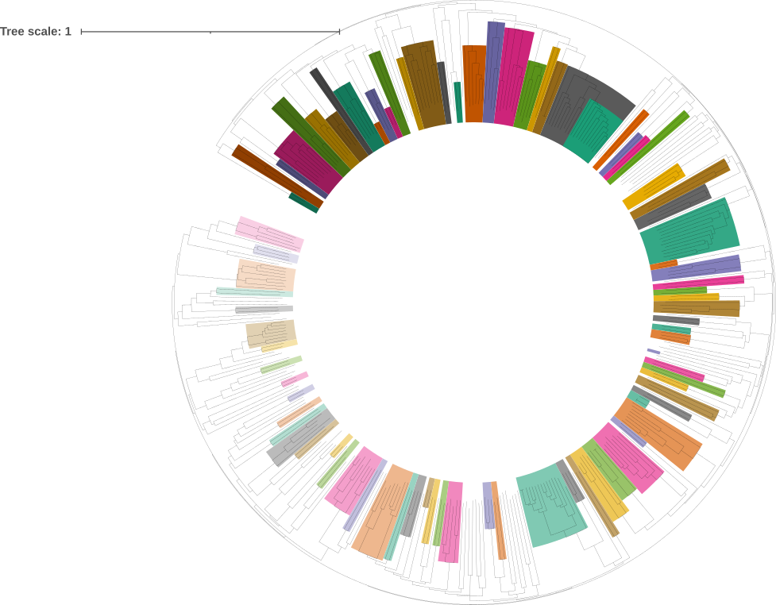
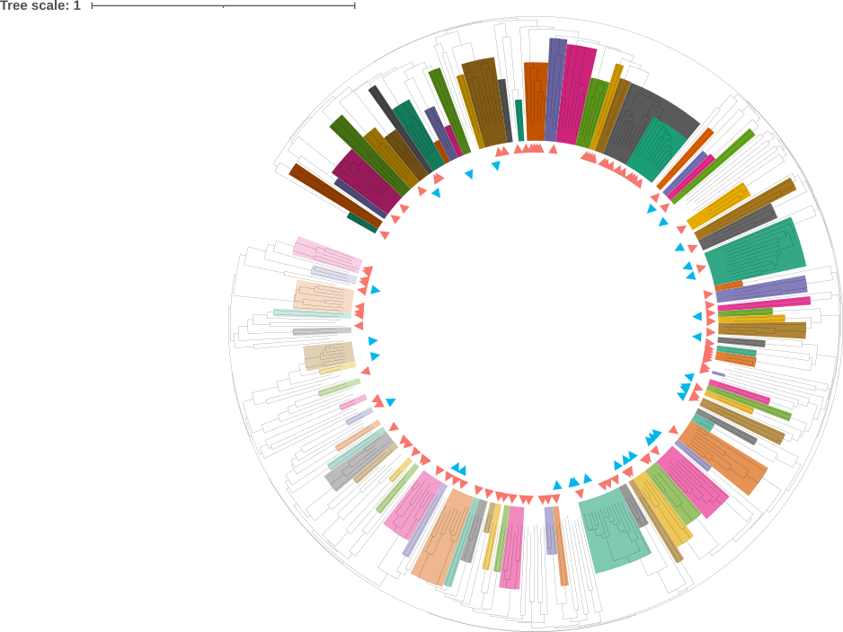
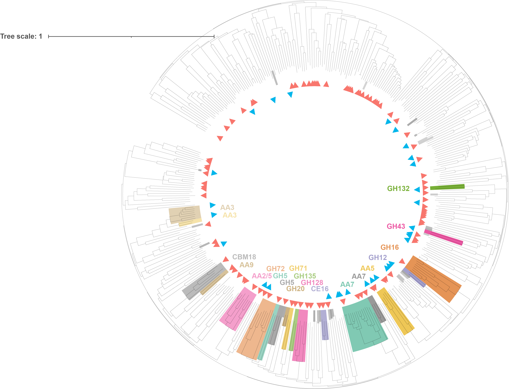
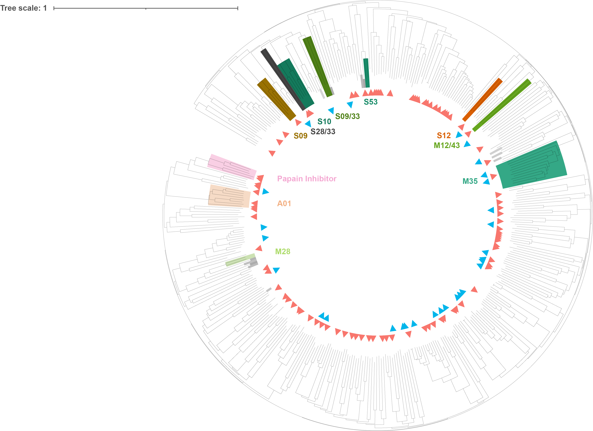
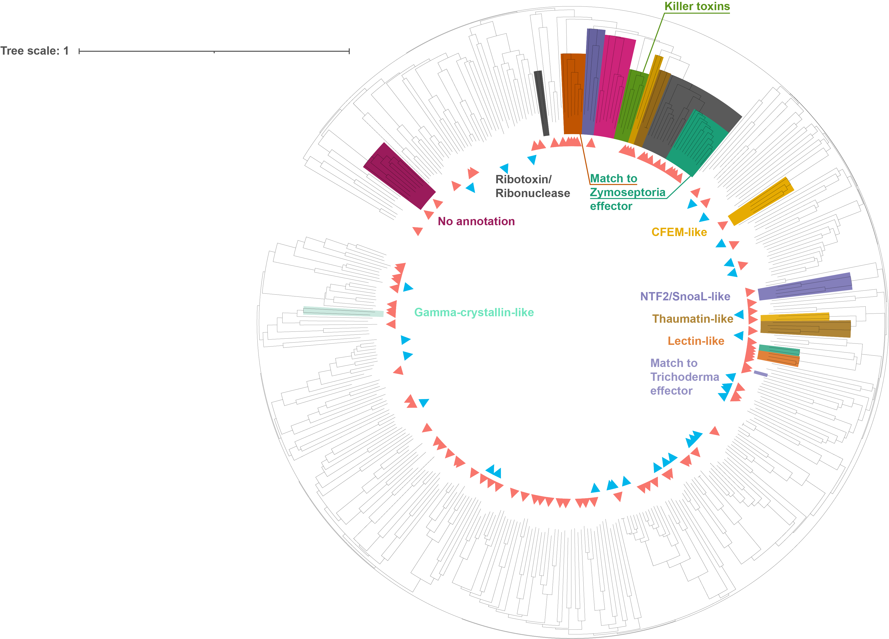

```{r setup, include=FALSE}
knitr::opts_chunk$set(echo = TRUE)
knitr::opts_knit$set(root.dir = "/Users/gol22pin/Documents/Lichen_project_TSL/10_lichen_effectors/notebook")
library(kableExtra)
library(stringr)
library(tidyverse)
```

**Rationale:** cluster all secreted proteins based on their structures

## 1. Clip pdb files to remove signal peptides
* Get list of coordinates for signal peptides. Only include proteins from the final secretome list
```{r}
secreted<-read.delim2( "../analysis_and_temp_files/01_predicting_effectors/all_secreted_list.txt", sep = "\t",header = F)

signal<-read.delim2("../analysis_and_temp_files/01_predicting_effectors/GTX0501_signalp_prediction_results.txt",skip=1) %>% filter(Prediction!="OTHER") %>%
  mutate(TranscriptID = X..ID,
         last_position_in_SP = as.numeric(gsub("CS pos: ([0-9]+)-.*$", "\\1", CS.Position))) %>%
  select(TranscriptID,last_position_in_SP,CS.Position) %>%
  filter(TranscriptID %in% secreted$V1)
```

* Function to clip the signal peptide
```{r}
library(Rpdb)
clip_SP <- function(input_file,output_file,residue){
pdb<-read.pdb(input_file)
pdb_subset<-subset(pdb,pdb$atoms$resid>residue)
write.pdb(pdb_subset,output_file)
rm(pdb,pdb_subset)}
```

* Make table for all secretome and apply the function to it
```{r,eval=F}
df<-data.frame("input_file" = list.files("../analysis_and_temp_files/03_fold_secretome/colab_fold_best_model", pattern=".pdb",full.names = T)) %>%
  mutate(TranscriptID = gsub("../analysis_and_temp_files/03_fold_secretome/colab_fold_best_model/(.*)_unrelaxed.*$", "\\1", input_file)) %>%
         mutate(output_file = paste0("../analysis_and_temp_files/05_cluster_structures/pdb_signal_removed/",TranscriptID,"_clipped.pdb")) %>% left_join(signal)
mapply(clip_SP, df$input_file,df$output_file,df$last_position_in_SP)                       
```


## 2. SP removal -> Foldtree:
* Prepared files for the run:
  * to the folder `analysis_and_temp_files/05_cluster_structures/pdb_signal_removed/` added an empty file identifiers.txt and an empty folder called structs
	* zip the folder
	* in [foldtree colab notebook](https://colab.research.google.com/github/DessimozLab/fold_tree/blob/main/notebooks/Foldtree.ipynb) change input_type -> custom
	* remove seed_id and cluster_id
	* jobname -> the name of the folder (in this case "pdb_signal_removed")
	* edit code under Run Foldtree: ` mv "${JOBNAME}/ADD HERE THE FOLDER NAME/"*.pdb "${JOBNAME}/ADD HERE THE FOLDER NAME"*.cif "${JOBNAME}/structs"`
	* Press RUn all, then it will prompt to upload the zip file
	* Visualization always fails, it's fine!
	* To download the result, press run on the last section, Package and download
	* According to Adam, the main output is `foldtree_struct_tree.PP.nwk.rooted.final`
* Saved the entire output from Foldtree under `analysis_and_temp_files/05_cluster_structures/pdb_signal_removed_da39a.result.zip`

### Compare the three trees
* Foldtree produces three trees:
  * foldtree: based on the global structure alignment
  * lddt: based on the local structure alignment
  * alntm: based on the sequence alignment
* The trees seem very different

* Anecdotally comparing the trees. Took one protein model: FUN_009178-T1
  * In alntm tree it's sister to FUN_009311-T1, but it doesn't align at all in ChimeraX
  * In foldtree it's sister to FUN_003873-T1, in ChimeraX it's more similar but still doesn't align well
  * In lddt it's sister to FUN_010665-T1, and it matches great in Chimera X
* Took another example: FUN_005200-T1
  * In alntm it's sister to FUN_005151-T1, and it matches great in Chimera X
  * In foldtree it's sister to FUN_000470-T1
  * In lddt it's sister to FUN_005151-T1, and it matches great in Chimera X
* In these examples, **lddt works best**

* **Results:** the tree seems random. The proteins with identical or nearly identical sequences are grouped together, as expected. But beyond that, clades make no sense
		
## 3. SP removal -> Filtering -> Foldtree
* After SP removal, some models still had disordered regions in the N-terminus
* With Adam, we did his filtering, the files for this process is in `analysis_and_temp_files/05_cluster_structures/pdb_signal_removed_filtering_Adam`
* Used Adam's script byeSP.py (`analysis_and_temp_files/05_cluster_structures/pdb_signal_removed_filtering_Adam/analysis_and_temp_files/05_cluster_structures/pdb_signal_removed_filtering_Adam/PDB_edit/byeSP.py`) to clip all residues with pLDDT <=55 from the N-terminus. This should make sure that all parts of the disordered region are gone
  * As input, used the files that I produced by removing SP (`analysis_and_temp_files/05_cluster_structures/pdb_signal_removed_filtering_Adam/PDB_edit/No_SP_Xep`)
	* Output is in `analysis_and_temp_files/05_cluster_structures/pdb_signal_removed_filtering_Adam/PDB_edit/No_SP_Xep_edit`
* Removing low-confidence models:
  * Adam's script (`analysis_and_temp_files/05_cluster_structures/pdb_signal_removed_filtering_Adam/pTM_sort/pTM_sort.py`)
	* uses json file to extract pTM score and remove models with pTM<50
	* averages the pDDLT score and ranks by that
	* makes a csv file with this info
	* as an input takes a zip file with pdb and json files, they should be names the same!
	* NB: here we used an unedited json files (i.e. with the signal peptide)
	* As input, used the files produced by byeSP.py 
	* Output is in `analysis_and_temp_files/05_cluster_structures/pdb_signal_removed_filtering_Adam/pTM_sort`
	* The script produces two folders: `above_50` and `below_50`
* Copied the final folder (`above_50`) to `analysis_and_temp_files/05_cluster_structures/pdb_SP_removed_filtered`. Added the empty structs/ and identifier.txt, and ziped them
* **Results:** after filtering, had 393 proteins left

* Analyzed these files with Foldtree, and got an [error](https://github.com/DessimozLab/fold_tree/issues/19) close to the end of the pipeline.
  * Got some of the results: tree files `*_struct_tree.nwk`. These files are not final (the final should be called `*_struct_tree.PP.nwk.rooted.final`). However, when I compared `foldtree_struct_tree.nwk` and `foldtree_struct_tree.PP.nwk.rooted.final` from the previous successful run, they were identical except for the rooting point. From this, I conclude that I can use the `*_struct_tree.nwk` files
  * Initially, not all `*_struct_tree.nwk` were produced. To ensure that all three are produced, added one argument to the snakemake command `--until quicktree`
  
### Comparing the trees
* Comparing the trees to each other and also to the previous run with the infiltered set of trees
* The same anecdotal example: FUN_009178-T1
  * In foldtree it's sister to FUN_004818-T1, doesn't align in ChimeraX. Different from the full tree
  * In alntm tree it's sister to FUN_8015-T1, aligns well in ChimeraX. Different from the full tree
  * In lddt it's sister to (FUN_010665-T1 and FUN_8015-T1), and it matches great in Chimera X. Partially same as in the full tree
* The same anecdotal example: FUN_005200-T1
  * In foldtree it's sister to FUN_002283-T1, doesn't align in ChimeraX. Different from the full tree
  * In alntm tree it's sister to FUN_002910-T1, aligns well in ChimeraX. Different from the full tree
  * In dllt tree it's sister to FUN_005151-T1, aligns well in ChimeraX. Same as in the full tree
* **Foldtree tree (pTM = global alignment) consistantly fails. Will use lDDT tree instead**

* On the large scale, all three trees are completely incongruent

```{r,fig.width=20,fig.height=40,message=FALSE}
library(ape)
library(treeio)
lddt<-treeio::read.newick("../analysis_and_temp_files/05_cluster_structures/pdb_SP_removed_filtered_da39a/lddt_struct_tree.nwk")
fold<-treeio::read.newick("../analysis_and_temp_files/05_cluster_structures/pdb_SP_removed_filtered_da39a/foldtree_struct_tree.nwk")
aln<-treeio::read.newick("../analysis_and_temp_files/05_cluster_structures/pdb_SP_removed_filtered_da39a/alntmscore_struct_tree.nwk")

assoc<-data.frame(fold$tip.label ,fold$tip.label)
cophyloplot(lddt,aln,assoc,space=400)
```

* Went through the lDDT tree and annotated all potential clusters.
  * Annotation as an svg file is in `analysis_and_temp_files/05_cluster_structures/pdb_SP_removed_filtered_da39a/lddt_struct_tree_annotated.svg`
  * Tree mostly makes sense and many reasonable clusters can be derived from it
  * The lower part of the tree is very messy. I suspect the reason is that most of proteins there have long disordered regions that mess with the clustering
* **Conclusion:** will try to remove all disrodered regions

## 4. SP removal -> Removing disordered regions -> Filtering -> Foldtree
* Start with the models with SP removed (from the `analysis_and_temp_files/05_cluster_structures/pdb_signal_removed/` folder, see above)
* Instead of using Adam's script, in R filtered out models with pTM<=50
* First, got pTM values from the json files (NB: used the original json files from colabfold!)
```{r,eval=F,message=FALSE}
library(jsonlite)
get_ptm<-function(jsonfile){
  ptm<-fromJSON(jsonfile)$ptm
  return(ptm)
}

df2<-data.frame("input_file" = list.files("../analysis_and_temp_files/03_fold_secretome/colab_fold_best_model", pattern=".json",full.names = T)) %>%
  mutate(TranscriptID = gsub("../analysis_and_temp_files/03_fold_secretome/colab_fold_best_model/(.*)_scores.*$", "\\1", input_file))
df2$ptm<-mapply(get_ptm, df2$input_file)        
```

* Get average pLDDT statistic (post SP clipping) and save the table with it + pTM
```{r,eval=F,message=FALSE}
get_avg_lddt<-function(input_file){
pdb<-read.pdb(input_file)
avg_lddt<-mean(pdb$atoms$temp)
return(avg_lddt)
}
df$avg_lddt<-mapply(get_avg_lddt, df$input_file) 

pdb_stats<-df2 %>% select(-input_file) %>% left_join(df) %>% select(TranscriptID,ptm,avg_lddt,input_file,last_position_in_SP)
write.table(pdb_stats,"../analysis_and_temp_files/05_cluster_structures/pdb_stats.txt",col.names = T,row.names = F,quote = F,sep="\t")
```

* Remove all residues with lDDT <=55. Only do it on the structures with pTM >= 0.5
  * From original 608 proteins, this leaves me 393
```{r,message=FALSE}
clip_lddt <- function(input_file,output_file,threshold){
pdb<-read.pdb(input_file)
pdb_subset<-subset(pdb,pdb$atoms$temp>threshold)
write.pdb(pdb_subset,output_file)
rm(pdb,pdb_subset)}

pdb_stats<-read.delim2("../analysis_and_temp_files/05_cluster_structures/pdb_stats.txt")

df3<-data.frame("input_file" = list.files("../analysis_and_temp_files/05_cluster_structures/pdb_signal_removed/", pattern=".pdb",full.names = T)) %>%
  mutate(TranscriptID = gsub("../analysis_and_temp_files/05_cluster_structures/pdb_signal_removed//(.*)_clipped.*$", "\\1", input_file)) %>%
         mutate(output_file = paste0("../analysis_and_temp_files/05_cluster_structures/pdb_SP_removed_clipped_filtered/",TranscriptID,".pdb")) %>%
  filter(TranscriptID %in% pdb_stats$TranscriptID[pdb_stats$ptm>=0.5])
```

```{r,eval=F}
mapply(clip_lddt, df3$input_file,df3$output_file,55)  
```
* Prepared these models for Foldtree: added empty structs/ and identifiers.txt
* Run on Foldtree and saved the results in `/analysis_and_temp_files/05_cluster_structures/pdb_SP_removed_clipped_filtered_da39a_0`
* Annotated the lddt tree in Illustrator to add clusters in `/analysis_and_temp_files/05_cluster_structures/pdb_SP_removed_clipped_filtered_da39a_0/lddt_struct_tree_annotated.*`
  * put the info on which proteins are assigned to which clusters in `analysis_and_temp_files/05_cluster_structures/clusterin_lddt_clipped_filtered.txt`
* **Results: lddt tree is much better now. Clipping low confidence regions seems neccessary**

#### Defined 83 clusters
* One cluster (cl24) is split into two, where cl24a is nested within the cl24, which because of it is not monophyletic. Cl24a proteins are bigger than cl24 (maybe duplication?)
* Most of them have only 2-3 proteins
```{r,message=FALSE}
clusters_df<-read.delim2("../analysis_and_temp_files/05_cluster_structures/clusterin_lddt_clipped_filtered.txt") %>% filter(cluster_id!="")
cluster_info<-clusters_df %>% group_by(cluster_id) %>% summarize(n_proteins=n()) %>% 
  left_join(clusters_df %>% select(-tip) %>% distinct())
cluster_info %>% group_by(n_proteins) %>%summarize(n=n())
```
* Visualize
```{r,message=FALSE}
ggplot(cluster_info)+
  geom_histogram(aes(x=n_proteins))
```

#### Clusters in different trees
* Anecdotally, it appears that some 'clusters' that I defined based on the lddt tree are also present in the other two trees as monophyletic clades as well (although relationship within these clades *and* between different clades appear very different)
* Need to find a way to do this comparison programmatically
* Test run just one clade:
```{r,fig.width=20,fig.height=50,message=FALSE}
library(phytools)
lddt<-treeio::read.newick("../analysis_and_temp_files/05_cluster_structures/pdb_SP_removed_clipped_filtered_da39a_0/lddt_struct_tree.nwk")
fold<-treeio::read.newick("../analysis_and_temp_files/05_cluster_structures/pdb_SP_removed_clipped_filtered_da39a_0/foldtree_struct_tree.nwk")
aln<-treeio::read.newick("../analysis_and_temp_files/05_cluster_structures/pdb_SP_removed_clipped_filtered_da39a_0/alntmscore_struct_tree.nwk")

lddt_rooted<-midpoint.root(lddt)
fold_rooted<-midpoint.root(fold)
aln_rooted<-midpoint.root(aln)

clade<-c("FUN_010209-T1","FUN_007256-T1","FUN_005784-T1")
data.frame(rbind(c("lddt","foldtree","aln"),sapply(c(lddt_rooted,fold_rooted,aln_rooted),is.monophyletic,tips=clade)))
```

* Compared for all clusters
```{r,message=FALSE}
clusters_df<-read.delim2("../analysis_and_temp_files/05_cluster_structures/clusterin_lddt_clipped_filtered.txt") %>% filter(cluster_id!="")
cluster_info<-clusters_df %>% group_by(cluster_id) %>% summarize(n_proteins=n()) %>% 
  left_join(clusters_df %>% select(-tip) %>% distinct())

test_cluster<-function(cl){
  tip_list<-clusters_df$tip[clusters_df$cluster_id==cl]
  l<-is.monophyletic(lddt_rooted,tip_list)
  f<-is.monophyletic(fold_rooted,tip_list)
  a<-is.monophyletic(aln_rooted,tip_list)
  df<-data.frame("cluster_id"=cl,"lDDT"=l,"pTM"=f,"Sequence"=a)
  return(df)
}

l<-lapply(cluster_info$cluster_id,test_cluster)
cluster_info2<-cluster_info %>% left_join(do.call(rbind,l))

cluster_info2 %>%  
  kable(format = "html", col.names = colnames(cluster_info2)) %>%
  kable_styling() %>%
  kableExtra::scroll_box(width = "100%", height = "300px")
```

* Most clusters aren't present in the other trees. Of the 83, clusters 21 are monophyletic in the sequence tree and only 7 in the pTM tree
* Tracking the clades of interest
  * Clades in the vicinity of Killer toxins: clusters cl18 - cl24
  * In Foldtree they are dispesed throughout
```{r,fig.width=20,fig.height=50,message=FALSE}
library(ggtree)
library(RColorBrewer)
col_1<-cluster_info %>% mutate(selected = ifelse(
  cluster_id %in% c("cl18","cl19","cl20","cl21","cl22","cl23","cl24","cl24a"),cluster_id,"other")) %>% select(cluster_id,selected)

col_f1<-data.frame("tip"=fold$tip.label) %>% left_join(clusters_df) %>%
  left_join(col_1) 

ggtree(fold,ladderize = TRUE,right = T) %<+% col_f1 +
  geom_tiplab(pch=16,size=3,aes(col=selected))+
  scale_color_manual(values=c("other"="black","cl18"=brewer.pal(n = 8, name = "Dark2")[1],
                              "cl19"=brewer.pal(n = 8, name = "Dark2")[2],
                              "cl20"=brewer.pal(n = 8, name = "Dark2")[3],
                              "cl21"=brewer.pal(n = 8, name = "Dark2")[4],
                              "cl22"=brewer.pal(n = 8, name = "Dark2")[5],
                              "cl23"=brewer.pal(n = 8, name = "Dark2")[6],
                              "cl24"=brewer.pal(n = 8, name = "Dark2")[7],
                              "cl24a"="red"))+
  xlim(0, 1.2)

```

  * In the sequence tree, there is a bit more structure, and I can see a clade that is mostly comprised of the proteins from these clusters. However, it's still quite messy. For example, there is a clade ((FUN_009178-T1,FUN_007748-T1),FUN_005533-T1), in which FUN_009178-T1 and FUN_005533-T1 come from cl24 and FUN_007748-T1 is from cl71. As expected, the structure of FUN_007748-T1 looks nothing like the other two. I manually aligned these 3 proteins, and based on this alignment I don't understand why FUN_009178-T1 and FUN_007748-T1 are grouped together
  
```{r,fig.width=20,fig.height=50,message=FALSE}
col_a1<-data.frame("tip"=aln$tip.label) %>% left_join(clusters_df) %>%
  left_join(col_1) 

ggtree(aln,ladderize = TRUE,right = T) %<+% col_a1 +
  geom_tiplab(pch=16,size=3,aes(col=selected))+
  scale_color_manual(values=c("other"="black", #NA="black",
                              "cl18"=brewer.pal(n = 8, name = "Dark2")[1],
                              "cl19"=brewer.pal(n = 8, name = "Dark2")[2],
                              "cl20"=brewer.pal(n = 8, name = "Dark2")[3],
                              "cl21"=brewer.pal(n = 8, name = "Dark2")[4],
                              "cl22"=brewer.pal(n = 8, name = "Dark2")[5],
                              "cl23"=brewer.pal(n = 8, name = "Dark2")[6],
                              "cl24"=brewer.pal(n = 8, name = "Dark2")[7],
                              "cl24a"="red"))+
  xlim(0, 1.2)

```

* For comparison, this is the lDDT tree
```{r,fig.width=20,fig.height=50,message=FALSE}
col_l1<-data.frame("tip"=lddt$tip.label) %>% left_join(clusters_df) %>%
  left_join(col_1) 

ggtree(lddt,ladderize = TRUE,right = T) %<+% col_l1 +
  geom_tiplab(pch=16,size=3,aes(col=selected))+
  scale_color_manual(values=c("other"="black", 
                              "cl18"=brewer.pal(n = 8, name = "Dark2")[1],
                              "cl19"=brewer.pal(n = 8, name = "Dark2")[2],
                              "cl20"=brewer.pal(n = 8, name = "Dark2")[3],
                              "cl21"=brewer.pal(n = 8, name = "Dark2")[4],
                              "cl22"=brewer.pal(n = 8, name = "Dark2")[5],
                              "cl23"=brewer.pal(n = 8, name = "Dark2")[6],
                              "cl24"=brewer.pal(n = 8, name = "Dark2")[7],
                              "cl24a"="red"))+
  xlim(0, 1.2)

```

* **Result:** not sure the sequence-based tree is trustworthy

#### Running ML tree based on the sequences
* Make a fasta file that includes only the 393 sequences that are included in the Foldtree analysis
```{r,message=F}
library(Biostrings)
all_fa<-readAAStringSet("../analysis_and_temp_files/01_predicting_effectors/all_secreted.fa")
subset_fa<-all_fa[df3$TranscriptID]
writeXStringSet(subset_fa,"../analysis_and_temp_files/05_cluster_structures/filtered.fa")
```
* Align, clip to remove positions missing from >99% of the alignment, and make a ML tree with 1000 rapid bootstraps
```{r,eval=F}
sbatch --mem=10G -c 20 --partition=tsl-short --wrap="source package /tgac/software/testing/bin/mafft-7.271; mafft --maxiterate 1000 --genafpair --thread 20  analysis_and_temp_files/05_cluster_structures/filtered.fa >  analysis_and_temp_files/05_cluster_structures/filtered_aligned.fa"

sbatch --mem=10G -c 20 --partition=tsl-short --wrap="source package /tsl/software/testing/bin/trimal-1.2; trimal -in analysis_and_temp_files/05_cluster_structures/filtered_aligned.fa -out analysis_and_temp_files/05_cluster_structures/filtered_aligned.phyl -gt 0.01 -phylip"

sbatch --mem=20G -c 25 --partition=tsl-long --wrap="source package /tgac/software/testing/bin/iqtree-2.2.2.2; iqtree2 -s analysis_and_temp_files/05_cluster_structures/filtered_aligned.phyl -B 1000 -T 25 --threads-max 25"
```

* Compare clusters' status (whether or not it is monophyletic) in thq IQtree

```{r}
iq<-treeio::read.newick("../analysis_and_temp_files/05_cluster_structures/filtered_aligned.phyl.contree")
iq_rooted<-midpoint.root(iq)

#rename tips in iqtree to make consistent
rename<-data.frame("new"=lddt_rooted$tip.label) %>% mutate(iq_old=sub("-.*", "", new))
rename<-data.frame("iq_old"=iq_rooted$tip.label) %>% left_join(rename)
iq_rooted$tip.label<-rename$new

#test clusters
test_cluster2<-function(cl){
  tip_list<-clusters_df$tip[clusters_df$cluster_id==cl]
  i<-is.monophyletic(iq_rooted,tip_list)
  l<-is.monophyletic(lddt_rooted,tip_list)
  f<-is.monophyletic(fold_rooted,tip_list)
  a<-is.monophyletic(aln_rooted,tip_list)
  df<-data.frame("cluster_id"=cl,"IQTREE_sequence"=i,"FOldtree_sequence"=a,"lDDT"=l,"pTM"=f)
  return(df)
}

l<-lapply(cluster_info$cluster_id,test_cluster2)
cluster_info3<-cluster_info %>% left_join(do.call(rbind,l))

cluster_info3 %>%  
  kable(format = "html", col.names = colnames(cluster_info3)) %>%
  kable_styling() %>%
  kableExtra::scroll_box(width = "100%", height = "300px")
```

* In the IQtree version of sequence-based tree, the number of clusters that come as monophyletic is higher by one (n=`r cluster_info3 %>% filter(IQTREE_sequence==T) %>% nrow()`)
* Looking at the IQtree, compared to the alntm tree, it's more consistent in some parts and less consistent in others. Probably, it's better to stick to the FOoldtree output
```{r,fig.width=20,fig.height=50,message=FALSE}
col_i1<-data.frame("tip"=iq_rooted$tip.label) %>% left_join(clusters_df) %>%
  left_join(col_1) 

ggtree(iq_rooted,ladderize = TRUE,right = T) %<+% col_i1 +
  geom_tiplab(pch=16,size=3,aes(col=selected))+
  scale_color_manual(values=c("other"="black", 
                              "cl18"=brewer.pal(n = 8, name = "Dark2")[1],
                              "cl19"=brewer.pal(n = 8, name = "Dark2")[2],
                              "cl20"=brewer.pal(n = 8, name = "Dark2")[3],
                              "cl21"=brewer.pal(n = 8, name = "Dark2")[4],
                              "cl22"=brewer.pal(n = 8, name = "Dark2")[5],
                              "cl23"=brewer.pal(n = 8, name = "Dark2")[6],
                              "cl24"=brewer.pal(n = 8, name = "Dark2")[7],
                              "cl24a"="red"))+
  xlim(0, 5)+geom_treescale()
```

## 5. Summarizinig clustering results
* 83 (or 84, see below) clusters
  * One cluster (cl24) is split into two, where cl24a is nested within the cl24, which because of it is not monophyletic. Cl24a proteins are bigger than cl24 (maybe duplication?)
* Make a table summarizing clustering results for all proteins. Add info on funannotate-derived annotations, matches to pdb, pTM and avarege pLDDT for the models, and size
* For the proteins not included in a cluster, had two options: singleton and below quality threshold
* Saved as `analysis_and_temp_files/05_cluster_structures/clustering_results.txt`
```{r,message=FALSE}
ann<-read.delim("../analysis_and_temp_files/04_characterize_secretome/secretome_annotations.txt")

clusters_df$TranscriptID <- str_replace(clusters_df$tip,"FUN","XANPAGTX0501")
pdb_stats$TranscriptID <- str_replace(pdb_stats$TranscriptID,"FUN","XANPAGTX0501")

size<-data.frame("size"=width(all_fa),"name"=names(all_fa))
size$TranscriptID <- str_replace(size$name,"FUN","XANPAGTX0501")

combined<-ann %>% left_join(clusters_df) %>% left_join(pdb_stats) %>% left_join(size) %>%
  select(TranscriptID,cluster_id,descrition,DGE,ptm,pLDDT,size,InterPro,CAZyme_new,Protease_new,antimicrobial,pdb_best,pdb_second,af_best,af_second) %>%
  mutate(cluster_id = case_when(is.na(cluster_id) & ptm>=0.5 ~ "not in cluster",
   is.na(cluster_id) & ptm<0.5 ~ "pTM below threshold",                         
    T ~ cluster_id)) %>% arrange(cluster_id) 
colnames(combined)<-c("ProteinID","ClusterID","CLuster_Description","Gene_Expression",
                      "pTM_Score", "Average_pLDDT", "Size_aa", "InterPro", "CAZyme_new","Protease_new","Antimicrobial_activity_prediction","Best_match_PDB","Second_match_PDB","Best_match_AF","Second_match_AF")

write.table(combined,"../analysis_and_temp_files/05_cluster_structures/clustering_results.txt",col.names = T,row.names = F,quote = F,sep="\t")

combined %>%  
  kable(format = "html", col.names = colnames(combined)) %>%
  kable_styling() %>%
  kableExtra::scroll_box(width = "100%", height = "300px")
```


## 6. Visualize 
* Make annotation files for iTOL
* First, I had to make a version of the tree with inner node numbers (so I can map cluster ranges to the tree). Save this tree to `analysis_and_temp_files/05_cluster_structures/lddt_tree_itol.nwk.txt`
* Saved the tree with cluster annotations as `results/cluster_tree/clusters.*`
```{r}
library(RColorBrewer)

#define palette
get_11_colors<-function(color){ # a function for each color gives 11 shades from dark to light as a dataframe with one row
  colfunc1 <- colorRampPalette(c("black", color))
  colfunc2 <- colorRampPalette(c(color,"white"))
  darks<-colfunc1(10)[7:10]
  lights<-colfunc2(10)[2:8]
  return(c(darks,lights))
}
l<-lapply(brewer.pal(8,"Dark2"),get_11_colors)
color_table<-do.call(rbind,l)
color_table<-data.frame(color_table)
color_table$hue<-brewer.pal(8,"Dark2")
color_list<-color_table %>% pivot_longer(-hue,names_to="shade",values_to = "color") %>%
  mutate(shade2 = case_when(shade=="X10"~"XX10",shade=="X11"~"XX11",T~shade)) %>% arrange(shade2) %>% select(color)

#add pallet to the cluster list
cluster_info_col<-cbind(cluster_info,color_list[1:84,])

#get common ancestors for all clades
itol_tree<-makeNodeLabel(lddt)
write.tree(itol_tree,"../analysis_and_temp_files/05_cluster_structures/lddt_tree_itol.nwk")
get_clade_node<-function(cluster,tree="itol_tree"){
  tips<-clusters_df$tip[clusters_df$cluster_id==cluster]
  mrsa_node<-findMRCA(itol_tree,tips,type="node")
  node<-itol_tree$node.label[mrsa_node - length(itol_tree$tip.label)]
  return(node)
}

cluster_info_col$node<-sapply(cluster_info_col$cluster_id,get_clade_node) 
#had to manually assign the node for cl42 (the one that has 1 protein only)
cluster_info_col$node[cluster_info_col$cluster_id=="cl42"]<-clusters_df$tip[clusters_df$cluster_id=="cl42"]
cluster_info_col$node<-unlist(cluster_info_col$node)
write.table(cluster_info_col,"../analysis_and_temp_files/05_cluster_structures/cluster_col.txt",sep=",",quote = F, row.names = F, col.names=T)

#prepare the dataset
cat("DATASET_RANGE\nSEPARATOR COMMA\nDATASET_LABEL,Cluster\nRANGE_COVER,clade\nDATA\n", file="../analysis_and_temp_files/05_cluster_structures/itol_clusters.txt")

itol_data<-cluster_info_col %>% mutate(node2=node) %>%
  select(node,node2,color) 

write.table(itol_data,"../analysis_and_temp_files/05_cluster_structures/itol_clusters.txt",append=TRUE,sep=",",quote = F, row.names = F, col.names=F)

```

* Add DGE genes
```{r}
dge <- ann %>% mutate(ProteinID=str_replace(TranscriptID,"XANPAGTX0501","FUN")) %>% filter(ProteinID %in% lddt$tip.label) %>% 
  mutate(symbol1 = case_when(DGE=="Upregulated in lichen" ~ 1, T ~ -1),
         symbol2 = case_when(DGE=="Upregulated in culture" ~ 1,T ~ -1)) %>%
  select(ProteinID,symbol1,symbol2)

#prepare the dataset
cat("DATASET_BINARY\nSEPARATOR COMMA\nDATASET_LABEL,Differentially Expressed\nCOLOR,#ff0000\nFIELD_LABELS,Upregulated in lichen,Upregulated in culture\nFIELD_SHAPES,4,5\nFIELD_COLORS,#F8766D,#00B6EB\nDATA\n", file="../analysis_and_temp_files/05_cluster_structures/itol_dge.txt")

write.table(dge,"../analysis_and_temp_files/05_cluster_structures/itol_dge.txt",append=TRUE,sep=",",quote = F, row.names = F, col.names=F)

```

* Highlight CAZymes. Here I showed all the actual clusters with CAZys and also added ranges for each individual proteins with CAZy annotations
  * Here I'm showing the clusters where the number of CAZy-annotated proteins >0.5
  * Manually in Illustrator added CAZy families to clusters
```{r}
cazy_cluster_list<-combined %>%
  mutate(cazy_binary=ifelse(is.na(CAZyme_new),"noncazy","cazy")) %>%
  group_by(ClusterID,cazy_binary) %>% summarize(n=n()) %>%
  pivot_wider(names_from = cazy_binary,values_from = n,values_fill=0)  %>%
  mutate(cazy_perc=cazy/(cazy+noncazy)) %>% filter(cazy_perc>0.5) 

cluster_info_col_cazy <- cluster_info_col %>% 
  filter(cluster_id %in% cazy_cluster_list$ClusterID) %>%
  mutate(node2=node) %>% select(node,node2,color) 

#add 'range' for CAZymes not in the clusters above
ind_cazy_list<-combined %>% filter(!is.na(CAZyme_new),
                                   !(ClusterID %in% cazy_cluster_list$ClusterID),
                                   ClusterID!="pTM below threshold") %>%
  mutate(node=str_replace(ProteinID,"XANPAGTX0501","FUN"),node2=str_replace(ProteinID,"XANPAGTX0501","FUN")) %>% select(node,node2)
#define colors as shades of light grey
colfunc <- colorRampPalette(c("#d4d4d4", "#a8a8a8"))
ind_cazy_list$color<-colfunc(nrow(ind_cazy_list))

#prepare the dataset
cat("DATASET_RANGE\nSEPARATOR COMMA\nDATASET_LABEL,CAZymes\nRANGE_COVER,clade\nDATA\n", file="../analysis_and_temp_files/05_cluster_structures/itol_cazy.txt")

write.table(rbind(cluster_info_col_cazy,ind_cazy_list),"../analysis_and_temp_files/05_cluster_structures/itol_cazy.txt",append=TRUE,sep=",",quote = F, row.names = F, col.names=F)

```

* Highlight proteases. Here I showed all the actual clusters with proteases and also added ranges for each individual proteins with protease annotations
  * Here I'm showing the clusters where the number of protease-annotated proteins >0.5
  * Manually added two clusters:
    * cl32: metallopeptidase M35. All proteins are similar to each other, and half of them has IPR annotation to M35, but only one of them had MEROPS annotation
    * cl83: papain inhibitors
  * Added proteins with MEROPS annotations and protease/peptidase IPR annotations
  * Manually in Illustrator added MEROPS families to clusters
```{r}
protease_cluster_list<-combined %>%
  mutate(protease_binary=ifelse(is.na(Protease_new),"nonprotease","protease")) %>%
  group_by(ClusterID,protease_binary) %>% summarize(n=n()) %>%
  pivot_wider(names_from = protease_binary,values_from = n,values_fill=0)  %>%
  mutate(protease_perc=protease/(protease+nonprotease)) %>% filter(protease_perc>0.5) 

cluster_info_col_protease <- cluster_info_col %>% 
  filter(cluster_id %in% c(protease_cluster_list$ClusterID,"cl32","cl83")) %>%
  mutate(node2=node) %>% select(node,node2,color) 

#add 'range' for proteases not in the clusters above
ind_protease_list<-combined %>% filter(!(ClusterID %in% c(protease_cluster_list$ClusterID,"cl32","cl83")),ClusterID!="pTM below threshold") %>%
  filter(!is.na(Protease_new) | grepl("eptidase",InterPro) |
           grepl("rotease",InterPro)) %>%
  mutate(node=str_replace(ProteinID,"XANPAGTX0501","FUN"),node2=str_replace(ProteinID,"XANPAGTX0501","FUN")) %>% select(node,node2)
#define colors as shades of light grey
colfunc <- colorRampPalette(c("#d4d4d4", "#a8a8a8"))
ind_protease_list$color<-colfunc(nrow(ind_protease_list))

#prepare the dataset
cat("DATASET_RANGE\nSEPARATOR COMMA\nDATASET_LABEL,Protease\nRANGE_COVER,clade\nDATA\n", file="../analysis_and_temp_files/05_cluster_structures/itol_protease.txt")

write.table(rbind(cluster_info_col_protease,ind_protease_list),"../analysis_and_temp_files/05_cluster_structures/itol_protease.txt",append=TRUE,sep=",",quote = F, row.names = F, col.names=F)

```

* Show clusters of interest. Based it on clusters that are similar to known effector families (partially from [Krasileva's paper](https://www.nature.com/articles/s41564-022-01287-6))
  * NB: the secretome also contained 3 proteins with LysM IPR domains, but all of them had pTM below the threshold
  * Also added cl04, because it's big and contains lichen-upregulated proteins, and lacks annotation
```{r}
int_cluster_list <- c("cl04","cl16","cl18","cl19","cl20","cl21","cl22","cl23",
                      "cl24","cl24a","cl37","cl38","cl40","cl41","cl42","cl80",
                      "cl29","cl34")
  
cluster_info_col_int <- cluster_info_col %>% 
  filter(cluster_id %in% int_cluster_list) %>%
  mutate(node2=node) %>% select(node,node2,color) 

#prepare the dataset
cat("DATASET_RANGE\nSEPARATOR COMMA\nDATASET_LABEL,Putative Effectors\nRANGE_COVER,clade\nDATA\n", file="../analysis_and_temp_files/05_cluster_structures/itol_interest.txt")

write.table(rbind(cluster_info_col_int),"../analysis_and_temp_files/05_cluster_structures/itol_interest.txt",append=TRUE,sep=",",quote = F, row.names = F, col.names=F)

```

* As an afterthought, are any proteins from cl04 labeled as effector by the sequence-based tools?
* None according to EffectorP
```{r}
effp<-read.delim2("../analysis_and_temp_files/01_predicting_effectors/effectorp_GTX0501.out")
effp$prot<-gsub( " .*$", "", effp$X..Identifier)
effp$prot<-str_replace(effp$prot,"FUN","XANPAGTX0501")
deep1<-read.csv2("../analysis_and_temp_files/01_predicting_effectors/deepredeef_prediction_1.csv",sep=",")
deep2<-read.csv2("../analysis_and_temp_files/01_predicting_effectors/deepredeef_prediction_2.csv",sep=",")
deep<-rbind(deep1,deep2)
deep$prot<-gsub( " .*$", "", deep$name)
deep$prot<-str_replace(deep$prot,"FUN","XANPAGTX0501")

effp %>% filter(prot %in% clusters_df$TranscriptID[clusters_df$cluster_id=="cl04"]) %>% select(prot,Prediction,Non.effector)
```
* BUt deepredeff identified 5 out of 8 as effectors
```{r}
deep %>% filter(prot %in% clusters_df$TranscriptID[clusters_df$cluster_id=="cl04"]) %>% select(prot,prediction,s_score)
```


* Make a tree highlighting all hydrolases (CAZymes, proteases, esterase/lipase) in clusters
```{r}
hyd_cluster_list<-c(protease_cluster_list$ClusterID,cazy_cluster_list$ClusterID,
                    "cl05","cl07","cl11","cl12","cl58","cl32","cl83") 

cluster_info_col_hyd <- cluster_info_col %>% 
  filter(cluster_id %in% hyd_cluster_list) %>%
  mutate(node2=node) %>% select(node,node2,color) 

#prepare the dataset
cat("DATASET_RANGE\nSEPARATOR COMMA\nDATASET_LABEL,Hydrolase\nRANGE_COVER,clade\nDATA\n", file="../analysis_and_temp_files/05_cluster_structures/itol_hydrolase.txt")

write.table(cluster_info_col_hyd,"../analysis_and_temp_files/05_cluster_structures/itol_hydrolase.txt",append=TRUE,sep=",",quote = F, row.names = F, col.names=F)
```

```{r}
hyd_cluster_list<-c(protease_cluster_list$ClusterID,cazy_cluster_list$ClusterID,
                    "cl05","cl07","cl11","cl12","cl58","cl32","cl83") 

cluster_info_col_hyd <- cluster_info_col %>% 
  filter(cluster_id %in% hyd_cluster_list) %>%
  mutate(node2=node) %>% select(node,node2,color) 

#prepare the dataset
cat("DATASET_RANGE\nSEPARATOR COMMA\nDATASET_LABEL,Hydrolase\nRANGE_COVER,clade\nDATA\n", file="../analysis_and_temp_files/05_cluster_structures/itol_hydrolase.txt")

write.table(cluster_info_col_hyd,"../analysis_and_temp_files/05_cluster_structures/itol_hydrolase.txt",append=TRUE,sep=",",quote = F, row.names = F, col.names=F)
```

